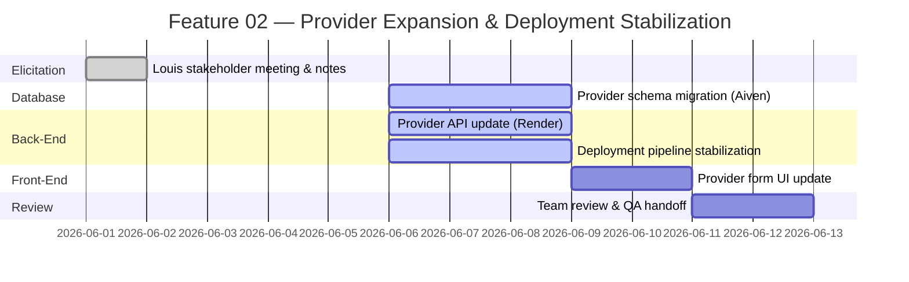
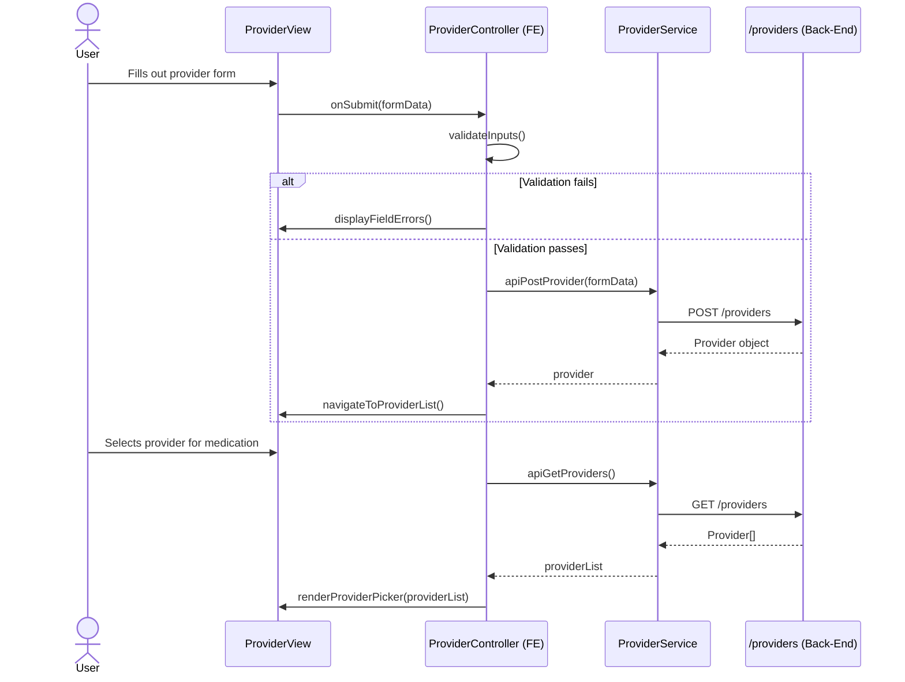
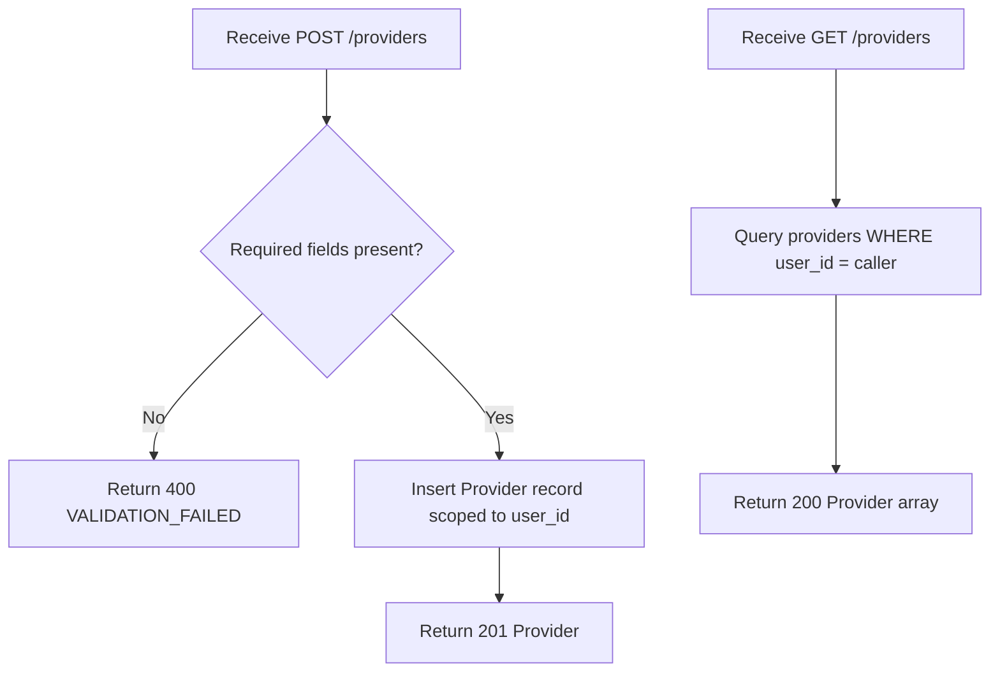
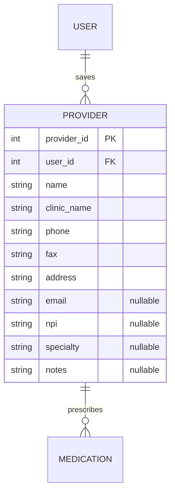

# Feature Planning Report - Detail Design

### Reference Information
---
* **Feature Title**: Provider Schema Expansion & Render/Aiven Deployment Stabilization
* **Feature Number**: 02
* **Date**: 2026-06-06
* **Author**: Xander Weibel
* **Team Members**: Haejin Na, Joshua Palmer, Joseph Tolley, Xander Weibel

| Role | Assignee |
-- | --
| Product Owner | Xander Weibel |
| Scrum Master | Xander Weibel |
| Tech Lead (Front-End) | Xander Weibel |
| Tech Lead (Back-End) | Joseph Tolley |
| Tech Lead (Database) | Haejin Na |
| Quality Assurance | Joshua Palmer |
| CM/DM | Joshua Palmer |

---

### Traceability
* **Requirement Number** (SRS Ref #): FR18 (Provider Association); DB1–DB9; SA1, SA2, SA4; DC1, DC2
* **Design Number** (SDD Ref #): SDD Section 4 (Back-End Design), Section 5 (Data Access), Section 6 (Database Design), Component C2 (Medication Management), Component C7 (DAL), Component C8 (Database)
* **Test Plan** (TPD Ref #): FR18 (Verification Mapping — Demonstration, Inspection; Integration, System)
* **User Document** (Ref Section #): SRS Section 3.1 (FR18), Section 3.5 (DB2, DB3)
* **Installation Document** (Ref #): Installation Guide v2.0 — Render deployment, Aiven DB connection
* **Software Developer Guide** (Ref #): API-README.md — openapi.yaml `/providers` endpoints; ERD (EntityRelationshipDiagram.md)

---

### Agile Tasking Information
* **Epic Story**:
  As a patient user,
  I want to save my provider's contact details and associate them with my medications,
  so that I can generate a complete refill request without having to look up provider information each time.

* **Value**: Expands the Provider entity per stakeholder direction (Louis Ramos) to support a complete refill request workflow. Stabilizes the Render + Aiven deployment so the team can reliably push and test backend changes going forward.

* **Planned Delivery**: v2.0 — Week 07 (Testing & DevOps Cycle)

* **Schedule**:


* **Known Dependencies / Obstacles**:
  - Aiven schema migration must complete before back-end or front-end changes can be tested end-to-end
  - Render deploy pipeline is currently unstable — deployment stabilization is a blocker for all v2.0 integration testing
  - openapi.yaml `Provider` schema must be updated before front-end form changes begin
  - Louis confirmed user-created providers only — no fixed list, no Maps/Surescripts integration

* **GitHub**:
  * **GitHub Branch**: `feature/02`
  * **GitHub Project**: RXNow MVP

---

## Detailed Design

### Front-End

**Workflow Description**:
The provider form is updated to collect name, clinic/office name, fax number, phone number, and physical address. Optional fields (email, NPI, specialty, notes) are included as nullable inputs. Users manually create and save providers from a Provider screen; providers are then selectable when associating with a medication record.



- Agile Info:
  - Story: As a user, I want to add and save provider contact details so I can associate them with my medications.
  - Est Story Points: 3
  - Assigned Responsible Engineer: Xander Weibel

**Classes**:

* **Model**:
  * **UML Class**:
    ```mermaid
    classDiagram
      class ProviderModel {
        +int provider_id
        +int user_id
        +string name
        +string clinic_name
        +string phone
        +string fax
        +string address
        +string email
        +string npi
        +string specialty
        +string notes
      }
    ```
  * ***Code Location***: `src/models/ProviderModel.ts`

* **Control**:
  * **UML Class**:
    ```mermaid
    classDiagram
      class ProviderController {
        +validateInputs(formData) bool
        +navigateToProviderList() void
        +renderProviderPicker(list) void
      }
    ```
  * **Create** (Function name): `processCreateProvider(formData)`
  * **Read** (Function name): `processGetProviders()`
  * **Update** (Function name): `processUpdateProvider(providerId, formData)`
  * **Delete** (Function name): `processDeleteProvider(providerId)`
  * ***Code Location***: `src/controllers/ProviderController.ts`

* **View**:
  * **User Interface**: Provider form screen with labeled fields for name, clinic/office name, phone, fax, and address (required); email, NPI, specialty, and notes (optional). Provider picker rendered as a selectable list when associating a provider with a medication.
  * **Create** (Function name): `renderProviderForm()`
  * **Read** (Function name): `renderProviderList()`
  * **Update** (Function name): `renderProviderEditForm(provider)`
  * **Delete** (Function name): N/A — handled via list action
  * ***Code Location***: `src/views/ProviderView.tsx`
  * **Back Interface**:
    * **Create** (Function name): `apiPostProvider(formData)` → POST `/providers`
    * **Read** (Function name): `apiGetProviders()` → GET `/providers`
    * **Update** (Function name): `apiPutProvider(id, formData)` → PUT `/providers/{provider_id}`
    * **Delete** (Function name): `apiDeleteProvider(id)` → DELETE `/providers/{provider_id}`
    * ***Code Location***: `src/services/ProviderService.ts`

---

### Back-End

* **Business Logic**:


- Agile Info:
  - Story: As the system, I need to store and return provider records scoped to the authenticated user so that refill requests are populated correctly.
  - Est Story Points: 3
  - Assigned Responsible Engineer: Joseph Tolley

**Classes**:

* **Models**:
  * **UML Class**:
    ```mermaid
    classDiagram
      class Provider {
        +int provider_id
        +int user_id
        +string name
        +string clinic_name
        +string phone
        +string fax
        +string address
        +string email
        +string npi
        +string specialty
        +string notes
      }
    ```
  * ***Code Location***: `src/models/Provider.py`

* **Control**:
  * **UML Class**:
    ```mermaid
    classDiagram
      class ProviderController {
        +createProvider(userId, data) Provider
        +getProviders(userId) Provider[]
        +updateProvider(providerId, data) Provider
        +deleteProvider(providerId) void
      }
    ```
  * **Create** (Function name): `createProvider(userId, data)`
  * **Read** (Function name): `getProviders(userId)`
  * **Update** (Function name): `updateProvider(providerId, data)`
  * **Delete** (Function name): `deleteProvider(providerId)`
  * ***Code Location***: `src/controllers/ProviderController.py`

* **View** (API surface):
  * **Create** (Function name): `POST /providers`
  * **Read** (Function name): `GET /providers`
  * **Update** (Function name): `PUT /providers/{provider_id}`
  * **Delete** (Function name): `DELETE /providers/{provider_id}`
  * ***Code Location***: `openapi.yaml` `/providers` — update required

  * **Database Interface**:
    * **Create** (Function name): `ProviderRepository.insert(userId, data)`
    * **Read** (Function name): `ProviderRepository.findByUser(userId)`
    * **Update** (Function name): `ProviderRepository.update(providerId, data)`
    * **Delete** (Function name): `ProviderRepository.delete(providerId)`
    * ***Code Location***: `src/repositories/ProviderRepository.py`

---

### Database

* **Data Relationship Logic**:


- Agile Info:
  - Story: As the system, I need an expanded Provider table so that all stakeholder-required contact fields are stored and retrievable for refill requests.
  - Est Story Points: 2
  - Assigned Responsible Engineer: Haejin Na

**Classes**:

* **Models** (Table Descriptions):
  * `PROVIDER` — Stores provider contact records scoped per user. `name`, `clinic_name`, `phone`, `fax`, and `address` are required. `email`, `npi`, `specialty`, and `notes` are nullable for future expansion. Per FR18 and Louis's direction — user-created only, no fixed list.
  * ***Code Location***: `db/migrations/002_expand_provider.sql`

* **Control** (DBMS Scripts):
  * **Create** (Function name): `INSERT INTO provider (user_id, name, clinic_name, phone, fax, address, ...) VALUES (...)`
  * **Read** (Function name): `SELECT * FROM provider WHERE user_id = ?`
  * **Update** (Function name): `UPDATE provider SET ... WHERE provider_id = ?`
  * **Delete** (Function name): `DELETE FROM provider WHERE provider_id = ?`
  * ***Code Location***: `db/migrations/002_expand_provider.sql`

* **View** (Back-End API / Queries):
  * **Create** (Function name): `ProviderRepository.insert()`
  * **Read** (Function name): `ProviderRepository.findByUser()`
  * **Update** (Function name): `ProviderRepository.update()`
  * **Delete** (Function name): `ProviderRepository.delete()`
  * ***Code Location***: `src/repositories/ProviderRepository.py`

---

### Review
- [ ] All elements of the form are filled out
    - [ ] Reference
    - [ ] Traceability
    - [ ] Agile
    - [ ] Detailed Design
- [ ] Epic Story is created in the project's repo Issue
    * Issue Number (Reference):
- [ ] Sub stories are created as the project's repo Issues
    * Issue Number 1 (Front-End):
    * Issue Number 2 (Back-End):
    * Issue Number 3 (Database):
- [ ] All stories/issues project attributes are filled out
- [ ] Team members have reviewed the items
