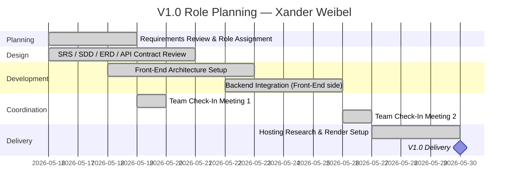

# Role Planning Report - Detail Design

### Reference Information (5 pts)

---

* **Role**: Back End Lead
* **Date**: 2026-05-30
* **Author**: Joe Tolley

* **Team Members**:

| Role | Team member name |
-- | --
| Product Owner | Xander Weibel |
| Scrum Master | Xander Weibel (adapted — we're using structured check-ins in place of formal sprint scrums, but still using the main elements) |
| Tech Lead (Front-End) | Xander Weibel |
| Tech Lead (Back-End) | Joseph  Tolley |
| Tech Lead (Database) | Haeji Na |
| Quality Assurance | Joshua Palmer |
| CM/DM | Joshua Palmer |

---

### Agile Tasking Information (10 pts)

* [**Epic Story**:](https://miro.com/app/board/uXjVHW1B9x4=/)
  As back end lead,
  I want to plan and execute the tasks associated with my roles for v2.0,
  so that the project can have traceable, quality assurance and due diligence to deliver a high quality MVP product. Finding an
  online home for our work is a big step forward in development. With the repo being private, our work has mostly been local to our
  own computers with fingers crossed it will work out. Now we can more closely align the needs of the app, find bugs, and implement
  all the features we want.

* **Story Point/Value**: 5

* **Planned Delivery**: v2.0 — Weeks 06–07

* **Schedule**:

* **Known Dependencies/Obstacles**:
  - Backend API must be stable before front-end integration can be completed
  - Having server online means a more complicated process of updating back-end
  - MySql, javascript, node, and flutter knowledge is needed
  - Sickness during this week
  - Multiple fronts of development make tasking difficult, one fix might break another
---

### Implementation (80 pts: 10 pts each)

Sub-Tasking has been divided amongst the group in the [miro board](https://miro.com/app/board/uXjVHW1B9x4=/?focusWidget=3458764670953758822)
and we have accomplished a roadmap of what we plan to do. Our next focus will be making a bare bones version that combines the FE, BE, and Database communication.
- [x] [Database hosted online -Joe](https://console.aiven.io/)
- [x] [Back-end hosted online - Joe](https://rxnow-backend-latest.onrender.com/)
- [x] Test plan v1 - Josh
- [x] Keeping the team in sync -Xander
- [x] Back-end tasking -Joe
- [X] Database structure and views - Haeji
- [x] Front-end tasking -Xander
- [x] Database tasking -Haeji
- [x] Quality Assurance tasking -Josh
- [x] API tasking -Josh

### Review (5 pts)
- [x] All elements of the form are filled out
    - [x] Reference
    - [x] Agile
    - [x] Implementation

- [x] Epic Story is created in the project's repo Issue
- [x] Sub stories are created as the project's [repo Issues](https://miro.com/app/board/uXjVHW1B9x4=/?focusWidget=3458764670953758822)
- [x] All stories/issues project attributes are filled out
- [x] Team members have reviewed the items
