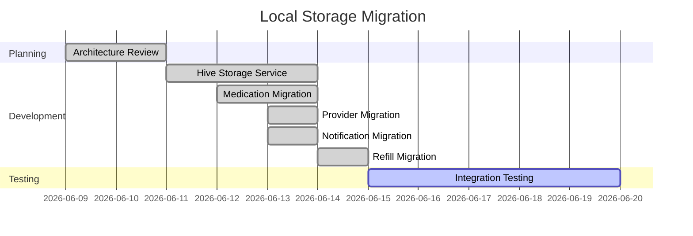
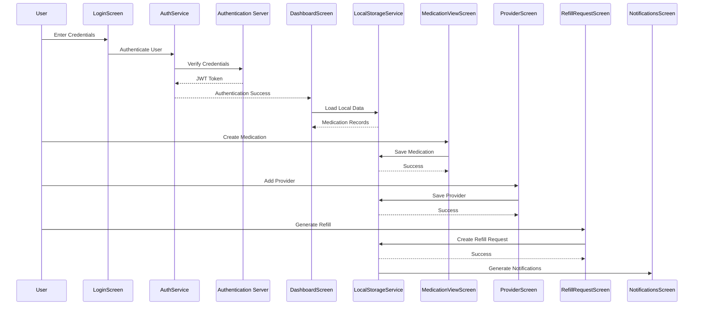
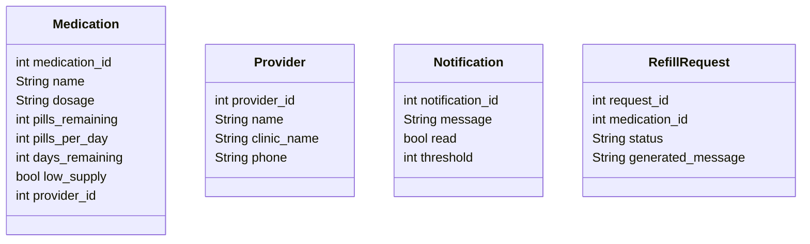
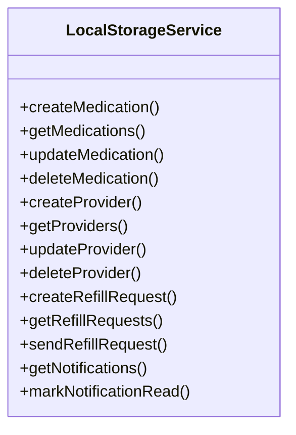
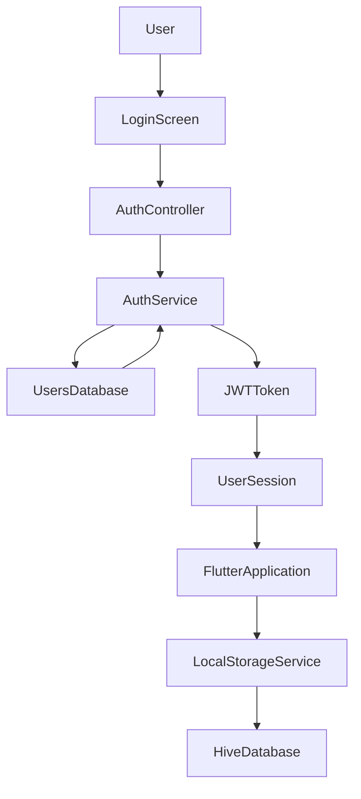
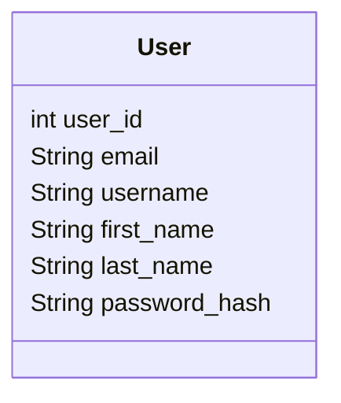
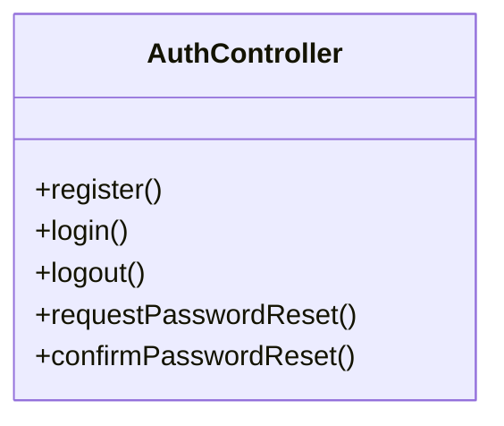
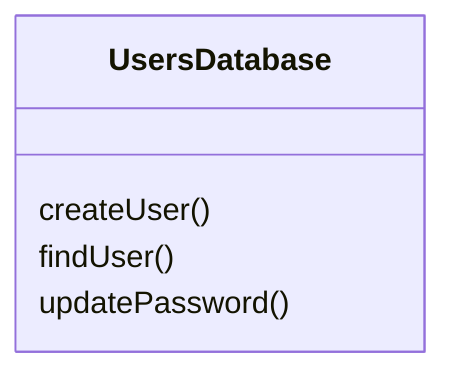
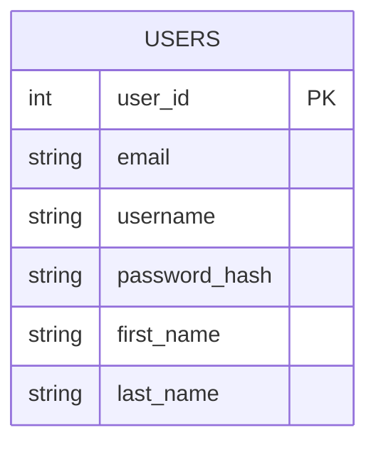
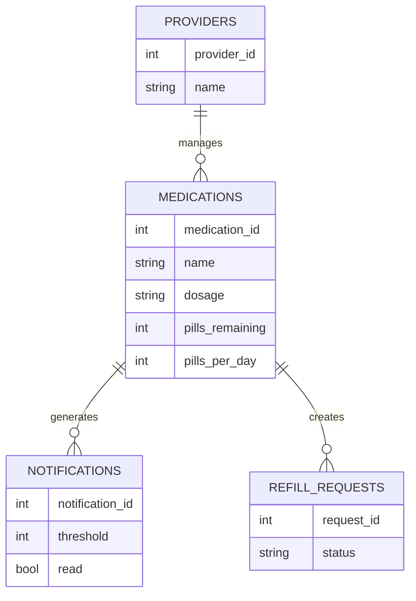

# Feature Planning Report - Detail Design

### Reference Information

---

* **Feature Title**: Local Data Storage Migration
* **Feature Number**: 04
* **Date**: June 20, 2026
* **Author**: Joe Tolley
* **Team Members**:

| Role                  | Team Member Name |
| --------------------- | ---------------- |
| Product Owner         | Xander Weibel    |
| Scrum Master          | Kelson Gneiting  |
| Tech Lead (Front-End) | Xander Weibel    |
| Tech Lead (Back-End)  | Joe Tolley       |
| Tech Lead (Database)  | Haeji Na         |    
| Quality Assurance     | Joshua Palmer    |
| CM/DM                 | Joshua Palmer    |
| Responsible Engineer  | Joe Tolley       |
| Responsible Engineer  | Haeji            |

---

### Traceability

---

* **Requirement Number (SRS Ref #)**:

  * FR6 – Create Medication
  * FR7 – Store Medication
  * FR8 – Update Medication
  * FR9 – Delete Medication
  * FR14 – Low Supply Monitoring
  * FR15 – Notification Generation
  * FR16 – Notification Viewing
  * FR17 – Refill Request Creation
  * FR18 – Provider Management
  * FR19 – Refill Request Workflow
  * FR20 – Refill Submission
  * FR21 – Refill Status Tracking
  * FR22 – Generated Refill Messages
  * FR23 – View Refill Requests

* **Design Number (SDD Ref #)**:

  * DD-07 Local Storage Architecture

* **Test Plan (TPD Ref #)**:

  * TP-07 Local Data Persistence Testing

* **User Document (Ref Section #)**:

  * User Guide Section 4.0 Medication Management

* **Installation Document (Ref #)**:

  * INST-03 Hive Local Database Setup

* **Software Developer Guide (Ref #)**:

  * SDG-05 Local Storage Services

---

### Agile Tasking Information

---

#### Epic Story

As an RxNow user,

I want my medication information stored locally on my device,

so that my healthcare information remains private and available even without internet access.

#### Value

* Increased privacy and security
* Offline application functionality
* Reduced cloud infrastructure requirements
* Simplified deployment architecture
* Improved performance by removing network dependency

#### Planned Delivery

Sprint 7

#### Schedule



#### Known Dependencies / Obstacles

* Hive initialization and configuration
* Flutter Secure Storage compatibility
* Migration from previous cloud APIs
* Testing local persistence across application restarts

#### GitHub

* **GitHub Issue Number**: #47
* **GitHub Branch**: update-providers
* **GitHub Project**: RxNow

---

# Detailed Design

## Front-End

### Workflow Description

The user authenticates through the login screen. Once authenticated, all medications, providers, notifications, and refill requests are stored and retrieved from local Hive storage rather than a cloud database.



### Agile Information

* **Story**:

  * Move patient data storage from cloud database to local Hive storage

* **Estimated Story Points**:

  * 13

* **Assigned Responsible Engineer**:

  * Joe Tolley

* **GitHub Issue Number**:

  * #47

---

### Classes

#### Model

##### UML Class



##### Code Location

```
lib/services/local_storage_service.dart
```

---

#### Control

##### UML Class



##### CRUD Functions

**Create**

* createMedication()
* createProvider()
* createRefillRequest()

**Read**

* getMedications()
* getProviders()
* getRefillRequests()
* getNotifications()

**Update**

* updateMedication()
* updateProvider()
* sendRefillRequest()
* markNotificationRead()

**Delete**

* deleteMedication()
* deleteProvider()

##### Code Location

```
lib/services/local_storage_service.dart
```

---

#### View

##### User Interface Screens

* DashboardScreen
* MedicationViewScreen
* AddEditMedicationScreen
* ProviderScreen
* RefillRequestScreen
* NotificationsScreen

##### CRUD Functions

**Create**

* Add Medication
* Add Provider
* Create Refill Request

**Read**

* View Medications
* View Providers
* View Notifications
* View Refills

**Update**

* Edit Medication
* Edit Provider
* Mark Notification Read

**Delete**

* Delete Medication
* Delete Provider

##### Code Location

```
lib/screens/
```

---

## Back-End

### Business Logic

The back-end was simplified to authentication-only services. Medication, provider, refill, and notification logic were migrated into Flutter local storage.



### Agile Information

* **Story**:

  * Reduce backend responsibilities to authentication only

* **Estimated Story Points**:

  * 5

* **Assigned Responsible Engineer**:

  * Joe Tolley

* **GitHub Issue Number**:

  * #48

---

### Classes

#### Models

##### UML Class



##### Code Location

```
src/controllers/authController.js
src/services/authService.js
```

---

#### Control

##### UML Class



##### CRUD Functions

**Create**

* register()

**Read**

* login()
* profile()

**Update**

* requestPasswordReset()
* confirmPasswordReset()

**Delete**

* logout()

##### Code Location

```
src/controllers/authController.js
```

---

#### View

##### Front-End API

**Create**

* POST /api/auth/register

**Read**

* POST /api/auth/login
* GET /api/auth/profile

**Update**

* POST /api/auth/password-reset/request
* POST /api/auth/password-reset/confirm

**Delete**

* POST /api/auth/logout

##### Code Location

```
src/routes/authRoutes.js
```

---

### Database Interface

Authentication Server Database



---

## Database

### Data Relationship Logic

The application now uses a hybrid architecture.

Only authentication information remains in the cloud database.

All healthcare information is stored locally on the user's device using Hive.



### Local Device Storage



### Agile Information

* **Story**:

  * Remove cloud dependency for patient healthcare information

* **Estimated Story Points**:

  * 8

* **Assigned Responsible Engineer**:

  * Joe Tolley

* **GitHub Issue Number**:

  * #49

---

### Classes

#### Models

**Cloud Database**

* USERS

**Local Hive Storage**

* MEDICATIONS
* PROVIDERS
* NOTIFICATIONS
* REFILL_REQUESTS

##### Code Location

```
Aiven Authentication Database

lib/services/local_storage_service.dart
```

---

#### Control

##### DBMS

**Create**

* Hive Box Initialization

**Read**

* Hive Box Queries

**Update**

* Hive Put Operations

**Delete**

* Hive Delete Operations

##### Code Location

```
lib/services/local_storage_service.dart
```

---

#### View

##### Back-End API / Queries

**Cloud Authentication Queries**

* Create User
* Authenticate User
* Update Password

**Local Storage Queries**

* Create Medication

* Read Medication

* Update Medication

* Delete Medication

* Create Provider

* Read Provider

* Update Provider

* Delete Provider

* Create Refill Request

* Read Refill Request

* Update Refill Request

* Read Notification

* Update Notification

##### Code Location

```
lib/services/local_storage_service.dart
src/controllers/authController.js
```

---

## Review

* [x] All elements of the form are filled out

  * [x] Reference
  * [x] Traceability
  * [x] Agile
  * [x] Detailed Design

* [x] Epic Story is created in the project repository

  * Issue Number: #47

* [x] Sub Stories are created

  * Issue Number 1 (Front-End): #47
  * Issue Number 2 (Back-End): #48
  * Issue Number 3 (Database): #49

* [x] All stories/issues project attributes are filled out

* [x] Team members have reviewed the items

---

## Summary

Feature 07 migrated RxNow from a cloud-centric architecture to a local-first architecture. Authentication remains online to support user account management and secure login. Medication records, providers, refill requests, and notifications are now stored locally using Hive, providing offline functionality, increased privacy, and reduced infrastructure complexity while maintaining future extensibility.
