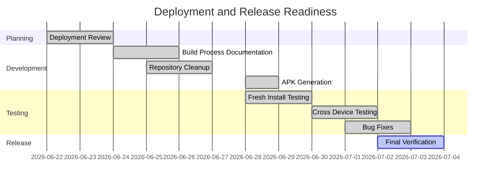
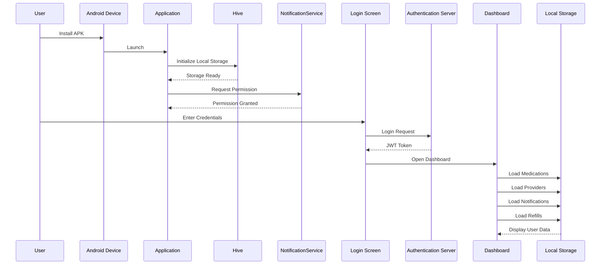
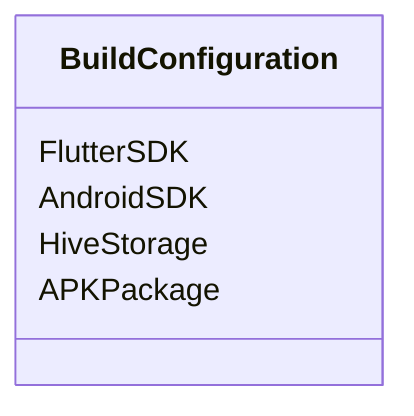
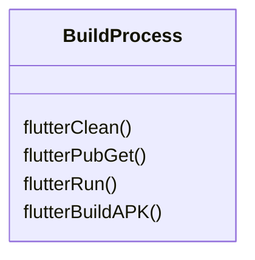
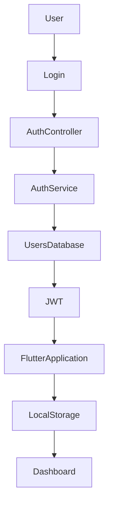
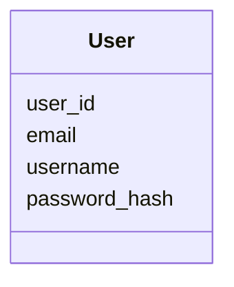
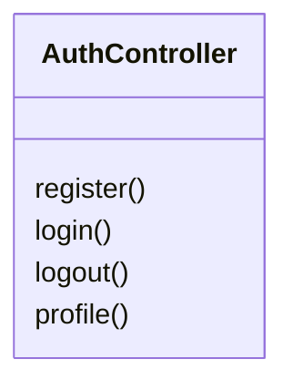
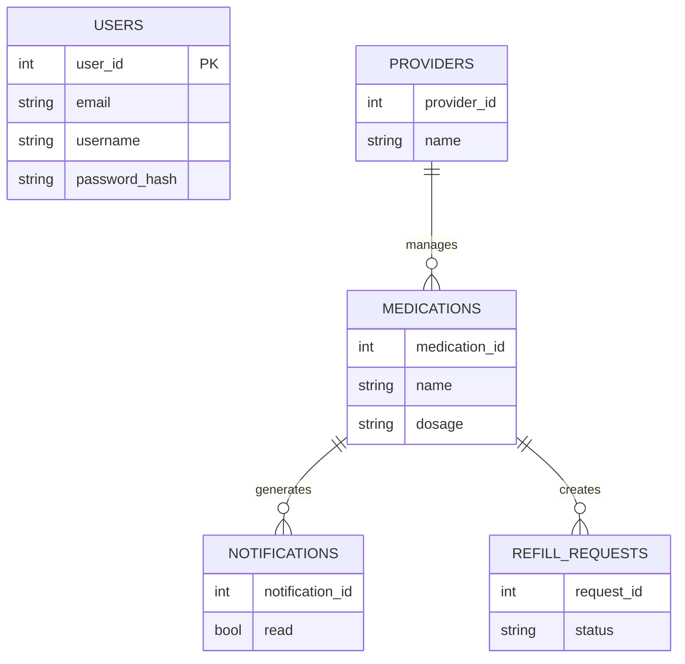

# Feature Planning Report - Deployment and Distribution

### Reference Information

---

* **Feature Title**: Application Distribution and Deployment Readiness
* **Feature Number**: 05
* **Date**: July 3, 2026
* **Author**: Joe Tolley
* **Team Members**:

| Role | Team Member Name |
| --------------------- | ---------------- |
| Product Owner | Xander Weibel |
| Scrum Master | Kelson Gneiting |
| Tech Lead (Front-End) | Xander Weibel |
| Tech Lead (Back-End) | Joe Tolley |
| Tech Lead (Database) | Haeji Na |
| Quality Assurance | Joshua Palmer |
| CM/DM | Joshua Palmer |
| Responsible Engineer | Joe Tolley |
| Responsible Engineer | Joshua Palmer |

---

# Traceability

---

### Requirement Number (SRS Ref #)[SRS](https://github.com/louisramos23/RXNOW/blob/main/Documents/SoftwareRequirementsSpecification.md)

* FR1 – User Authentication
* FR2 – User Registration
* FR6 – Create Medication
* FR7 – Store Medication
* FR8 – Update Medication
* FR9 – Delete Medication
* FR15 – Notification Generation
* FR16 – Notification Viewing
* FR17 – Refill Request Creation
* FR18 – Provider Management
* FR23 – View Refill Requests

### Design Number (SDD #)

*  [08-Deployment and Distribution](https://github.com/louisramos23/RXNOW/blob/main/Documents/SoftwareDesignDocumentSDD.md)

### Test Plan (TPD Ref #)

* [Test Plan](https://github.com/louisramos23/RXNOW/blob/main/Documents/RxNow-Test-Plan-v0.2.pdf)

### User Guide Document (Ref Section #) - In Progress

* [User Guide](https://github.com/louisramos23/RXNOW/tree/main/Documents)

### Installation Document (Ref #) - In Progress

* [Installation Guide](https://github.com/louisramos23/RXNOW/tree/main/Documents)

### Software Developer Guide (Ref #) - Not yet Begun

* [Software Developer Guide](https://github.com/byui-cse397/2026.2SprCSE397PCP/tree/Tolley_Wk11/product-example/delv/7.DevelopmentGuide)

---

# Agile Tasking Information

---

## Epic Story

As an RxNow developer,

I want a repeatable build, deployment, and installation process,

so that developers, instructors, and users can install and run the application consistently across Android devices.

---

## Value

* Standardized deployment process
* Easier onboarding for new developers
* Improved application stability
* Reduced installation errors
* Consistent release builds
* Improved project maintainability

---

## Planned Delivery

Sprint 8

---

## Schedule



---

## Known Dependencies / Obstacles

* Flutter SDK compatibility
* Android SDK versions
* Hive database initialization
* Git branch synchronization
* APK compatibility across Android devices

# Detailed Design

# Front-End

## Workflow Description

The application is distributed as an Android APK. Users install the application directly onto their device. Upon launch, the application initializes local storage, requests notification permissions, and presents the authentication screen. After successful authentication, locally stored healthcare data is loaded and the user is taken to the dashboard.



---

## Agile Information

### Story

Prepare the Flutter application for deployment and Android distribution.

### Estimated Story Points

8

### Assigned Responsible Engineer

Joe Tolley

---

## Classes

### Model



### Code Location

```
frontend/pubspec.yaml
frontend/android/
```

---

### Control



### Build Functions

**Create**

* flutter build apk

**Read**

* flutter pub get

**Update**

* flutter clean

**Execute**

* flutter run

### Code Location

```
Flutter CLI
```

---

### View

#### User Interface Screens

* Login Screen
* Dashboard
* Medication Screen
* Provider Screen
* Notifications Screen
* Refill Request Screen

---

# Back-End

## Business Logic

The backend continues to provide authentication services while deployment testing focused on validating compatibility with the Flutter application and resolving defects discovered during installation and integration testing.



---

## Agile Information

### Story

Stabilize authentication services and resolve issues discovered during deployment testing.

### Estimated Story Points

5

### Assigned Responsible Engineer

Joe Tolley

---

## Classes

### Models



### Code Location

```
src/controllers/authController.js
src/services/authService.js
```

---

### Control



### CRUD Functions

**Create**

* Register User

**Read**

* Login
* Profile

**Delete**

* Logout

---

### View

#### API Endpoints

* POST /api/auth/register
* POST /api/auth/login
* GET /api/auth/profile
* POST /api/auth/logout

---

# Database

## Data Relationship Logic

Healthcare information continues to reside within local Hive storage while authentication data remains in the cloud database. Deployment testing focused on validating successful initialization of local storage and persistence across application restarts.



---

## Agile Information

### Story

Validate local storage initialization and persistence during installation testing.

### Estimated Story Points

3

### Assigned Responsible Engineer

Joe Tolley

---

## Classes

### Models

**Cloud Database**

* USERS

**Local Hive Storage**

* MEDICATIONS
* PROVIDERS
* NOTIFICATIONS
* REFILL_REQUESTS

---

### Control

#### Deployment Validation

**Create**

* Initialize Hive Storage

**Read**

* Load User Data

**Update**

* Save Local Data

**Delete**

* Remove Local Data

---

### Code Location

```
lib/services/local_storage_service.dart
```

---

# Testing and Validation

## Deployment Testing

Completed testing included:

* Fresh repository clone
* Flutter dependency installation
* Android build verification
* APK generation
* APK installation on clean Android devices
* User registration
* User login
* Local Hive initialization
* Medication CRUD validation
* Provider CRUD validation
* Notification testing
* Refill workflow validation

---

## Build Process

The standardized installation procedure is:

```text
git pull

cd frontend

flutter clean

flutter pub get

flutter run
```

For distribution:

```text
flutter build apk
```

The generated APK is placed in the release directory and can be installed directly on Android devices for testing or demonstration.

---

## Major Contributions

### Deployment

* Standardized Flutter build process
* Created installation documentation
* Generated distributable Android APK
* Verified installation on multiple devices

### Debugging

* Resolved build configuration issues
* Assisted with provider creation bugs
* Assisted with refill workflow debugging
* Verified authentication functionality
* Validated local Hive initialization
* Tested fresh installations

### Configuration Management

* Repository cleanup
* Merge validation
* Updated .gitignore
* Verified project builds from a clean clone
* Assisted teammates with installation and deployment procedures

---

# Review

* [x] All elements of the form are filled out

  * [x] Reference
  * [x] Traceability
  * [x] Agile
  * [x] Detailed Design

* [x] Epic Story created

* [x] Sub Stories created
  * [x] Front-EndIssue (
  * [x] Back-End Issue (
  * [x] Database Issue
* [x] Project attributes completed

* [x] Team review completed

---

# Summary

Feature 05 focused on preparing RxNow for final deployment and distribution. Development efforts emphasized creating a repeatable build and installation process, producing a distributable Android APK, validating deployment on clean devices, and documenting installation procedures for both developers and end users. Additional effort was dedicated to debugging application behavior, resolving deployment-related issues, improving repository organization, and standardizing the development workflow. These activities resulted in a stable release candidate that can be consistently built, installed, tested, and demonstrated across multiple Android devices while providing a smoother onboarding experience for future developers.
