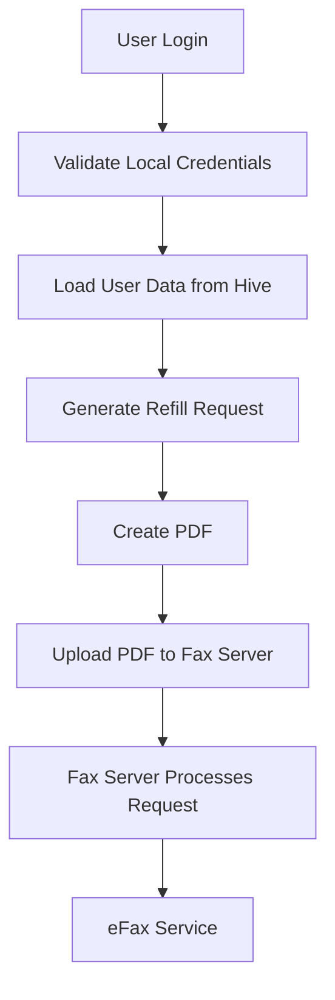

# Feature Planning Report - eFax Integration

### Reference Information
---

* **Feature Title**: Local Authentication, Fax Service Integration, and Deployment Finalization
* **Feature Number**: 05
* **Date**: 2026-07-15
* **Author**: Joseph Tolley
* **Team Members**:

| Role | Team Member |
| -- | -- |
| Product Owner | Xander Weibel |
| Scrum Master | Kelson Gneiting |
| Tech Lead (Front-End) | Xander Weibel |
| Tech Lead (Back-End) | Joseph Tolley |
| Tech Lead (Database) | Haejin Na |
| Quality Assurance | Joshua Palmer |
| CM/DM | Joshua Palmer |

This feature concludes the back-end work for the RxNow MVP. Earlier features transitioned the application away from a cloud database and toward an offline-first architecture. This feature focuses on completing the remaining back-end responsibilities by finalizing local authentication, implementing the refill request fax workflow, documenting deployment, and validating the completed architecture for delivery.

---

## Traceability

* **Requirement Number (SRS Ref #):**
  * FR02 – User Authentication
  * FR06 – Provider Management
  * FR07 – Medication Management
  * FR10 – Refill Requests
  * FR18 – Provider Association
  * FR24 – Pharmacy Association

* **Design Number (SDD Ref #):**
  * DD-04 Local Authentication
  * DD-05 Refill Request Processing
  * DD-08 Deployment and Distribution

* **Test Plan (TPD Ref #):**
  * TP-04 Authentication Testing
  * TP-07 Refill Request Generation
  * TP-08 Installation and Release Testing

* **User Document (Ref Section #):**
  * User Guide Sections 5.0–6.0

* **Installation Document (Ref #):**
  * INST-04 Android Installation Guide

* **Software Developer Guide (Ref #):**
  * SDG-06 Build and Deployment Process

---

## Agile Tasking Information

### Epic Story

As a user, I want to securely access my account, generate refill requests, and send those requests through the application without requiring manual document creation, so that managing prescriptions is quick and reliable.

### Value

This feature completes the remaining back-end work necessary for the MVP release. The application now supports fully local authentication, PDF refill request generation, communication with the fax service, and documented deployment for demonstration and future maintenance.

### Planned Delivery

**Version:** v5.0 (Final MVP)

### Known Dependencies / Obstacles

- Fax transmission requires a lightweight intermediary server to protect eFax credentials.
- Local authentication replaces the previous cloud implementation.

### GitHub

* **Branch:** `main`
* **Project:** RxNow MVP

---

# Detailed Design

## Back-End Design

### Workflow Description

The application now authenticates users locally and isolates each user's information on the device. Medication information is used to generate a refill request PDF which is transmitted to the fax server. The server receives the document and forwards it to the configured fax provider.



### Agile Information

**Story**

As the system, I need to authenticate users locally while securely forwarding refill requests through a backend service so that sensitive fax credentials are never exposed within the mobile application.

**Estimated Story Points:** 3

**Assigned Engineer:** Joseph Tolley

---

## Business Logic

The previous online authentication model was removed in favor of local storage. User credentials are validated against locally stored account information and each user maintains independent medication, provider, and pharmacy records.

When a refill request is submitted:

1. Medication and provider information are collected.
2. A PDF refill request is generated.
3. The PDF is uploaded to the fax server.
4. The server validates the request.
5. The server forwards the request using the protected eFax credentials.
6. A success or failure response is returned to the application.

This architecture separates sensitive third-party credentials from the mobile application while remaining simple enough for demonstration purposes.

---

## Deployment

Deployment documentation was completed to support both development and demonstration.

The finalized installation process includes:

- Clone the repository.
- Navigate to the Flutter frontend.
- Run:

```bash
flutter clean
flutter pub get
flutter run
```

For demonstration devices, a release APK can be distributed directly without requiring the recipient to build the application.
That APK has been added to the repository.
The fax server is deployed independently and communicates with the mobile application over HTTP.

---

## Validation

The following functionality has been verified:

- User registration
- User login
- Local authentication
- Medication management
- Provider management
- Pharmacy management
- PDF refill generation
- Communication with fax server
- Android installation process
- Release APK deployment

---

# Lessons Learned

Migrating from a traditional cloud backend to an offline-first architecture required redesigning several services while preserving the overall user experience. Separating fax transmission into its own lightweight server provided a cleaner architecture, improved security, and leaves room for future expansion into a production-ready backend.

Completing deployment documentation and installation guides also highlighted the importance of planning for software delivery in addition to software development.

---

# Review

- [x] All reference information completed
- [x] Traceability verified
- [x] Agile task information completed
- [x] Detailed design reviewed
- [x] Documentation updated
- [x] Installation guide completed
- [x] Test plan updated
- [x] Team review completed
- [x] Ready for final MVP delivery
