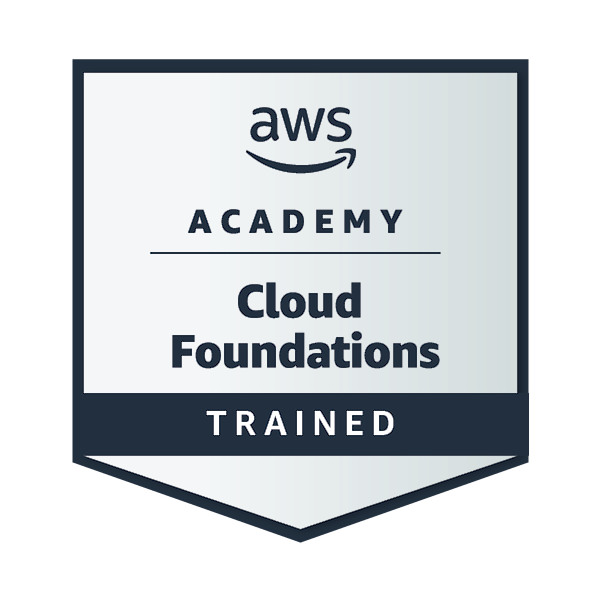

# AWS Academy Cloud Foundations

## Curriculum objectives

Upon completion of this course, students will be able to do the following:

- Define the AWS Cloud
- Explain the AWS pricing philosophy
- Identify the global infrastructure components of AWS
- Describe the security and compliance measures of the AWS Cloud, including AWS Identity and Access Management (IAM)
- Create a virtual private cloud (VPC) by using Amazon Virtual Private Cloud (Amazon VPC)
- Demonstrate when to use Amazon Elastic Compute Cloud (Amazon EC2), AWS Lambda, and AWS Elastic Beanstalk
- Differentiate between Amazon Simple Storage Service (Amazon S3), Amazon Elastic Block Store (Amazon EBS), Amazon Elastic File System (Amazon EFS), and Amazon Simple Storage Service Glacier (Amazon S3 Glacier)
- Demonstrate when to use AWS database services, including Amazon Relational Database Service (Amazon RDS), Amazon DynamoDB, Amazon Redshift, and Amazon Aurora
- Explain the architectural principles of the AWS Cloud
- Explore key concepts related to Elastic Load Balancing, Amazon CloudWatch, and Amazon EC2 Auto Scaling

## Duration

Approximately 20 hours, when delivered synchronously by an educator

## Table of Contents

- [x] Module 1: Cloud Concepts Overview -- Done
- [x] Module 2: Cloud Economics and Billing -- Done
- [x] Module 3: AWS Global Infrastructure -- Done
- [x] Module 4: Cloud Security -- Done
- [x] Module 5: Networking and Content Delivery --Done
- [x] Module 6: Compute --Done
- [x] Module 7: Storage --Done
- [x] Module 8: Databases --Done
- [x] Module 9: Cloud Architecture --Done
- [x] Module 10: Automatic Scaling and Monitoring --Done
- [x] AWS Finishing Finals: Course Assessment and Badge

## AWS Academy Graduate Badge

## Instructions
* Complete all AWS Modules, upon finishinig the final and recieving the badge, create a pdf of the badge.
* Put this file in your artifacts/project/staffing dossier directory.
* Link it to your dossier md file. 
* Add a table entry to artifacts/training/certifications/AWSTraining/Readme.md
