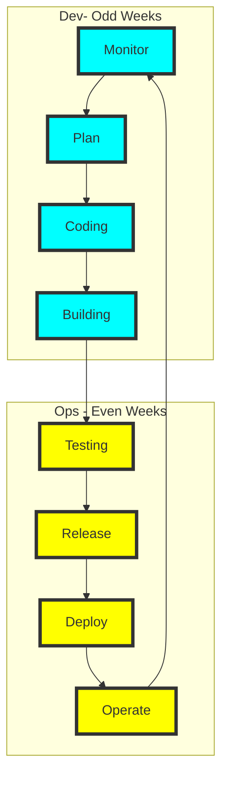

# Software Methodologies
**From Waterfall to DevOps** 

## Overview
Software methodologies have evolved over the last 50 years. 
* The first methodology was nicknamed, Waterfall, that outline different software phases that were connected in a series of deliverable. We now refer to this as the software lifecycle phases: Concept of Operation, Requirements, Design, Implementation, Test, and Delivery.
* The next note worth methodology was spiral that introduce objective planning, risk mitigation and iterative process to the development
* The next was agile, that is a bit more holistic but heavy on the ownership and commitments of the software team and interactive role with the customer. Stories play a huge role in the task management.
* The current is DevOps which is link Waterfall with multiple phases, and Spiral with multiple interactions, and agile as customer oriented and small tasking stories.

As part of this project students will use the 8 phases in DevOps to deliver multiple iterations of the customer's problem product solution package. 

During a two week period student teams will deliver iterations of the product based on the SRS and SDD documents starting on Week 4.

### DevOps Phases
* **Plan**: Goal: Align on goals, priorities, and project scope
* **Develop**: Ensure high-quality, maintainable code is being written
* **Build**: Confirm the application is being built consistently and reliably
* **Test**: Verify the application's functionality, stability, and security.
* **Release**: Ensure readiness and coordination for safe deployment
* **Deploy**: Deploy the application reliably with minimal downtime
* **Operate**: Ensure the system is stable, scalable, and performant
* **Monitor**: Gain insights into system behavior, user experience, and app health.

### Iteration Tasks/Review/Checklists:
* **Week Odd**: Monitor, Plan, Code and Build
* **Week Even**: Test, Release, Deploy, and Operate

Each week, teams will meet execute each phases of DevOps

## Even Week Checklist
The following files should be saved in this, the class's, and the project's repo.
**Even Checklist** covers: Monitor, Plan, Code and Build phases
* Use the [TemplateEvenWkDevOpsChecklist.md](./TemplateEvenWkDevOpsChecklist.md) to verify that all information is complete for the Code.
* Save your copy of the template as \<Team Name>EvenWkDevOpsChecklist.md, in this directory. 
* Add a link to your summary in the list below:

## Odd Week Checklist
The following files should be save in this, the class's, and the project's repo.
**Odd Checklist** covers: Test, Release, Deploy, and Operate
* Use the [TemplateOddWkDevOpsChecklist.md](./TemplateOddWkDevOpsChecklist.md) to verify that all information is complete for the Code.
* Save your copy of the template as \<Team Name>OddWkDevOpsChecklist.md, in this directory. 
* Add a link to your summary in the list below:

## **Odd Checklist** 
Covers: Monitor, Plan, Code and Build phases
* **Week05:** 
* **Week07**
* **Week09**
* **Week11**
* **Week13**

## Even Checklist
Covers: Test, Release, Deploy, and Operate
* **Week04:**
* **Week06**
* **Week08**
* **Week10**
* **Week12**
* **Week14**
