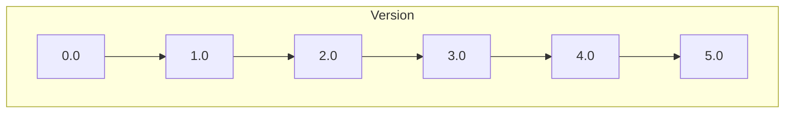
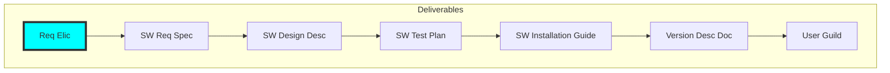

# Version Development Plan

## Version Overview

| Version | Milestone Week | Focus                               |
| ------- | -------------- | ----------------------------------- |
| 0.0     | Week 03        | Requirements                        |
| 1.0     | Week 05        | Architecture & Initial Build        |
| 2.0     | Week 07        | Testing & DevOps Cycle Introduction |
| 3.0     | Week 09        | Deployment & Installation           |
| 4.0     | Week 11        | User Experience & Documentation     |
| 5.0     | Week 13        | Quality & Process Maturity          |
| 6.0     | Week 14        | Final Delivery                      |

**Major Deliverables**

---

# Version 0.0 — Requirements Foundation

### Research

* Included in **Requirements Elicitation**

### Schedule

* Week 01: Team and Project Formation
* Week 02: Requirements Elicitation
* Week 03: Requirements Documentation

### Milestone

* **Week 03 Delivery 0.0**

### Branch

* `development_Wk03Delv0.0`

### Deliverables

* Requirements Elicitation Document
* Software Requirements Specification (SRS)
* Version Description Document (VDD) – Delivery 0.0

---

# Version 1.0 — Architecture & Initial Product

### Research

* Week 05: Software Architecture

### Schedule

* Week 04: Design Documentation
* Week 05: Plan, Develop, Build

### Milestone

* **Week 05 Delivery 1.0**

### Branch

* `development_Wk05Delv1.0`

### Deliverables

* Software Design Document (SDD)
* Version Description Document (VDD) – Delivery 1.0
* Product Package – Version 1

---

# Version 2.0 — DevOps Cycle Introduction

### Research

* Week 07: Software Lifecycles and Methodologies

### Schedule

* Week 06: Test, Release, Deploy, Operate
* Week 07: Monitor, Plan, Develop, Build

### Milestone

* **Week 07 Delivery 2.0**

### Branch

* `development_Wk07Delv2.0`

### Deliverables

* Software Test Plan
* Version Description Document (VDD) – Delivery 2.0
* Product Package – Version 2

---

# Version 3.0 — Deployment & Installation

### Research

* Week 09: Software Concepts

### Schedule

* Week 08: Test, Release, Deploy, Operate
* Week 09: Monitor, Plan, Develop, Build

### Milestone

* **Week 09 Delivery 3.0**

### Branch

* `development_Wk09Delv3.0`

### Deliverables

* Software Installation Plan
* Version Description Document (VDD) – Delivery 3.0
* Product Package – Version 3

---

# Version 4.0 — User Experience & Documentation

### Research

* Week 11: Networking

### Schedule

* Week 10: Test, Release, Deploy, Operate
* Week 11: Monitor, Plan, Develop, Build

### Milestone

* **Week 11 Delivery 4.0**

### Branch

* `development_Wk11Delv4.0`

### Deliverables

* Software User Manual
* Version Description Document (VDD) – Delivery 4.0
* Product Package – Version 4

---

# Version 5.0 — Quality & Process Maturity

### Research

* Week 13: Quality Assurance

### Schedule

* Week 12: Test, Release, Deploy, Operate
* Week 13: Monitor, Plan, Develop, Build

### Milestone

* **Week 13 Delivery 5.0**

### Branch

* `development_Wk13Delv5.0`

### Deliverables

* Software Development Guide
* Version Description Document (VDD) – Delivery 5.0
* Product Package – Version 5

---

#  Version 6.0 — Final Delivery

### Schedule

* Week 14: Final Report & Presentation

### Milestone

* **Week 14 Delivery 6.0**

### Branch

* `development_Wk14Delv6.0`

### Deliverables

* Final Version Description Document (VDD) – Delivery 6.0
* Final Product Package – Version 6
* Product Presentation

---

#  Notes for Students

* Each version represents a **complete DevOps cycle iteration**
* Every delivery must include:

  * Updated documentation
  * Working product increment
  * Versioned package
* Branch names must match the required naming convention
* Previous functionality must remain operational (no regressions)

---
