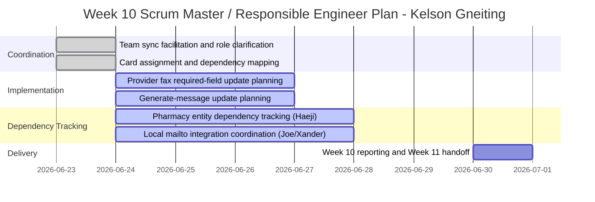

# Role Planning Report - Detail Design

### Reference Information (5 pts)

---
* **Role**: Scrum Master / Responsible Engineer
* **Date**: 2026-06-30
* **Author**: Kelson Gneiting

* **Team Members**: 

| Role | Team member name|
-- | --
| Product Owner | Xander Weibel |
| Scrum Master | Kelson Gneiting |
| Tech Lead (Front-End) | Xander Weibel |
| Tech Lead (Back-End) | Joseph Tolley |
| Tech Lead (Database) | Haeji Na |
| Quality Assurance | Joshua Palmer | 
| CM/DM | Joshua Palmer | 
| Responsible Engineer | Kelson Gneiting | 

----
### Agile Tasking Information (10 pts)
* **Epic Story**:
  As Scrum Master and Responsible Engineer,
  I want to coordinate team sequencing and complete assigned implementation updates for Week 10,
  so that the RxNow MVP remains aligned with client direction for local storage, refill workflow quality, and provider/pharmacy data requirements.

* **Story Point/Value**: 5

* **Planned Delivery**: Week 10 to Week 11 transition (v4.0 delivery preparation)

* **Schedule**:

* **Known Dependencies/Obstacles**: 
  - Generate-message update depends on Pharmacy entity details being finalized first.
  - Provider fax field must be required before finalizing refill send flow acceptance criteria.
  - mailto integration work is cross-role and must align with Joe's URI schema implementation.
  - SRS/ERD/openapi documentation still needs reconciliation with local architecture and new Pharmacy scope.
  - Local auth pivot is still in planning and may affect data flow assumptions in validation/testing.

* **GitHub**
    * **GitHub Issue Number**: #167 (primary assigned implementation) + team cards from June 23 Kanban sync
    * **GitHub Branch**: gneitblood/Kelson
    * **GitHub Project**: RXNow MVP

### Implementation (80 pts: 10 pts each)
Sub-Tasking
- [x] (1) Plan Tasking: #165_Scope full-local auth architecture pivot
    * Description: Coordinated with the team to sequence role-level work around the client-approved local-only direction and identify where implementation assumptions may change.
    * Story Points: 3
- [x] (2) Code Tasking: #167_Make Provider fax required and support generate-message updates
    * Description: Owned Scrum-side sequencing and Responsible Engineer execution planning for required fax validation and refill message content updates dependent on Pharmacy details.
    * Story Points: 5
- [x] (3) Build Tasking: #166_Pharmacy entity and repository dependency alignment
    * Description: Coordinated build order so Pharmacy model/repository changes land before final generate-message behavior is closed.
    * Story Points: 3
- [x] (4) Test Tasking: Team QA validation for refill workflow requirements
    * Description: Defined validation targets for no-error refill flow, required provider fax, and message output quality before client testing.
    * Story Points: 3
- [x] (5) Release Tasking: #168_SRS/ERD/openapi reconciliation support
    * Description: Captured documentation deltas from implementation and handed them forward for release-level document updates.
    * Story Points: 2
- [x] (6) Deploy Tasking: User installation guide handoff tracking
    * Description: Coordinated with teammates on end-user installation support tasks so reporting and delivery notes reflect current app setup expectations.
    * Story Points: 2
- [x] (7) Operate Tasking: June 23 team sync facilitation
    * Description: Facilitated coordination, clarified Scrum Master responsibilities, and aligned owners/dependencies across the week's cards.
    * Story Points: 2
- [x] (8) Monitor Tasking: Dependency and blocker monitoring for Week 11 handoff
    * Description: Tracked open dependencies (Pharmacy timeline, mailto integration, documentation alignment) and surfaced sequencing risks for next-week planning.
    * Story Points: 3

---
# Reference Material

---
### Reference
---
* [Role Responsiblity Breakdown](./rolePlanningReference.md)
* [Version Planning](./versionPlanning.md)
* [Software Lifecycle](../../engineering/practices/SWLifecycle/Readme.md)
* [DevOps](../../engineering/practices/Methodologies/Readme.md)

### Review (5 pts)
- [x] All elements of the form are filled out
    - [x] Reference 
    - [x] Agile
    - [x] Implementation

- [x] Epic Story is created in the project's repo Issue
    * Issue Number (Reference): #167 (primary assignment) with linked team Kanban cards from Week 10 sync
- [x] Sub stories are created as the project's repo Issues
    * Issue Number1 (Plan): #165
    * Issue Number2 (Code): #167
    * Issue Number3 (Build): #166
    * Issue Number4 (Test): Team QA checklist tasking
    * Issue Number5 (Release): #168
    * Issue Number6 (Deploy): Installation guide tracking card
    * Issue Number7 (Operate): June 23 team sync card
    * Issue Number8 (Monitor): Week 11 dependency tracking card
- [x] All stories/issues project attributes are filled out
- [x] Team members have reviewed the items
