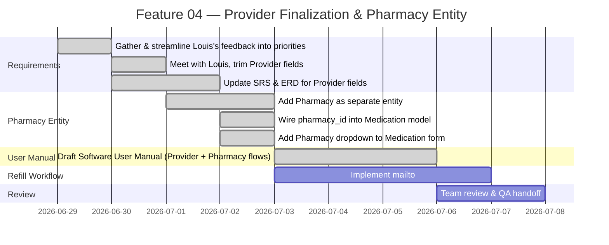
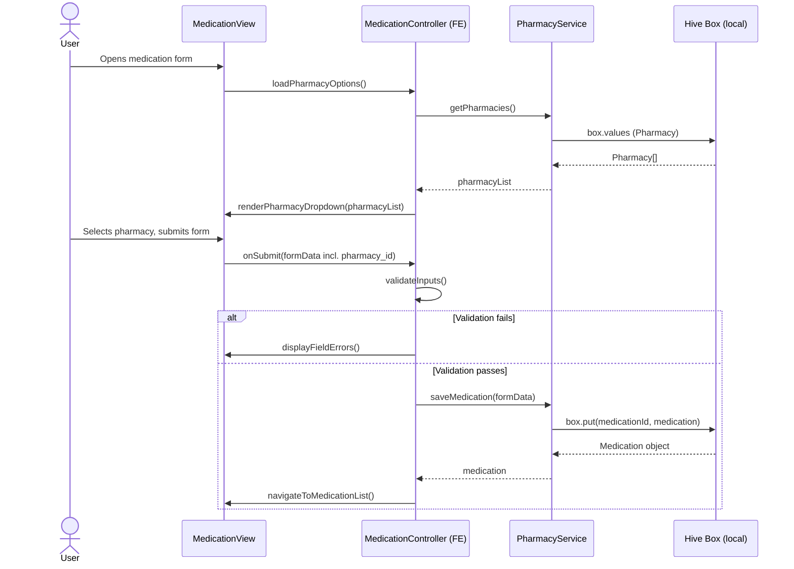
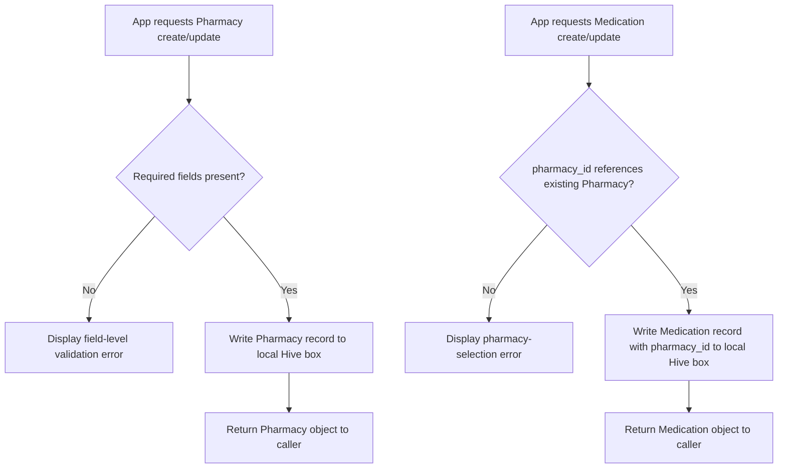
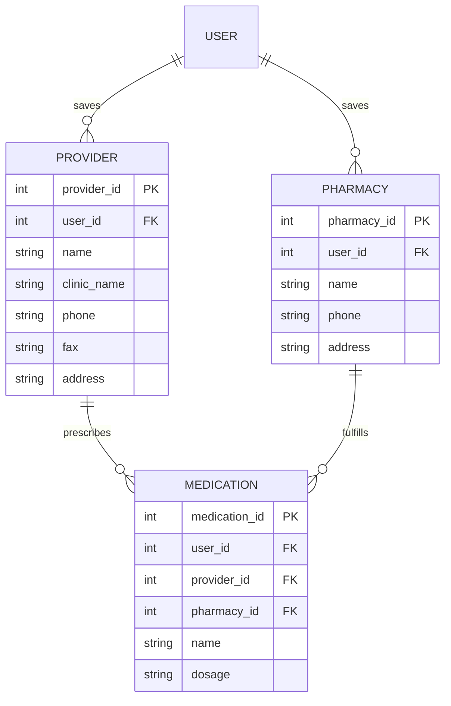

# Feature Planning Report - Detail Design

### Reference Information (10 pts)
---
* **Feature Title**: Provider Field Finalization, Pharmacy Entity Addition & Local-Storage Architecture Confirmation
* **Feature Number**: 04
* **Date**: 2026-07-03
* **Author**: Kelson Gneiting
* **Team Members**: Haejin Na, Joshua Palmer, Joseph Tolley, Xander Weibel, Kelson Gneiting

| Role | Team member name|
-- | --
| Product Owner | Xander Weibel |
| Scrum Master | Kelson Gneiting |
| Tech Lead (Front-End) | Xander Weibel |
| Tech Lead (Back-End/Local Auth) | Joseph Tolley |
| Tech Lead (Local Storage) | Haejin Na |
| Quality Assurance | Joshua Palmer |
| CM/DM | Joshua Palmer |

**Supersedes**: Feature 03 (Provider Schema Migration to Local Storage, Week 09). This feature closes the open architecture question left by Feature 03 and the June 27 decision log — **local Hive storage is now confirmed as the intentional MVP architecture, not drift** — and builds on it. The Provider field set is finalized to Louis's trimmed specification, fax becomes a required field, and a new Pharmacy entity is introduced alongside its wiring into the Medication model and form. The software User Manual (Kelson's individual deliverable this sprint) supports this feature cycle by documenting the updated Provider and new Pharmacy flows for end users.


----
### Traceability (10 pts)
* **Requirement Number** (SRS Ref #): FR18 (Provider Association, fields updated); Pharmacy requirement — *number pending SRS revision*; DB1–DB9 (revised for Pharmacy + Provider field changes); IR5 (native mail app refill flow); SA1, SA2, SA4; DC1, DC2, DC3
* **Design Number** (SDD Ref #): SDD Section 4 (Back-End Design) and Section 6 (Database Design) — being rewritten to describe local Hive architecture as authoritative; Component C2 (Medication Management) — extended to reference Pharmacy
* **Test Plan** (TPD Ref #): FR18 (Verification Mapping — Demonstration, Inspection; Unit, Integration, System — local equivalents); new test cases pending for Pharmacy entity and fax-required validation
* **User Document** (Ref Section #): SRS Section 3.1 (FR18), Section 3.5 (DB2, DB3) — updated this week; **Software User Manual** — authored by Kelson Gneiting this sprint, covering updated Provider and new Pharmacy flows
* **Installation Document** (Ref #): VDD 3.0 / Louis Installation Guide — unchanged, local Flutter build only
* **Software Developer Guide** (Ref #): `openapi.yaml` `/providers` endpoints remain historical/reference only; ERD (`EntityRelationshipDiagram.md`) updated this week for revised Provider fields and new Pharmacy entity

----
### Agile Tasking Information (10 pts)
* **Epic Story**:
  As a patient user,
  I want my provider and pharmacy contact details, trimmed to what Louis actually needs, saved on my device and linked to my medications,
  so that I can generate a complete refill request — addressed to the right pharmacy — without an internet connection or server, and without re-entering information I've already saved.

* **Value**: Resolves the architecture ambiguity from the June 27 decision log by confirming local-only storage as intentional. Finalizing the Provider field set against Louis's feedback reduces form churn. Adding Pharmacy as its own entity is a prerequisite for the `mailto:` refill workflow. The User Manual documents these changes so end users can operate the updated flows without developer support.

* **Planned Delivery**: v3.1 — Week 11 (Requirements Alignment & Pharmacy Entity cycle)

* **Schedule**:


* **Known Dependencies / Obstacles**:
  - Local-vs-backend architecture question resolved: **local Hive storage stands**.
  - Fax number is now a **required** field on the Provider form — changes validation across Front-End and Local Storage layers.
  - Pharmacy is a new entity stored in its own local Hive box; Medication now carries a `pharmacy_id` foreign key.
  - User Manual must reflect both the updated Provider fields and new Pharmacy screens before QA handoff.
  - `mailto:` integration is in progress and carries into Week 12; User Manual will need a final update once that flow is complete.

* **GitHub**:
  * **GitHub Issue Number**: [RxNOW Kanban Board - Miro](https://miro.com/app/board/uXjVHW1B9x4=/?share_link_id=2185336987)
    * **GitHub Branch**: `feature/04`
    * **GitHub Project**: RXNow MVP
  * **Issue Board Link**: [RxNOW Kanban Board - Miro](https://miro.com/app/board/uXjVHW1B9x4=/?share_link_id=2185336987)


---
## Detailed Design
---

### Front-End (20 pts)

**Workflow Description**:
The Provider form is updated to reflect Louis's trimmed field set and the now-required fax number. A new Pharmacy form and list screen follow the same pattern as Provider. The Medication form gains a Pharmacy picker so a medication can be associated with a pharmacy at creation or edit time. The **Software User Manual** (Kelson's deliverable) documents all three updated flows — Provider edit, Pharmacy add/edit, and Medication pharmacy selection — for end users.



- Agile Info:
    - Story: As a user, I want to pick a saved pharmacy when adding or editing a medication, and find clear instructions in the User Manual, so my refill requests know where to go.
    - Est Story Points: 3 (2 Xander FE + 1 Kelson User Manual)
    - Assigned Responsible Engineer: Xander Weibel (FE implementation); Kelson Gneiting (User Manual)
    - GitHub Issue Number: (see Kanban board)

**Classes**:
* **Model**:
    * **UML Class**:
        ```mermaid
        classDiagram
          class ProviderModel {
            +int provider_id
            +int user_id
            +string name
            +string clinic_name
            +string phone
            +string fax
            +string address
          }
          class PharmacyModel {
            +int pharmacy_id
            +int user_id
            +string name
            +string phone
            +string address
          }
          class MedicationModel {
            +int medication_id
            +int user_id
            +int provider_id
            +int pharmacy_id
            +string name
            +string dosage
          }
          MedicationModel --> ProviderModel
          MedicationModel --> PharmacyModel
        ```
    * ***Code Location***: `src/models/ProviderModel.ts`; `src/models/PharmacyModel.ts` (new); `src/models/MedicationModel.ts` (adds `pharmacy_id`)

* **Control**:
    * **UML Class**:
        ```mermaid
        classDiagram
          class PharmacyController {
            +validateInputs(formData) bool
            +navigateToPharmacyList() void
            +renderPharmacyPicker(list) void
          }
        ```
    * **Create** (Function name): `processCreatePharmacy(formData)`
    * **Read** (Function name): `processGetPharmacies()`
    * **Update** (Function name): `processUpdatePharmacy(pharmacyId, formData)`
    * **Delete** (Function name): `processDeletePharmacy(pharmacyId)`
    * ***Code Location***: `src/controllers/PharmacyController.ts` (new, mirrors `ProviderController.ts`)

* **View** (UML Class):
    * **User Interface**:
        * **Create** (Function name): `renderPharmacyForm()`
        * **Read** (Function name): `renderPharmacyList()`
        * **Update** (Function name): `renderPharmacyEditForm(pharmacy)`
        * **Delete** (Function name): N/A — handled via list action
        * ***Code Location***: `src/views/PharmacyView.tsx` (new); `src/views/MedicationView.tsx` (updated for dropdown)
    * **Back Interface** (UML Class):
        * **Create** (Function name): `savePharmacy(formData)` → `Hive box.put()`
        * **Read** (Function name): `getPharmacies()` → `Hive box.values`
        * **Update** (Function name): `updatePharmacy(id, formData)` → `Hive box.put(id, updated)`
        * **Delete** (Function name): `deletePharmacy(id)` → `Hive box.delete(id)`
        * ***Code Location***: `src/services/PharmacyService.ts` (new)

---

### Back-End / Local Storage (20 pts)

* **Business Logic**:


- Agile Info:
    - Story: As the system, I need to store Pharmacy records and validate that Medications reference a real Pharmacy, so refill requests resolve to a valid destination without a server.
    - Est Story Points: 2
    - Assigned Responsible Engineer: Joseph Tolley
    - GitHub Issue Number: (see Kanban board)

**Classes**:
* **Models**:
    * **UML Class**:
        ```mermaid
        classDiagram
          class Pharmacy {
            +int pharmacy_id
            +int user_id
            +string name
            +string phone
            +string address
          }
        ```
    * ***Code Location***: `lib/models/pharmacy.dart` (new Hive `@HiveType` model, mirrors `lib/models/provider.dart`)

* **Control**:
    * **UML Class**:
        ```mermaid
        classDiagram
          class PharmacyController {
            +createPharmacy(userId, data) Pharmacy
            +getPharmacies(userId) Pharmacy[]
            +updatePharmacy(pharmacyId, data) Pharmacy
            +deletePharmacy(pharmacyId) void
          }
        ```
    * **Create** (Function name): `createPharmacy(userId, data)`
    * **Read** (Function name): `getPharmacies(userId)`
    * **Update** (Function name): `updatePharmacy(pharmacyId, data)`
    * **Delete** (Function name): `deletePharmacy(pharmacyId)`
    * ***Code Location***: `lib/controllers/pharmacy_controller.dart` (new)

* **View** (local data interface):
    * **Front-End API**:
        * **Create** (Function name): `PharmacyRepository.insert(userId, data)`
        * **Read** (Function name): `PharmacyRepository.findByUser(userId)`
        * **Update** (Function name): `PharmacyRepository.update(pharmacyId, data)`
        * **Delete** (Function name): `PharmacyRepository.delete(pharmacyId)`
        * ***Code Location***: `lib/repositories/pharmacy_repository.dart` — wraps the Hive box; no REST layer
    * **Database Interface** (UML Class): N/A — this project uses local Hive storage, not a traditional DBMS. All data persistence is handled through the repository layer above.
        * ***Code Location***: `lib/repositories/pharmacy_repository.dart`

---

### Local Storage / Database (20 pts)

* **Data Relationship Logic**:


- Agile Info:
    - Story: As the system, I need a local Pharmacy store linked to Medication, so refill requests can be addressed to the correct pharmacy without any network dependency.
    - Est Story Points: 2
    - Assigned Responsible Engineer: Haejin Na
    - GitHub Issue Number: (see Kanban board)

**Classes**:
* **Models** (Hive Box Descriptions):
    * `PHARMACY` box — stores pharmacy contact records scoped per local account. `name`, `phone`, and `address` are required.
    * `PROVIDER` box — field set finalized this week: `name`, `clinic_name`, `phone`, `fax`, `address` all required (fax moved from nullable to required).
    * `MEDICATION` box — updated to store `pharmacy_id` alongside the existing `provider_id`.
    * ***Code Location***: `lib/models/pharmacy.dart` (new); `lib/models/provider.dart` (fax validation updated); `lib/models/medication.dart` (adds `pharmacy_id`)

* **Control** (Hive Operations):
    * **Create** (Function name): `box.put(pharmacyId, pharmacy)`
    * **Read** (Function name): `box.values` / `box.get(pharmacyId)`
    * **Update** (Function name): `box.put(pharmacyId, updatedPharmacy)`
    * **Delete** (Function name): `box.delete(pharmacyId)`
    * ***Code Location***: `lib/repositories/pharmacy_repository.dart`

* **View** (Local Data Access):
    * **Back-End API/Queries**:
        * **Create** (Function name): `PharmacyRepository.insert()`
        * **Read** (Function name): `PharmacyRepository.findByUser()`
        * **Update** (Function name): `PharmacyRepository.update()`
        * **Delete** (Function name): `PharmacyRepository.delete()`
        * ***Code Location***: `lib/repositories/pharmacy_repository.dart`

---
### Review (10 pts)
- [ ] All elements of the form are filled out
    - [x] Reference
    - [x] Traceability
    - [x] Agile
    - [x] Detailed Design
- [ ] Epic Story is created in the project's repo Issue
    * Issue Number (Reference): [RxNOW Kanban Board - Miro](https://miro.com/app/board/uXjVHW1B9x4=/?share_link_id=2185336987)
- [ ] Sub stories are created as the project's repo Issues
    * Issue Number 1 (Front-End — Pharmacy dropdown/form + User Manual):
    * Issue Number 2 (Back-End/Local Storage — Pharmacy entity, fax required):
    * Issue Number 3 (Refill Workflow — mailto: integration, carried):
- [ ] All stories/issues project attributes are filled out
- [ ] Team members have reviewed the items
