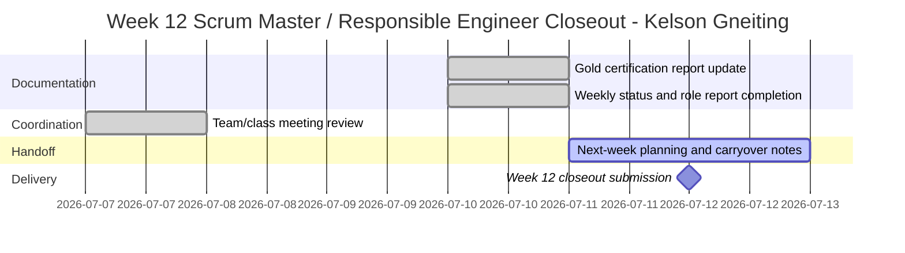

# Role Planning Report - Detail Design

### Reference Information (5 pts)

---

* **Role**: Scrum Master / Responsible Engineer
* **Date**: 2026-07-12
* **Author**: Kelson Gneiting

* **Team Members**:

| Role | Team member name |
| Product Owner | Xander Weibel |
| Scrum Master | Kelson Gneiting |
| Tech Lead (Front-End) | Xander Weibel |
| Tech Lead (Back-End) | Joseph Tolley |
| Tech Lead (Database) | Haeji Na |
| Quality Assurance | Joshua Palmer |
| CM/DM | Joshua Palmer |
| Responsible Engineer | Kelson Gneiting |
| Responsible Engineer | Haeji Na |

---

### Agile Tasking Information

* **Epic Story**:
    As Scrum Master and Responsible Engineer,
    I want to close out Week 12 documentation, verify certification and meeting evidence, and prepare the next-week handoff,
    so that the team can finish the semester with clear status, traceable artifacts, and no missing deliverables.

* **Story Point/Value**: 3

* **Planned Delivery**: Week 12 closeout / v4.0 UX & Docs handoff

* **Schedule**:

* **Known Dependancies/Obstacles**:
    - Gold and Silver certification evidence needed to be updated together so the status summary stays consistent.
    - Week 13 planning will need whatever carryover items remain after the final handoff.

* **GitHub Issue Number**: N/A (week 12 closeout artifact)
* **GitHub Branch**: gneitblood/Kelson

### Implementation (80 pts: 10 pts each)

For this closeout, the week 12 work centered on the two kanban issues that were completed and documented here:

- [x] **(1) Code Tasking:** Updated the refill workflow so requests clearly route to the provider, are labeled as requests, and treat the required items as non-optional.
    * Description: Adjusted the workflow wording and handling so the user-facing action reads as a request sent to the provider, not a generic send action, and ensured the required fields/items are treated as required throughout the flow.
    * Story Points: 3

- [x] **(2) Build Tasking:** Fixed text overflow handling for app descriptions and other long text fields.
    * Description: Added cutoff behavior so long descriptions do not run past the layout bounds when displayed in the app, keeping the UI readable across fields with long user-entered content.
    * Story Points: 2

- [x] **(3) Documentation Tasking:** Updated the Week 12 role report and weekly status to match the completed work.
    * Description: Reflected the completed kanban issues, the current closeout status, and the updated certification evidence in the submitted reports.
    * Story Points: 2

- [x] **(4) Test Tasking:** Report review pass.
    * Story Points: 2

- [x] **(5) Coordination Tasking:** Recorded the class and team meeting evidence used in the closeout.
    * Description: Kept the meeting links aligned with the Week 12 submission package.
    * Story Points: 2

- [x] **(6) Handoff Tasking:** Prepared the remaining carryover notes for Week 13.
    * Description: Left the next-week planning items in place so the team could continue without losing the closeout context.
    * Story Points: 2

- [x] **(7) Certification Tasking:** Updated the Gold certification report with the completed badge and appointment evidence.
    * Description: Added the Gold badge link, Silver badge link, and Handshake appointment link so the career readiness report is complete and current.
    * Story Points: 2

- [x] **(8) Status Tasking:** Finalized the weekly status submission content.
    * Description: Made the weekly status reflect the completed work, the two kanban issues, and the submission-ready closeout state.
    * Story Points: 2

---

### Reference Material

### Reference
* [Role Responsiblity Breakdown](./rolePlanningReference.md)
* [Version Planning](./versionPlanning.md)
* [Software Lifecycle](../../engineering/practices/SWLifecycle/Readme.md)
* [DevOps](../../engineering/practices/Methodologies/Readme.md)

### Review (5 pts)
- [x] All elements of the form are filled out
    - [x] Reference
    - [x] Agile

* Issue Number (Reference): N/A for this closeout artifact
- [x] Sub stories are created as the project's repo Issues
    * Issue Number1 (Code): 12.1
    * Issue Number2 (Build): 12.2
    * Issue Number3 (Documentation): 12.3
    * Issue Number4 (Test): 12.4
    * Issue Number5 (Coordination): 12.5
    * Issue Number6 (Handoff): 12.6
    * Issue Number7 (Certification): 12.7
    * Issue Number8 (Status): 12.8
- [x] All stories/issues project attributes are filled out
- [x] Team members have reviewed the items
