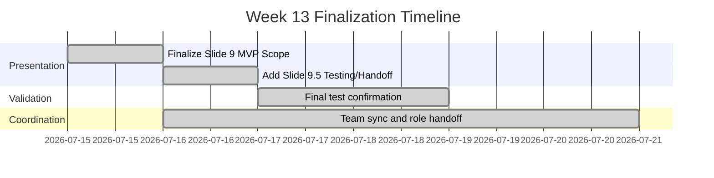
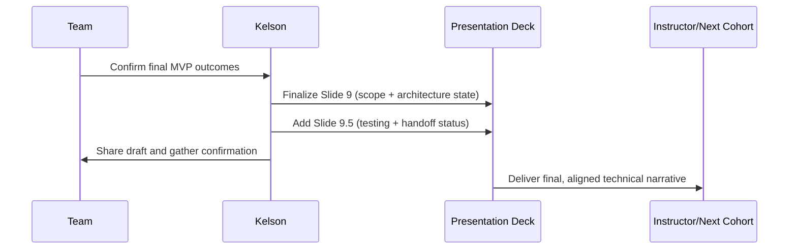
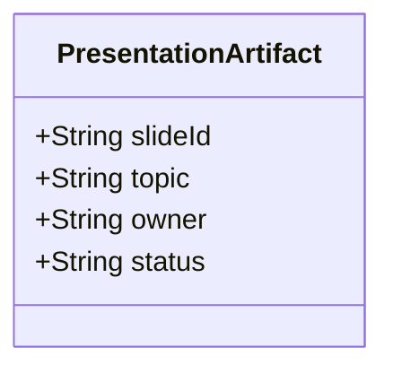
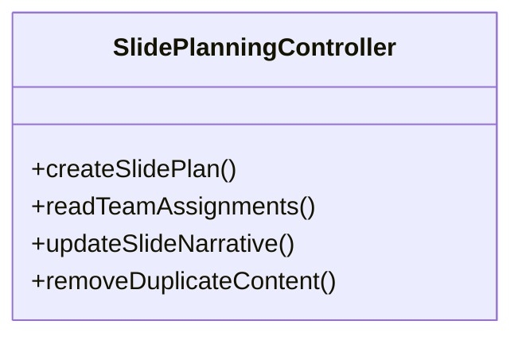
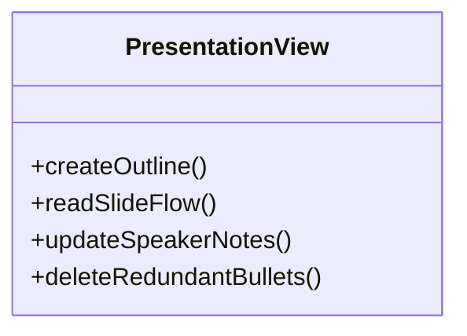
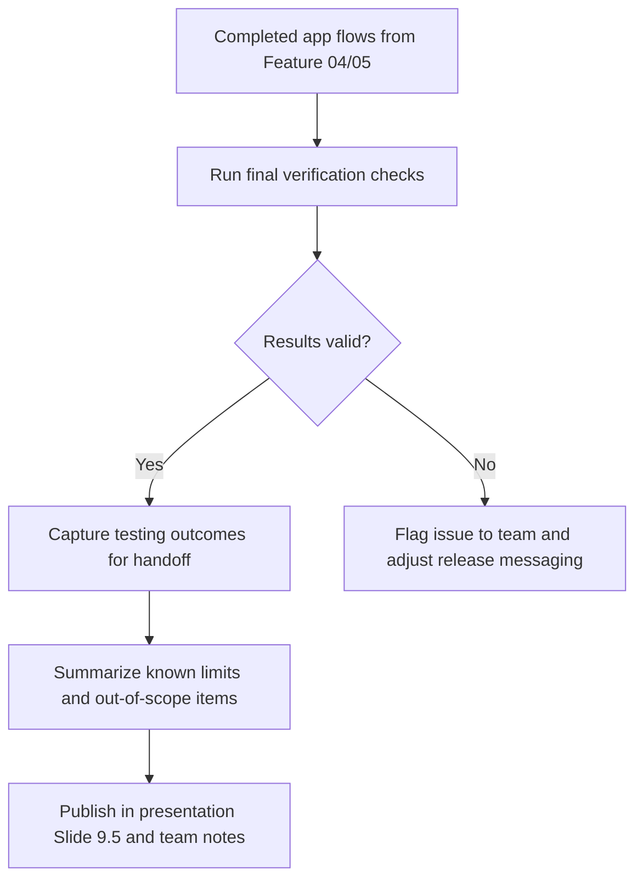
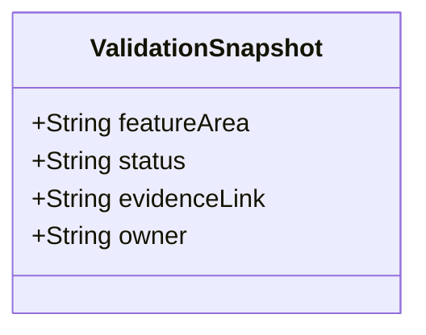
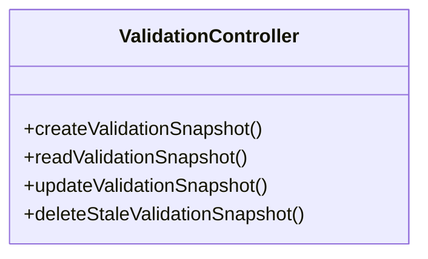
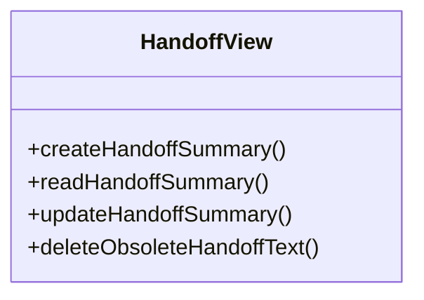
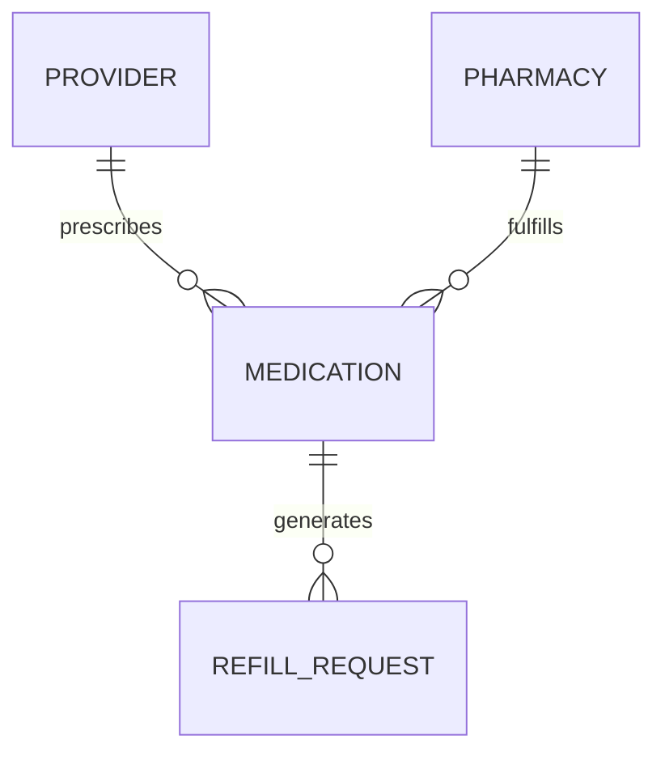

# Feature Planning Report - Detail Design

### Reference Information (10 pts)
---
* **Feature Title**: Final Presentation Scope (Slides 9 and 9.5), MVP Validation, and Handoff Support
* **Feature Number**: 05
* **Date**: 2026-07-21
* **Author**: Kelson Gneiting
* **Team Members**: Haeji Na, Joshua Palmer, Joseph Tolley, Xander Weibel, Kelson Gneiting

| Role | Team member name|
-- | --
| Product Owner | Xander Weibel |
| Scrum Master | Kelson Gneiting |
| Tech Lead (Front-End) | Xander Weibel |
| Tech Lead (Back-End) | Joseph Tolley |
| Tech Lead (Database) | Haeji Na |
| Quality Assurance | Joshua Palmer | 
| CM/DM | Joshua Palmer | 
| Responsible Engineer | Kelson Gneiting | 

----
### Traceablility (10 pts)
* **Requirement Number** (SRS Ref #): FR18, FR24, IR5, SA1, SA2, SA4, DC1-DC3
* **Design Number** (SDD Ref #): SDD Section 4 (Back-End Design), Section 6 (Database Design), presentation architecture summary flow (Slides 9 and 9.5)
* **Test Plan** (TPD Ref #): Week 13 final QA/regression validation for provider-pharmacy-refill flow and notification behavior
* **User Documnet** (Ref Section #): SRS Section 3.1 and 3.5 updates reflected in handoff narrative
* **Installation Document** (Ref #): VDD 3.0 / local Flutter build path (no deployment change)
* **Software Developer Guide** (Ref #): openapi.yaml auth identifier contract confirmation; local Hive paths documented in handoff

----
### Agile Taksing Information (10 pts)
* **Epic Story**:
As a final-delivery team member,
I want the MVP scope, completed testing state, and handoff details clearly presented,
so that instructors and the next cohort can understand exactly what shipped and what is out of scope.
* **Value**: Reduces handoff ambiguity, confirms readiness for final presentation, and preserves final-week decisions in artifacts.
* **Planned Delivery**: v5.0 (Week 13 quality/process maturity) with Week 14 handoff support
* **Schedule**:

* **Known Dependancies/Obsticles**: No technical blockers. Main dependency was teammate availability for final presentation alignment.
* **GitHub**
    * **GitHub Issue Number**: Team issue board (Miro): [RXNow Kanban Board](https://miro.com/app/board/uXjVHW1B9x4=/?share_link_id=2185336987)
    * **GitHub Branch**: feature/05
    * **GitHub Project**: RXNow MVP

---
Detailed Design 
---
<!-- NOTE: Not all projects will follow the 3-Tier and MVC architecture, please find the corresponding functionality. You may use N/A for any of the them but you must provide a detailed reason. 
-->
### FrontEnd (20 pts)
**Workflow Description**: Week 13 Front-End work for this report centered on communicating completed product behavior and ensuring the presentation reflects the real implementation. Slide 9 was finalized to define MVP boundaries and scope reality. Slide 9.5 was added to capture final testing and handoff evidence so stakeholders can see validation status and transfer readiness in one place.

- Agile Info:
    - Story: As a reviewer, I need a clear MVP scope/testing slide pair so I can evaluate solution completeness quickly.
    - Est Story Points: 2
    - Assigned Responsible Engineer: Kelson Gneiting
    - GitHub Issue Number: Team presentation task (board tracked)

<!-- See Role -->

**Classes**:
* **Model**:
    * **UML Class**:

    * ***Code Location***: N/A (artifact/documentation feature; no product-code class created this cycle)
* **Control** 
    * **UML Class**:

        * **Create** (Function name): createSlidePlan
        * **Read** (Function name): readTeamAssignments
        * **Update** (Function name): updateSlideNarrative
        * **Delete** (Function name): removeDuplicateContent
        * ***Code Location***: N/A (process/documentation workflow)

* **View** (UML Class)

    * **User Interface (Wireframe)**:
        * **Create** (Function name): createOutline
        * **Read** (Function name): readSlideFlow
        * **Update** (Function name): updateSpeakerNotes
        * **Delete** (Function name): deleteRedundantBullets
        * ***Code Location***: Team presentation deck (external collaboration file)
    * **Back Interface** (UML Class):
        * **Create** (Function name): createEvidenceSummary
        * **Read** (Function name): readValidationStatus
        * **Update** (Function name): updateHandoffDetails
        * **Delete** (Function name): deleteOutdatedStateNotes
        * ***Code Location***: Classwork/Kelson-Gneiting/Wk13/FeatureReport.md

### Back-End (20 pts)
* **Business Logic**: 

- Agile Info:
    - Story: As a team, we need final validation summarized correctly before final delivery.
    - Est Story Points: 2
    - Assigned Responsible Engineer: Kelson Gneiting (coordination), Joseph Tolley (implementation owner)
    - GitHub Issue Number: Team validation task (board tracked)

**Classes**
* **Models**: 
    * **UML Class**:

    * ***Code Location***: N/A (reporting construct used for documentation)
* **Control**: 
    * **UML Class**:

        * **Create** (Function name): createValidationSnapshot
        * **Read** (Function name): readValidationSnapshot
        * **Update** (Function name): updateValidationSnapshot
        * **Delete** (Function name): deleteStaleValidationSnapshot
        * ***Code Location***: N/A (process/documentation workflow)

* **View**(UML Class)

    * **Front-End API** ():
        * **Create** (Function name): createHandoffSummary
        * **Read** (Function name): readHandoffSummary
        * **Update** (Function name): updateHandoffSummary
        * **Delete** (Function name): deleteObsoleteHandoffText
        * ***Code Location***: Teamwork/Team-Notes/July 16th.md
    * **Database Interface** (UML Class):
        * **Create** (Function name): createVerificationRecord
        * **Read** (Function name): readVerificationRecord
        * **Update** (Function name): updateVerificationRecord
        * **Delete** (Function name): deleteVerificationRecord
        * ***Code Location***: N/A (local Hive data model unchanged this week)
    
### Database (20 pts)
* **Data Relationship Logic**: 

Week 13 did not add or alter schema objects. This section confirms stability of existing relationships used in testing and presentation handoff.

- Agile Info:
    - Story: As a team, we need the persisted model state confirmed before final handoff.
    - Est Story Points: 1
    - Assigned Responsible Engineer: Haeji Na (storage), Kelson Gneiting (handoff documentation)
    - GitHub Issue Number: Team finalization task (board tracked)

**Classes**:
* **Models**: (Table/Doc Descriptions) 
    * ***Code Location***: Hive models for Provider, Pharmacy, Medication, RefillRequest (existing codebase; unchanged in Week 13)
* **Control**: DBMS
    * Setup, Maintenance, Trigger Scripts
        * **Create** (Function name): createMedication
        * **Read** (Function name): readMedication
        * **Update** (Function name): updateMedication
        * **Delete** (Function name): deleteMedication
        * ***Code Location***: Existing local-storage repositories/controllers (unchanged this cycle)
* **View** (UML Class)
    * **Back-End API/Queries** ():
        * **Create** (Function name): createRefillRequest
        * **Read** (Function name): readRefillRequests
        * **Update** (Function name): updateRefillRequestStatus
        * **Delete** (Function name): deleteRefillRequest
        * ***Code Location***: Existing refill request workflow (local storage + mailto handoff)

---
### Review (10 pts)
- [x] All elements of the form are filled out
    - [x] Reference 
    - [x] Traceablity
    - [x] Agile
    - [x] Detailed Design 
- [x] Epic Story is created in the project's repo Issue
    * Issue Number (Reference): [RXNow Kanban Board](https://miro.com/app/board/uXjVHW1B9x4=/?share_link_id=2185336987)
- [x] Sub stories are created as the project's repo Issues
    * Issue Number 1 (i.e. Front-End): Slide 9 scope finalization
    * Issue Number 2 (i.e. Back-End): Validation/testing confirmation summary
    * Issue Number 3 (i.e. Database): Data-model stability and handoff confirmation
- [x] All stories/issues project attributes are filled out
- [x] Teammembers have reviewed the items
