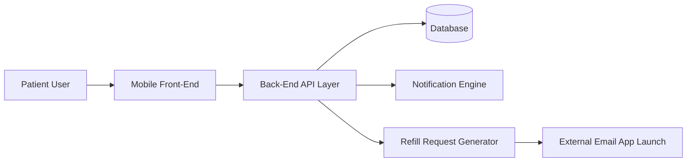
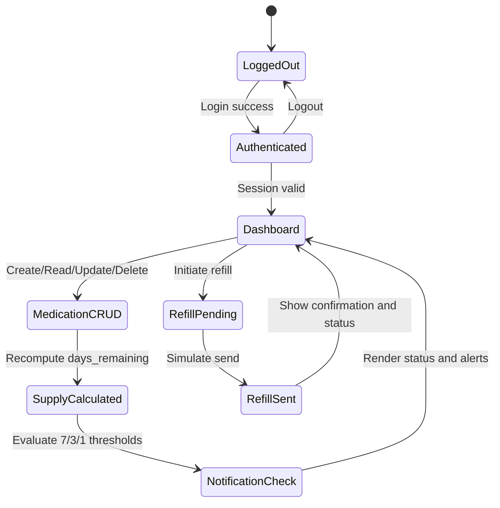

# Kelson Gneiting System Model Analysis

## Tasks
> Create three models of what you have discovered so far from the previous Eliciation Techniques, provide a brief 2-4 sentence summary of your Model.

* Model 1: Context and Architecture Model
        * Model:



        * Summary:
            This model shows the top-level boundaries of RXNOW and how data moves through the system. The patient interacts with a mobile-first front end, which calls backend API services for account, medication, and refill workflows. The backend persists data to the database and triggers notification/refill logic. This architecture supports the MVP goal of a lightweight but complete medication and refill experience without direct pharmacy or EHR integration.

* Model 2: Domain and Data Relationship Model
        * Model:

```mermaid
erDiagram
        USER ||--o{ MEDICATION : owns
        USER ||--o{ SESSION : has
        USER ||--o{ NOTIFICATION : receives
        MEDICATION ||--o{ NOTIFICATION : triggers
        MEDICATION ||--o{ REFILL_REQUEST : references

        USER {
            int user_id PK
            string email UNIQUE
            string password_hash
        }

        SESSION {
            int session_id PK
            int user_id FK
            string token
            datetime expires_at
            string state
        }

        MEDICATION {
            int medication_id PK
            int user_id FK
            string name
            string dosage
            int pills_remaining
            int pills_per_day
        }

        NOTIFICATION {
            int notification_id PK
            int user_id FK
            int medication_id FK
            int threshold
            string message
            bool is_read
        }

        REFILL_REQUEST {
            int refill_id PK
            int user_id FK
            int medication_id FK
            string provider_name
            string generated_message
            string status
            datetime sent_at
        }
```

        * Summary:
            This model captures the minimum data structures needed for the MVP requirements. A user can own many medications and sessions, while each medication can generate notifications and refill requests. The model directly supports requirement coverage for authentication, medication CRUD, supply awareness, and refill state tracking. It also preserves data integrity by using explicit user ownership and foreign-key style relationships.

* Model 3: Core Workflow and State Model
        * Model:



        * Summary:
            This model represents the key behavior flow for a normal user session. After authentication, the user lands on the dashboard, manages medications, and sees supply and notification updates. Refill workflow transitions from Pending to Sent and returns status feedback to the dashboard. The flow emphasizes speed, clear state transitions, and stability, which align with the stakeholder priority of a functional, testable MVP.
