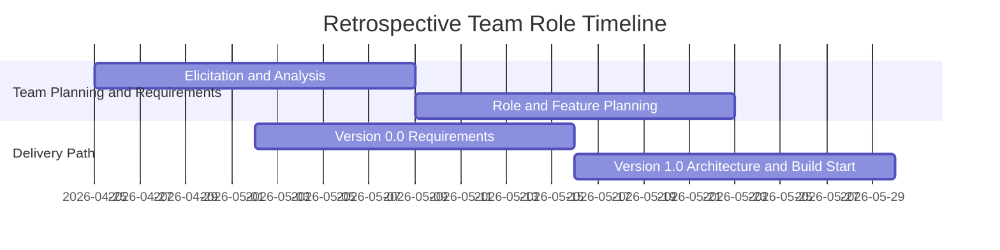

# Role Planning Report - Detail Design
<!-- Instructions
Please fill this out prior to your planning meeting, and bring it with you to meeting to discuss the issues created to assign to team members who's roles would best fit the development of those issues.

You need to make a copy of this file.
Name it the V<Version#>_<Role>_<Author>.md and
Put it in the artifacts/<team>/project/engineering/methodology directory
    where <team> will be replace with your team's name
        i.e. artifacts/RecSrv/project/engineering/methodology/V1.0_FEDev_Clements.md

Reference
* ***Note***: see project/engineering/Roles.md
* ***Note***: see project/engineering/practices/Methodologies
* ***Notes***: see project/engineering/practices/SWLifecycle
-->

### Reference Information (5 pts)

---
<!-- Reference Information 
This show cases your contributions to the team by fulfilling a role within the project. 
If you fulfill more than one role, you will need to fill out one of these for each role. 

The Role is from the list of roles in project/engineering/Roles.md. Each team member should have 1 or more roles from this file.
The Date is the date of when you finished this file.
The Author is you (your name)
-->
* **Role**: No Assigned Engineering Role (Team Retrospective Summary)
* **Date**: 2026-06-12
* **Author**: Kelson Gneiting

<!-- As proof that you are collaborating with your team, and have discussed everyone's role, provide the approiated team member's name.
All roles need to be fulfilled, and yes you will need to fulfill more than one role if your team is less than the number of roles. If you have more team member's than roles assign those team members as Responsible Engineers. As a team, you should consider rotating roles each iteration/version of the software product if practical. 
-->

* **Team Members**: 

| Role | Team member name|
-- | --
| Product Owner | Xander Weibel |
| Scrum Master | Xander Weibel |
| Tech Lead (Front-End) | Parker Morgan (initial), then Xander Weibel |
| Tech Lead (Back-End) | Joseph Tolley |
| Tech Lead (Database) | Haeji Na |
| Quality Assurance | Josh Palmer | 
| CM/DM | Josh Palmer | 
| Responsible Engineer | Kelson Gneiting (Starting Wk 8) |
| Responsible Engineer | N/A |

----
### Agile Tasking Information (10 pts)
<!-- Create an epic story (GitHub Issue) to track this task
    Role Planning is a task (Project), that should be tracked in as a GitHub Issue. 
    The deliverable from this task is this file. 
    The task need to be tracked as a GitHub Issue, to also track the sub-issues associated or bi-products of this planning task. 

    In Agile methodology, all tasks are tracked as stories.
    Please fill in the Agile Story with the prompted information
-->

<!-- Epic Story:
Use the following template to create an agile story for this planning task:
As <<Role>>,
I want plan tasks associated with my role for the version and iteration of our product,
so that the project can have traceable, quality assurance and due dilance to deliver a high quality product. 
    where <<Role>> is your assigned role.-->
* **Epic Story**:
Retrospective summary only. This report documents role ownership and past planning actions from team artifacts. During this period, I did not hold a formal assigned engineering delivery role.

[Epic](https://github.com/byui-cse397/2026.2SprCSE397PCP/issues/171)

As an unassigned supporting contributor,
I want to summarize role-linked tasks completed by the team for the current version,
so that responsibility, delivery history, and process continuity remain clear for future planning and to contribute to the team.
<!-- Story Points/Value:
In software Estimation, the major contributing factor is how complex the feature or sub-feature the story represents. A Story Point is not how long it will take, but the complexity of the tasks associated with the story, although, complexity does influence the time it takes. (Cause and effect).
    A story's points can be the sum of it sub-stories or on a scale complared to other stories.
    The following is one example:
    Point Value 1:    Easy complexity, single person, common knowledge
    Point Value 2:    Easy complexity, single person, some research needed
    Point Value 3:    Easy complexity, 1-2 persons, known dependancies, or dependant knowledge
    Point Value 5:    Minor Difficult, 2+ people collaboration, some unknowns that can easily found
    Point Value 8:    Difficult, 2+ people, Unknowns 
    Point Value 13:     Difficult, multiple people, Lots of Unknowns
For a role planning task the Story points for this story should be round 2-5. 
-->
* **Story Point/Value**: 13

<!-- Planned Delivery
    This task should be associated with a delivery either Version 1.0 to 5.0 
    Feel free to use https://mermaid.js.org/syntax/gitgraph.html as a visual.-->
* **Planned Delivery**: Retrospective summary for Version 0.0 to Version 1.0 planning context

<!-- Schedule 
    Using the schedule example from the repo's Readme.md, itentify when this tasks assoicated with this planning are going to be completed.
    Feel free to user <!-- Use https://mermaid.js.org/syntax/gantt.html as a visual.
-->
* **Schedule**:

<!-- GitHub 
    Create a gitHub issue from this planning document and Agile Tasking Information 
    Record the GitHub Issue Number
    Identify which gitHub Branch it will be implemented (saved) 
    Identify the GitHub Project that the issue will be tracked. 
-->
* **Known Dependancies/Obsticles**: 
    Access has been granted, another meeting this week seems unlikely, we are corresponding on Teams and figuring out what we need.
* **GitHub**
        * **GitHub Issue Number**: 171
        * **GitHub Branch**: Team planning reference branch
        * **GitHub Project**: CSE397 PCP 2026.02Spring

### Implementation (80 pts: 10 pts each)
For your Role, you need to develop a list of tasks that needs to be completed every two weeks as your team develops the next phase of the system. 
These tasks don't have be completed by just you, as you see there are quite alot of dependancies on other roles that need to be addressed. 

At a minimum, you need to develop 8 supporting storues to this epic story, addressing action items for each phase, relating to your role. 

Sub-Tasking
- [x] (1) Plan Tasking: [172_Planning](https://github.com/byui-cse397/2026.2SprCSE397PCP/issues/172)
    * Description: Brainstorming for the project and team role planning context.
    * Story Points: 3
- [x] (2) Requirements Tasking: [173_Requirements](https://github.com/byui-cse397/2026.2SprCSE397PCP/issues/173)
    * Description: Requirements work associated with software development planning.
    * Story Points: 5
- [x] (3) Architecture Tasking: [174_Architecture](https://github.com/byui-cse397/2026.2SprCSE397PCP/issues/174)
    * Description: Architecture planning for where the system will run and how components connect.
    * Story Points: 5
- [x] (4) Design Tasking: [175_Design](https://github.com/byui-cse397/2026.2SprCSE397PCP/issues/175)
    * Description: Design planning tied to software design document activities.
    * Story Points: 5
- [x] (5) Implementation Tasking: [176_Implementation](https://github.com/byui-cse397/2026.2SprCSE397PCP/issues/176)
    * Description: Implementation planning and feature coding progression.
    * Story Points: 5
- [x] (6) Deployment Tasking: [177_Deployment](https://github.com/byui-cse397/2026.2SprCSE397PCP/issues/177)
    * Description: Deployment planning and delivery workflow.
    * Story Points: 5
- [x] (7) Operations Tasking: [178_Operations](https://github.com/byui-cse397/2026.2SprCSE397PCP/issues/178)
    * Description: Operational delivery and support considerations.
    * Story Points: 5
- [x] (8) Monitor Tasking: [178_Monitoring](https://github.com/byui-cse397/2026.2SprCSE397PCP/issues/178)
    * Description: Monitor API and system performance as part of ongoing team quality checks.
    * Story Points: 3

---
# Reference Material

---
### Reference
---
* [Role Responsiblity Breakdown](./rolePlanningReference.md)
* [Version Planning](./versionPlanning.md)
* [Software Lifecycle](../../engineering/practices/SWLifecycle/Readme.md)
* [DevOps](../../engineering/practices/Methodologies/Readme.md)

### Review (5 pts)
- [x] All elements of the form are filled out
    - [x] Reference 
    - [x] Agile
    - [x] Implementation

- [x] Epic Story is created in the project's repo Issue
    * :[Issue#171](https://github.com/byui-cse397/2026.2SprCSE397PCP/issues/171)
    <!-- Include a link to the Issue--> 
- [x] Sub stories are created as the project's repo Issues
    <!-- Make sub-Issues from this issue-->
    * [172](https://github.com/byui-cse397/2026.2SprCSE397PCP/issues/172) (Plan): 
    * [173](https://github.com/byui-cse397/2026.2SprCSE397PCP/issues/173) (Code):
    * [174](https://github.com/byui-cse397/2026.2SprCSE397PCP/issues/174) (Build):
    * [175](https://github.com/byui-cse397/2026.2SprCSE397PCP/issues/175) (Design):
    * [176](https://github.com/byui-cse397/2026.2SprCSE397PCP/issues/176) (Implementation):
    * [177](https://github.com/byui-cse397/2026.2SprCSE397PCP/issues/177) (Deploy):
    * [178](https://github.com/byui-cse397/2026.2SprCSE397PCP/issues/178) (Operations):
    * [178](https://github.com/byui-cse397/2026.2SprCSE397PCP/issues/178) (Maintenance):
    <!-- Include a link to the Issues--> 
- [x] All stories/issues project attributes are filled out
- [x] Team members and role ownership are summarized from existing team artifacts while noting no assigned engineering role for author
