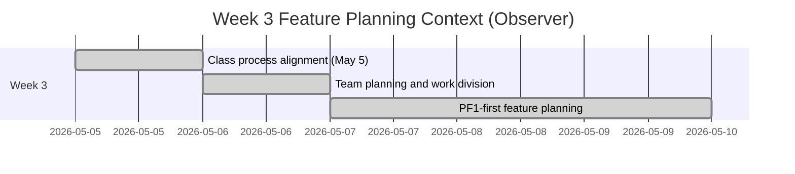

# Feature Planning Report - Detail Design
> Observer note: This Week 3 report documents team planning context from artifacts. I was not yet on the team during Week 3 implementation work.
<!-- Instructions
Please fill this out during your planning meeting.
Each member of the group should complete a feature every two weeks. You are encharge of ensuring that your feature is complete.

You need to make a copy of this file.
Name it the <FeatureNumber>_<Feature title>.md and
Put it in the <artifacts/<team>/project/engineering/detaileddesign directory
    where <team>, will be replace with your team's name 
    i.e. artifacts/RecSrv/project/engineering/methodology/02_UserProfile.md
-->

### Reference Information (10 pts)
---
* **Feature Title**: PF1 Authentication (Observer Summary)
* **Feature Number**: PF1
* **Date**: 2026-06-19
* **Author**: Kelson Gneiting
* **Team Members**: 

| Role | Team member name|
-- | --
| Product Owner | Xander Weibel |
| Scrum Master | Xander Weibel |
| Tech Lead (Front-End) | Parker Morgan |
| Tech Lead (Back-End) | Joseph Tolley |
| Tech Lead (Database) | Haejin Na |
| Quality Assurance | Joshua Palmer | 
| CM/DM | Joshua Palmer | 
| |if more team members than roles | 
| Responsible Engineer | Kelson Gneiting (observer only in Week 3) | 
| Responsible Engineer | N/A | 

----
### Traceablility (10 pts)
* **Requirement Number** (SRS Ref #): PF1 (FR1-FR5) primary focus; PF2-PF6 identified in queue
* **Design Number** (SDD Ref #): Deferred to Week 4 SDD planning
* **Test Plan** (TPD Ref #): Deferred to test planning iteration
* **User Documnet** (Ref Section #): N/A for observer report
* **Installation Document** (Ref #): N/A for observer report
* **Software Developer Guide** (Ref #): N/A for observer report

----
### Agile Taksing Information (10 pts)
* **Epic Story**:
<!--Format:
As <<>>,
I want <<>>,
so that <<>> -->
As an observer documenting Week 3 team work,
I want to capture the PF1-first planning decisions and role ownership,
so that requirement-to-design continuity is preserved even though I joined later.
* **Value**: Preserve planning continuity and onboarding context
* **Planned Delivery**: Version 0.0 requirements foundation (Week 3 observer summary)
<!--Use https://mermaid.js.org/syntax/gitgraph.html -->
* **Schedule**:

<!-- Use https://mermaid.js.org/syntax/gantt.html -->
* **Known Dependancies/Obsticles**: 
    * Process ambiguity around epics, sub-stories, and story points
    * Need for stakeholder clarification on technical direction
    * Inherited repository appeared incomplete during Week 3 planning
* **GitHub**
        * **GitHub Issue Number**: Observer reference only (board-based)
        * **GitHub Branch**: N/A (observer documentation)
        * **GitHub Project**: Team Kanban Board
        * **Issue Board Link**: [Miro](https://miro.com/app/board/uXjVHW1B9x4=/?share_link_id=2185336987) Kanban Board

---
Detailed Design 
---
<!-- NOTE: Not all projects will follow the 3-Tier and MVC architecture, please find the corresponding functionality. You may use N/A for any of the them but you must provide a detailed reason. 
-->
### FrontEnd (20 pts)
**Workflow Description**: <!-- Use paragraph and https://mermaid.js.org/syntax/sequenceDiagram.html-->
Observer summary only. The team planned PF1 front-end authentication flow where user credentials are captured, validated client-side, and sent to backend auth endpoints. Direct front-end execution and ownership remained with the assigned front-end lead during Week 3; I did not own front-end implementation in this period.
- Agile Info:
    - Story: PF1 authentication front-end planning
    - Est Story Points: 5 (team estimate from Week 3 artifacts)
    - Assigned Responsible Engineer: Parker Morgan
    - GitHub Issue Number: Miro board reference

<!-- See Role -->

**Classes**:
* **Model**:
    * **UML Class**:
        <!-- Use https://mermaid.js.org/syntax/classDiagram.html: --->
        N/A in observer report. Team referenced user account/authentication model planning.
    * ***Code Location***: 
        N/A (no direct Week 3 code ownership by author)
* **Control** 
    * **UML Class**:
        <!-- Use https://mermaid.js.org/syntax/classDiagram.html: --->
        N/A in observer report. Team planning referenced auth controller behavior.
        * **Create** (Function name):
            Planned: signup/create account flow
        * **Read** (Function name):
            Planned: login/authenticate flow
        * **Update** (Function name):
            Planned: password reset/update flow
        * **Delete** (Function name):
            Planned: logout/session termination flow
        * ***Code Location***: 
            N/A

* **View** (UML Class)
    <!--- Use https://mermaid.js.org/syntax/classDiagram.html: --->
    * **User Interface (Wireframe)**:
        * **Create** (Function name):
            Planned: render signup form
        * **Read** (Function name):
            Planned: render login form
        * **Update** (Function name):
            Planned: render reset form
        * **Delete** (Function name):
            Planned: clear session/logout UI
        * ***Code Location***: 
            N/A
    * **Back Interface** (UML Class):
        * **Create** (Function name):
            Planned: create user API call
        * **Read** (Function name):
            Planned: login/auth API call
        * **Update** (Function name):
            Planned: reset password API call
        * **Delete** (Function name):
            Planned: session delete/logout API call
        * ***Code Location***: 
            N/A

### Back-End (20 pts)
* **Business Logic**: 
<!-- Use https://mermaid.js.org/syntax/flowchart.html -->
Observer summary only. Back-end planning centered on secure credential handling, password hashing, authentication checks, and session lifecycle for PF1. This was owned by the assigned backend lead during Week 3.
- Agile Info:
    - Story: PF1 backend authentication planning
    - Est Story Points: 5 (team estimate from Week 3 artifacts)
    - Assigned Responsible Engineer: Joseph Tolley
    - GitHub Issue Number: Miro board reference

**Classes**
* **Models**: 
    <!--Use UML and Sequence or ZenUML -->
    * **UML Class**:
        <!-- Use https://mermaid.js.org/syntax/classDiagram.html: --->
        Planned model: User entity with email and password_hash for authentication.
    * ***Code Location***:
        N/A
* **Control**: 
    <!-- Use UML and https://mermaid.js.org/syntax/sequenceDiagram.html -->
    * **UML Class**:
        * **Create** (Function name):
            Planned: createAccount
        * **Read** (Function name):
            Planned: authenticateUser
        * **Update** (Function name):
            Planned: recoverPassword
        * **Delete** (Function name):
            Planned: terminateSession
        * ***Code Location***: 
            N/A
            <!-- Use https://mermaid.js.org/syntax/classDiagram.html: -->

* **View**(UML Class)
    <!--- Use https://mermaid.js.org/syntax/classDiagram.html: --->
    * **Front-End API** ():
        * **Create** (Function name):
            Planned: POST register
        * **Read** (Function name):
            Planned: POST login
        * **Update** (Function name):
            Planned: POST reset
        * **Delete** (Function name):
            Planned: POST logout
        * ***Code Location***: 
            N/A
    * **Database Interface** (UML Class):
        * **Create** (Function name):
            Planned: insertUser
        * **Read** (Function name):
            Planned: findUserByEmail
        * **Update** (Function name):
            Planned: updatePassword
        * **Delete** (Function name):
            Planned: deleteSession
        * ***Code Location***: 
            N/A
    
### Database (20 pts)
* **Data Relationship Logic**: 
<!-- Use https://mermaid.js.org/syntax/entityRelationshipDiagram.html -->
Observer summary only. Week 3 planning identified core account data constraints for PF1 and queued additional relational modeling for PF2-PF6. Database planning ownership remained with the assigned database lead.
- Agile Info:
    - Story: PF1 authentication data model planning
    - Est Story Points: 3 (team estimate from Week 3 artifacts)
    - Assigned Responsible Engineer: Haejin Na
    - GitHub Issue Number: Miro board reference

**Classes**:
<!--Use https://mermaid.js.org/syntax/entityRelationshipDiagram.html -->
* **Models**: (Table/Doc Descriptions) 
    Planned Week 3 context: user table/entity (email uniqueness, password hash) and authentication support data.
    * ***Code Location***: 
        N/A
* **Control**: DBMS
    * Setup, Maintenance, Trigger Scripts
        * **Create** (Function name):
            Planned: create user record
        * **Read** (Function name):
            Planned: read user for authentication
        * **Update** (Function name):
            Planned: update password hash
        * **Delete** (Function name):
            Planned: remove/expire session data
        * ***Code Location***: 
            N/A
* **View** (UML Class)
    <!--- Use https://mermaid.js.org/syntax/classDiagram.html: --->
    * **Back-End API/Queries** ():
        * **Create** (Function name):
            Planned: account creation query path
        * **Read** (Function name):
            Planned: authentication query path
        * **Update** (Function name):
            Planned: password reset query path
        * **Delete** (Function name):
            Planned: session cleanup query path
        * ***Code Location***:
            N/A

---
### Review (10 pts)
- [x] All elements of the form are filled out
    - [x] Reference 
    - [x] Traceablity
    - [x] Agile
    - [x] Detailed Design 
- [x] Epic Story is created in the project's repo Issue
    * Issue Number (Reference): [Miro](https://miro.com/app/board/uXjVHW1B9x4=/?share_link_id=2185336987) Kanban Board
    <!-- Include a link to the Issue--> 
- [x] Sub stories are created as the project's repo Issues
    * Issue Number 1 (i.e. Front-End): [Miro](https://miro.com/app/board/uXjVHW1B9x4=/?share_link_id=2185336987) Kanban Board
    * Issue Number 2 (i.e. Back-End): [Miro](https://miro.com/app/board/uXjVHW1B9x4=/?share_link_id=2185336987) Kanban Board
    * Issue Number 3 (i.e. Database): [Miro](https://miro.com/app/board/uXjVHW1B9x4=/?share_link_id=2185336987) Kanban Board
    <!-- Include a link to the Issues--> 
- [x] All stories/issues project attributes are filled out
- [x] Teammembers have reviewed the items
