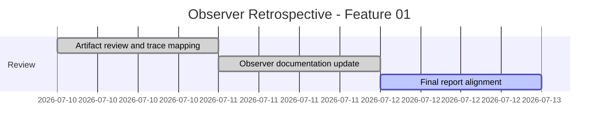
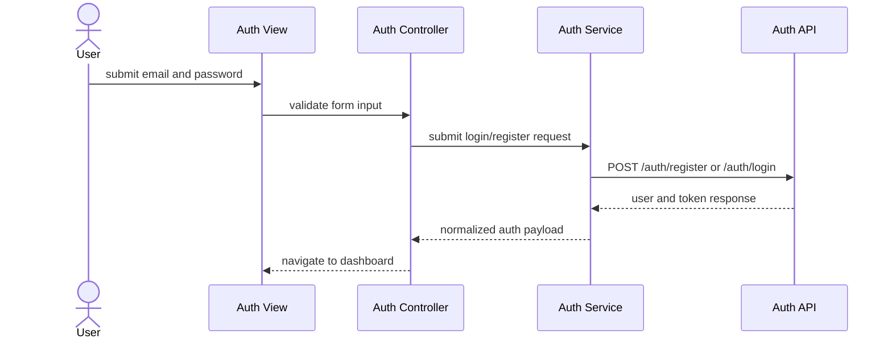
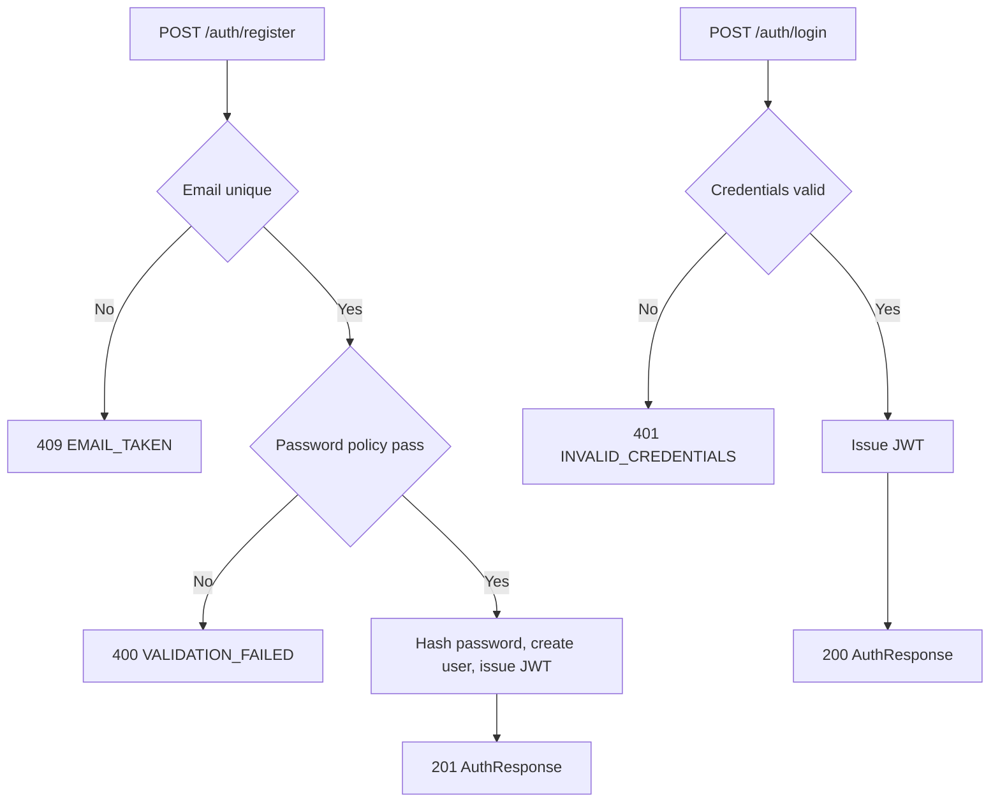
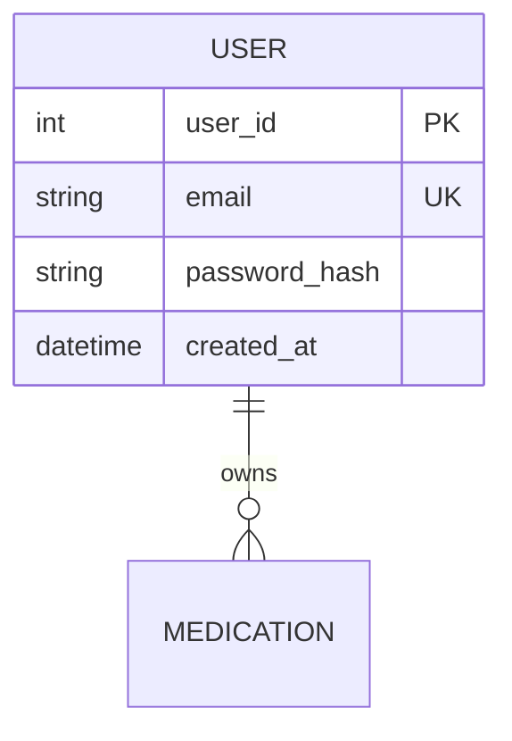

# Feature Planning Report - Detail Design

### Reference Information (10 pts)
---
* **Feature Title**: Observer Retrospective - User Authentication and Frontend Architecture Setup
* **Feature Number**: 01
* **Date**: 2026-07-12
* **Author**: Kelson Gneiting
* **Team Members**: Haejin Na, Joshua Palmer, Joseph Howard Tolley, Xander Weibel, Kelson Gneiting

| Role | Team member name|
-- | --
| Product Owner | Xander Weibel |
| Scrum Master | Xander Weibel |
| Tech Lead (Front-End) | Joseph Tolley |
| Tech Lead (Back-End) | Joseph Tolley |
| Tech Lead (Database) | Haeji Na |
| Quality Assurance | Joshua Palmer |
| CM/DM | Joshua Palmer |
| Observer | Kelson Gneiting |
| Responsible Engineer | Joseph Tolley |
| Responsible Engineer | Xander Weibel |


----
### Traceablility (10 pts)
* **Requirement Number** (SRS Ref #): FR1, FR2, FR3, FR4, FR5 (PF1); IR1, IR2, IR4; SA3, SA4; DB1, DB8
* **Design Number** (SDD Ref #): SDD Section 2 (Front-End), Section 3 (APIs - Auth), Section 4 (Back-End - Auth), Components C1/C5/C6
* **Test Plan** (TPD Ref #): FR1-FR5 verification mapping (inspection, demonstration; unit, integration, system)
* **User Documnet** (Ref Section #): SRS Section 1.3 and Section 3.1 (FR1-FR5)
* **Installation Document** (Ref #): SDD Section 7 (clone, install, run)
* **Software Developer Guide** (Ref #): API-README and openapi.yaml auth endpoints; observer notes in WhitePaper.md

----
### Agile Taksing Information (10 pts)
* **Epic Story**:
    As an Observer who joined in Week 8,
    I want to document and validate the Week 5 authentication feature design artifacts,
    so that feature intent, architecture, and traceability remain clear for final delivery and handoff.
* **Value**: Preserves continuity for a foundational feature and reduces ambiguity in late-semester integration and QA.
* **Planned Delivery**: Retrospective documentation completed in Week 8+ aligned to v1.0 feature history.
* **Schedule**:

* **Known Dependancies/Obsticles**:
    - Joined in Week 8, so work is retrospective and dependent on existing team artifacts
    - Some implementation evidence is external to this classwork repo
    - GitHub issue IDs for observer retrospective are pending
* **GitHub**
  * **GitHub Issue Number**: [RxNOW Kanban Board - Miro](https://miro.com/app/board/uXjVHW1B9x4=/?share_link_id=2185336987)
        * **GitHub Branch**: observer/wk5-feature-retrospective
        * **GitHub Project**: RXNOW Core MVP
  * **Issue Board Link**: [RxNOW Kanban Board - Miro](https://miro.com/app/board/uXjVHW1B9x4=/?share_link_id=2185336987)


---
Detailed Design 
---
### FrontEnd (20 pts)
**Workflow Description**: Feature 01 establishes authentication screens and routing behavior for account registration and login. Requests flow from view to controller to service and then to the auth API contract. Tokens are persisted after successful authentication and used to protect downstream routes. The observer role validates that this architecture is consistently documented and traceable across artifacts.



- Agile Info:
    - Story: As a user, I want secure register/login flows so I can access medication features.
    - Est Story Points: 5
    - Assigned Responsible Engineer: Joseph Tolley (implementation), Kelson Gneiting (observer validation)
    - GitHub Issue Number: Miro Auth Epic (team board), Observer issue TBD

**Classes**:
* **Model**:
    * **UML Class**:
        ```mermaid
        classDiagram
          class UserModel {
            +int user_id
            +string email
            +string created_at
          }
          class AuthState {
            +string token
            +UserModel user
            +bool isAuthenticated()
            +void clear()
          }
        ```
    * ***Code Location***: 
* **Control** 
    * **UML Class**:
        ```mermaid
        classDiagram
          class AuthController {
            +validateInputs(formData) bool
            +storeToken(token) void
            +clearToken() void
            +navigateToDashboard() void
            +navigateToLogin() void
          }
        ```
        * **Create** (Function name):
          processSignup(formData)
        * **Read** (Function name):
          processLogin(formData)
        * **Update** (Function name):
          processPasswordReset(token, newPassword)
        * **Delete** (Function name):
          processLogout()
        * ***Code Location***: 
          src/controllers/AuthController.ts

* **View** (UML Class)
    * **User Interface (Wireframe)**:
      Login, Register, and Password Reset screens with inline validation and mobile-first layout.
        * **Create** (Function name):
          renderRegisterScreen()
        * **Read** (Function name):
          renderLoginScreen()
        * **Update** (Function name):
          renderPasswordResetScreen()
        * **Delete** (Function name):
          N/A
        * ***Code Location***: 
          src/views/RegisterView.tsx, src/views/LoginView.tsx, src/views/PasswordResetView.tsx
    * **Back Interface** (UML Class):
        * **Create** (Function name):
          apiPostRegister(email, password)
        * **Read** (Function name):
          apiPostLogin(email, password)
        * **Update** (Function name):
          apiPostPasswordResetConfirm(token, newPassword)
        * **Delete** (Function name):
          apiPostLogout()
        * ***Code Location***: 
          src/services/AuthService.ts

### Back-End (20 pts)
* **Business Logic**: 


- Agile Info:
    - Story: As the system, I need secure authentication and token issuance.
    - Est Story Points: 5
    - Assigned Responsible Engineer: Joseph Howard Tolley
    - GitHub Issue Number: Miro Auth Epic (team board)

**Classes**
* **Models**: 
    * **UML Class**:
        ```mermaid
        classDiagram
          class User {
            +int user_id
            +string email
            +string password_hash
            +datetime created_at
          }
        ```
    * ***Code Location***:
      src/models/User.py
* **Control**: 
    * **UML Class**:
        ```mermaid
        classDiagram
          class AuthController {
            +createAccount(email, password)
            +authenticateUser(email, password)
            +confirmPasswordReset(token, newPassword)
            +terminateSession(token)
          }
        ```
        * **Create** (Function name):
          createAccount(email, password)
        * **Read** (Function name):
          authenticateUser(email, password)
        * **Update** (Function name):
          confirmPasswordReset(token, newPassword)
        * **Delete** (Function name):
          terminateSession(token)
        * ***Code Location***: 
          src/controllers/AuthController.py

* **View**(UML Class)
    * **Front-End API** ():
        * **Create** (Function name):
          POST /auth/register
        * **Read** (Function name):
          POST /auth/login
        * **Update** (Function name):
          POST /auth/password-reset/request and /auth/password-reset/confirm
        * **Delete** (Function name):
          POST /auth/logout
        * ***Code Location***: 
          openapi.yaml (/auth/*)
    * **Database Interface** (UML Class):
        * **Create** (Function name):
          UserRepository.insertUser(email, passwordHash)
        * **Read** (Function name):
          UserRepository.findUserByEmail(email)
        * **Update** (Function name):
          UserRepository.updatePassword(userId, newHash)
        * **Delete** (Function name):
          N/A (JWT session model)
        * ***Code Location***: 
          src/repositories/UserRepository.py
    
### Database (20 pts)
* **Data Relationship Logic**: 


- Agile Info:
    - Story: As the system, I need secure user credential storage for authentication.
    - Est Story Points: 2
    - Assigned Responsible Engineer: Haeji Na (schema collaboration), Joseph Tolley (integration)
    - GitHub Issue Number: Miro Auth Epic (team board)

**Classes**:
* **Models**: (Table/Doc Descriptions) 
    USER table stores identity fields and password hash with unique email constraint.
    * ***Code Location***: 
      db/migrations/001_create_users.sql
* **Control**: DBMS
    * Setup, Maintenance, Trigger Scripts
        * **Create** (Function name):
          INSERT INTO user (email, password_hash, created_at) VALUES (?, ?, ?)
        * **Read** (Function name):
          SELECT * FROM user WHERE email = ?
        * **Update** (Function name):
          UPDATE user SET password_hash = ? WHERE user_id = ?
        * **Delete** (Function name):
          N/A in MVP scope
        * ***Code Location***: 
          db/migrations/001_create_users.sql
* **View** (UML Class)
    * **Back-End API/Queries** ():
        * **Create** (Function name):
          UserRepository.insertUser()
        * **Read** (Function name):
          UserRepository.findUserByEmail()
        * **Update** (Function name):
          UserRepository.updatePassword()
        * **Delete** (Function name):
          N/A
        * ***Code Location***:
          src/repositories/UserRepository.py

---
### Review (10 pts)
- [x] All elements of the form are filled out
    - [x] Reference
    - [x] Traceablity
    - [x] Agile
    - [x] Detailed Design
- [x] Epic Story is created in the project's repo Issue
    * Issue Number (Reference): [RxNOW Kanban Board - Miro](https://miro.com/app/board/uXjVHW1B9x4=/?share_link_id=2185336987)
- [x] Sub stories are created as the project's repo Issues
    * Issue Number 1 (i.e. Front-End): TBD
    * Issue Number 2 (i.e. Back-End): TBD
    * Issue Number 3 (i.e. Database): TBD
- [x] All stories/issues project attributes are filled out
- [x] Teammembers have reviewed the items

## Observer Artifact Link
* [WhitePaper](./WhitePaper.md)
