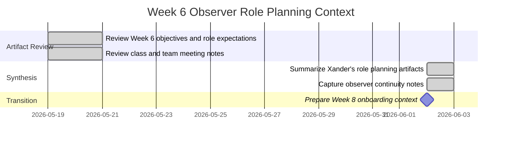

# Role Planning Report - Detail Design
> Observer note: I joined the RxNOW team in Week 8. This Week 6 role report is a retrospective observer summary based on project artifacts, not a claim of direct Week 6 implementation ownership.
<!-- Instructions
Please fill this out prior to your planning meeting, and bring it with you to meeting to discuss the issues created to assign to team members who's roles would best fit the development of those issues.

You need to make a copy of this file.
Name it the V<Version#>_<Role>_<Author>.md and
Put it in the artifacts/<team>/project/engineering/methodology directory
    where <team> will be replace with your team's name
        i.e. artifacts/RecSrv/project/engineering/methodology/V1.0_FEDev_Clements.md

Reference
* ***Note***: see project/engineering/Roles.md
* ***Note***: see project/engineering/practices/Methodologies
* ***Notes***: see project/engineering/practices/SWLifecycle
-->

### Reference Information (5 pts)

---
<!-- Reference Information 
This show cases your contributions to the team by fulfilling a role within the project. 
If you fulfill more than one role, you will need to fill out one of these for each role. 

The Role is from the list of roles in project/engineering/Roles.md. Each team member should have 1 or more roles from this file.
The Date is the date of when you finished this file.
The Author is you (your name)
-->
* **Role**:
* **Role**: Observer / Responsible Engineer (joined in Week 8; observer only for Week 6)
* **Date**: 2026-06-02
* **Author**: Kelson Gneiting

<!-- As proof that you are collaborating with your team, and have discussed everyone's role, provide the approiated team member's name.
All roles need to be fulfilled, and yes you will need to fulfill more than one role if your team is less than the number of roles. If you have more team member's than roles assign those team members as Responsible Engineers. As a team, you should consider rotating roles each iteration/version of the software product if practical. 
-->

* **Team Members**: 

| Role | Team member name|
-- | --
| Product Owner | Xander Weibel |
| Scrum Master | Xander Weibel (adapted async check-ins) |
| Tech Lead (Front-End) | Xander Weibel |
| Tech Lead (Back-End) | Joseph Tolley |
| Tech Lead (Database) | Haeji Na |
| Quality Assurance | Josh Palmer | 
| CM/DM | Josh Palmer | 
| |if more team members than roles | 
| Responsible Engineer | Kelson Gneiting (joined in Week 8; observer reference for Week 6) | 
| Responsible Engineer | | 

----
### Agile Tasking Information (10 pts)
<!-- Create an epic story (GitHub Issue) to track this task
    Role Planning is a task (Project), that should be tracked in as a GitHub Issue. 
    The deliverable from this task is this file. 
    The task need to be tracked as a GitHub Issue, to also track the sub-issues associated or bi-products of this planning task. 

    In Agile methodology, all tasks are tracked as stories.
    Please fill in the Agile Story with the prompted information
-->

<!-- Epic Story:
Use the following template to create an agile story for this planning task:
As <<Role>>,
I want plan tasks associated with my role for the version and iteration of our product,
so that the project can have traceable, quality assurance and due dilance to deliver a high quality product. 
    where <<Role>> is your assigned role.-->
* **Epic Story**:
    As an observer documenting Week 6 detailed design work,
    I want to capture the tasks, planning decisions, and dependencies associated with this role-planning period,
    so that project continuity is preserved as I join the team in Week 8.
<!-- Story Points/Value:
In software Estimation, the major contributing factor is how complex the feature or sub-feature the story represents. A Story Point is not how long it will take, but the complexity of the tasks associated with the story, although, complexity does influence the time it takes. (Cause and effect).
    A story's points can be the sum of it sub-stories or on a scale complared to other stories.
    The following is one example:
    Point Value 1:    Easy complexity, single person, common knowledge
    Point Value 2:    Easy complexity, single person, some research needed
    Point Value 3:    Easy complexity, 1-2 persons, known dependancies, or dependant knowledge
    Point Value 5:    Minor Difficult, 2+ people collaboration, some unknowns that can easily found
    Point Value 8:    Difficult, 2+ people, Unknowns 
    Point Value 13:     Difficult, multiple people, Lots of Unknowns
For a role planning task the Story points for this story should be round 2-5. 
-->
* **Story Point/Value**: 3

<!-- Planned Delivery
    This task should be associated with a delivery either Version 1.0 to 5.0 
    Feel free to use https://mermaid.js.org/syntax/gitgraph.html as a visual.-->
* **Planned Delivery**: v1.0 - Week 06 observer continuity summary before Week 8 onboarding

<!-- Schedule 
    Using the schedule example from the repo's Readme.md, itentify when this tasks assoicated with this planning are going to be completed.
    Feel free to user <!-- Use https://mermaid.js.org/syntax/gantt.html as a visual.
-->
* **Schedule**:

<!-- GitHub 
    Create a gitHub issue from this planning document and Agile Tasking Information 
    Record the GitHub Issue Number
    Identify which gitHub Branch it will be implemented (saved) 
    Identify the GitHub Project that the issue will be tracked. 
-->
* **Known Dependancies/Obsticles**:
    - I was not yet assigned to the team during Week 6, so this report depends on existing artifacts rather than direct implementation work
    - Week 6 context is reconstructed from the class notes, team meeting notes, Week 6 objective sheet, and Xander's completed role report
    - GitHub issue ownership and implementation branches for Week 6 work remained with the active team members at that time
* **GitHub**
        * **GitHub Issue Number**: Observer reference only (artifact-based summary)
        * **GitHub Branch**: Wk6-observer
        * **GitHub Project**: CSE397 PCP 2026.02Spring

### Implementation (80 pts: 10 pts each)
For your Role, you need to develop a list of tasks that needs to be completed every two weeks as your team develops the next phase of the system. 
These tasks don't have be completed by just you, as you see there are quite alot of dependancies on other roles that need to be addressed. 

At a minimum, you need to develop 8 supporting storues to this epic story, addressing action items for each phase, relating to your role. 

Sub-Tasking
- [x] (1) Plan Tasking: Observer reference - Review Week 6 role planning scope
    * Description: Reviewed the Week 6 detailed design objectives and Xander's completed role report to identify the scope of planning, ownership, and expected deliverables for v1.0.
    * Story Points: 1
- [x] (2) Code Tasking: Observer reference - Capture implementation focus from artifacts
    * Description: Documented the planned front-end and integration work described in the active team artifacts without claiming authorship of the implementation.
    * Story Points: 1
- [x] (3) Build Tasking: Observer reference - Track build and dependency context
    * Description: Recorded the build-phase dependencies noted by the team, including back-end readiness, API stability, and branch coordination.
    * Story Points: 1
- [x] (4) Test Tasking: Observer reference - Summarize Week 6 test-planning direction
    * Description: Mapped the May 19 class focus on test planning, CANOTNOT coverage, and traceability to the team's Week 6 detailed design effort.
    * Story Points: 1
- [x] (5) Release Tasking: Observer reference - Preserve v1.0 documentation alignment
    * Description: Noted that Week 6 planning aligned the SRS, SDD, ERD, API contract, and release expectations for the v1.0 milestone.
    * Story Points: 1
- [x] (6) Deloy Tasking: Observer reference - Review deployment preparation notes
    * Description: Captured the Render hosting and environment-setup planning described in the team artifacts as context for later onboarding.
    * Story Points: 1
- [x] (7) Opeate Tasking: Observer reference - Summarize coordination workflow
    * Description: Reviewed the May 19 team meeting summary to document the Miro-centered planning workflow, async coordination style, and role handoff expectations.
    * Story Points: 1
- [x] (8) Monitor Tasking: Observer reference - Record continuity risks before Week 8 join
    * Description: Identified the main observer limitation as lack of direct Week 6 participation and preserved linked evidence so Week 8 onboarding would start with traceable project context.
    * Story Points: 1

---
# Reference Material

---
### Reference
---
* [Role Responsiblity Breakdown](./rolePlanningReference.md)
* [Version Planning](./versionPlanning.md)
* [Software Lifecycle](../../engineering/practices/SWLifecycle/Readme.md)
* [DevOps](../../engineering/practices/Methodologies/Readme.md)
* [Week 6 Objectives](./Week06.md)
* [Class Notes - May 19](../../Class-Notes/May-19.md)
* [Team Meeting Notes - May 19](../../../Teamwork/Team-Notes/May-19.md)
* [AWS Academy Cloud Foundations Progress](../AWS.md)
* [Gold Certification Progress](../Gold/Gneiting_CertificationReport.md)

### Review (5 pts)
- [x] All elements of the form are filled out
    - [x] Reference 
    - [x] Agile
    - [x] Implementation

- [x] Epic Story is created in the project's repo Issue
    * Issue Number (Reference): Observer reference only (artifact-based summary)
    <!-- Include a link to the Issue--> 
- [x] Sub stories are created as the project's repo Issues
    <!-- Make sub-Issues from this issue-->
    * Issue Number1 (Plan): Observer reference only
    * Issue Number2 (Code): Observer reference only
    * Issue Number3 (Build): Observer reference only
    * Issue Number4 (Test): Observer reference only
    * Issue Number5 (Release): Observer reference only
    * Issue Number6 (Deploy): Observer reference only
    * Issue Number7 (Operate): Observer reference only
    * Issue Number8 (Monitor): Observer reference only
    <!-- Include a link to the Issues--> 
- [x] All stories/issues project attributes are filled out
- [x] Team members have reviewed the items
