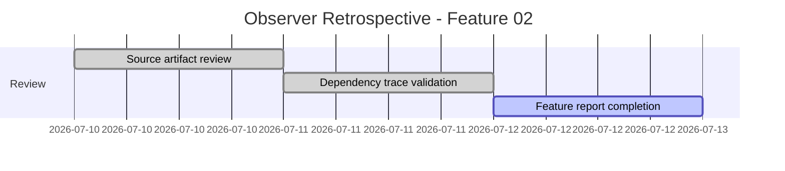
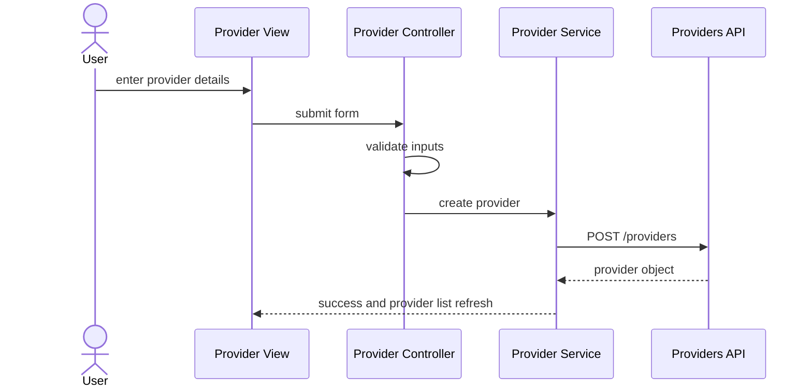
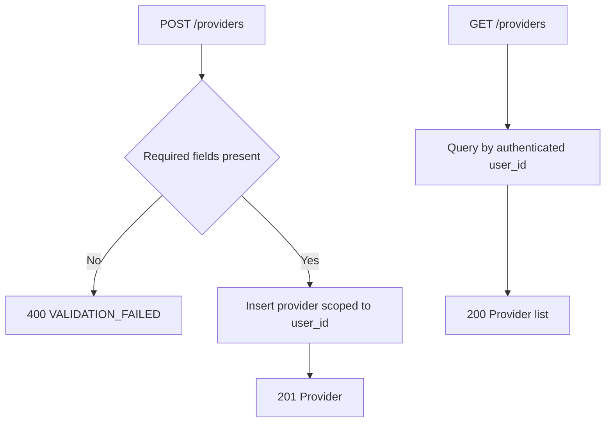
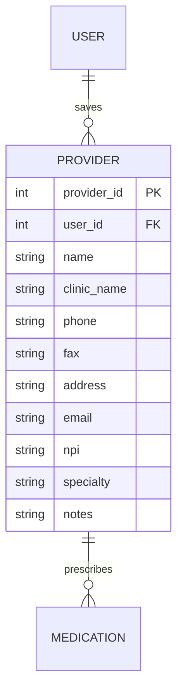

# Feature Planning Report - Detail Design

### Reference Information (10 pts)
---
* **Feature Title**: Observer Retrospective - Provider Schema Expansion and Deployment Stabilization
* **Feature Number**: 02
* **Date**: 2026-07-12
* **Author**: Kelson Gneiting
* **Team Members**: Haejin Na, Joshua Palmer, Joseph Tolley, Xander Weibel, Kelson Gneiting

| Role | Team member name|
-- | --
| Product Owner | Xander Weibel |
| Scrum Master | Xander Weibel |
| Tech Lead (Front-End) | Xander Weibel |
| Tech Lead (Back-End) | Joseph Tolley |
| Tech Lead (Database) | Haejin Na |
| Quality Assurance | Joshua Palmer |
| CM/DM | Joshua Palmer |
| Observer | Kelson Gneiting |
| Responsible Engineer | Joseph Tolley |
| Responsible Engineer | Haejin Na |


----
### Traceablility (10 pts)
* **Requirement Number** (SRS Ref #): FR18 (Provider Association), DB1-DB9, SA1, SA2, SA4, DC1, DC2
* **Design Number** (SDD Ref #): SDD Sections 4, 5, and 6; Components C2, C7, and C8
* **Test Plan** (TPD Ref #): FR18 mapping (integration and system verification)
* **User Documnet** (Ref Section #): SRS Section 3.1 and 3.5
* **Installation Document** (Ref #): Installation Guide v2.0 (Render and Aiven deployment)
* **Software Developer Guide** (Ref #): API-README, openapi.yaml /providers, ERD notes, observer Whitepaper.md

----
### Agile Taksing Information (10 pts)
* **Epic Story**:
    As an Observer who joined in Week 8,
    I want to retrospectively validate Feature 02 documentation and dependencies,
    so that provider workflow decisions and deployment constraints are clearly traceable for final project delivery.
* **Value**: Strengthens continuity across architecture, deployment, and data design decisions made before late-semester onboarding.
* **Planned Delivery**: Retrospective documentation in Week 8+ mapped to original Week 7 feature scope.
* **Schedule**:

* **Known Dependancies/Obsticles**:
    - Joined after Week 7, requiring retrospective synthesis
    - Deployment evidence depends on external Render and Aiven records
    - Some issue IDs are tracked in team board artifacts, not local files
* **GitHub**
  * **GitHub Issue Number**: [RxNOW Kanban Board - Miro](https://miro.com/app/board/uXjVHW1B9x4=/?share_link_id=2185336987)
        * **GitHub Branch**: observer/wk7-feature-retrospective
        * **GitHub Project**: RXNOW Core MVP
  * **Issue Board Link**: [RxNOW Kanban Board - Miro](https://miro.com/app/board/uXjVHW1B9x4=/?share_link_id=2185336987)


---
Detailed Design 
---
### FrontEnd (20 pts)
**Workflow Description**: Feature 02 extends provider capture and association in the client flow. Users create provider records with required and optional contact fields, then associate providers with medication entries. The observer role verifies consistency between stakeholder intent, form behavior, and API contract documentation.



- Agile Info:
    - Story: As a user, I want to add provider contact details and link them to medications.
    - Est Story Points: 3
    - Assigned Responsible Engineer: Xander Weibel (implementation), Kelson Gneiting (observer validation)
    - GitHub Issue Number: Team Miro Feature 02 panel

**Classes**:
* **Model**:
    * **UML Class**:
        ```mermaid
        classDiagram
          class ProviderModel {
            +int provider_id
            +int user_id
            +string name
            +string clinic_name
            +string phone
            +string fax
            +string address
            +string email
            +string npi
            +string specialty
            +string notes
          }
        ```
    * ***Code Location***: 
      src/models/ProviderModel.ts
* **Control** 
    * **UML Class**:
        ```mermaid
        classDiagram
          class ProviderController {
            +validateInputs(formData) bool
            +processCreateProvider(formData)
            +processGetProviders()
            +processUpdateProvider(id, formData)
            +processDeleteProvider(id)
          }
        ```
        * **Create** (Function name):
          processCreateProvider(formData)
        * **Read** (Function name):
          processGetProviders()
        * **Update** (Function name):
          processUpdateProvider(providerId, formData)
        * **Delete** (Function name):
          processDeleteProvider(providerId)
        * ***Code Location***: 
          src/controllers/ProviderController.ts

* **View** (UML Class)
    * **User Interface (Wireframe)**:
      Provider form includes required fields (name, clinic, phone, fax, address) and optional fields (email, NPI, specialty, notes).
        * **Create** (Function name):
          renderProviderForm()
        * **Read** (Function name):
          renderProviderList()
        * **Update** (Function name):
          renderProviderEditForm(provider)
        * **Delete** (Function name):
          N/A
        * ***Code Location***: 
          src/views/ProviderView.tsx
    * **Back Interface** (UML Class):
        * **Create** (Function name):
          apiPostProvider(formData)
        * **Read** (Function name):
          apiGetProviders()
        * **Update** (Function name):
          apiPutProvider(id, formData)
        * **Delete** (Function name):
          apiDeleteProvider(id)
        * ***Code Location***: 
          src/services/ProviderService.ts

### Back-End (20 pts)
* **Business Logic**: 


- Agile Info:
    - Story: As the system, I need provider records scoped to each user.
    - Est Story Points: 3
    - Assigned Responsible Engineer: Joseph Tolley
    - GitHub Issue Number: Team Miro Feature 02 panel

**Classes**
* **Models**: 
    * **UML Class**:
        ```mermaid
        classDiagram
          class Provider {
            +int provider_id
            +int user_id
            +string name
            +string clinic_name
            +string phone
            +string fax
            +string address
            +string email
            +string npi
            +string specialty
            +string notes
          }
        ```
    * ***Code Location***:
      src/models/Provider.py
* **Control**: 
    * **UML Class**:
        ```mermaid
        classDiagram
          class ProviderController {
            +createProvider(userId, data)
            +getProviders(userId)
            +updateProvider(providerId, data)
            +deleteProvider(providerId)
          }
        ```
        * **Create** (Function name):
          createProvider(userId, data)
        * **Read** (Function name):
          getProviders(userId)
        * **Update** (Function name):
          updateProvider(providerId, data)
        * **Delete** (Function name):
          deleteProvider(providerId)
        * ***Code Location***: 
          src/controllers/ProviderController.py

* **View**(UML Class)
    * **Front-End API** ():
        * **Create** (Function name):
          POST /providers
        * **Read** (Function name):
          GET /providers
        * **Update** (Function name):
          PUT /providers/{provider_id}
        * **Delete** (Function name):
          DELETE /providers/{provider_id}
        * ***Code Location***: 
          openapi.yaml (/providers)
    * **Database Interface** (UML Class):
        * **Create** (Function name):
          ProviderRepository.insert(userId, data)
        * **Read** (Function name):
          ProviderRepository.findByUser(userId)
        * **Update** (Function name):
          ProviderRepository.update(providerId, data)
        * **Delete** (Function name):
          ProviderRepository.delete(providerId)
        * ***Code Location***: 
          src/repositories/ProviderRepository.py
    
### Database (20 pts)
* **Data Relationship Logic**: 


- Agile Info:
    - Story: As the system, I need an expanded provider schema for refill-request workflows.
    - Est Story Points: 2
    - Assigned Responsible Engineer: Haejin Na
    - GitHub Issue Number: Team Miro Feature 02 panel

**Classes**:
* **Models**: (Table/Doc Descriptions) 
    PROVIDER stores required and optional provider contact fields, scoped by user_id.
    * ***Code Location***: 
      db/migrations/002_expand_provider.sql
* **Control**: DBMS
    * Setup, Maintenance, Trigger Scripts
        * **Create** (Function name):
          INSERT INTO provider (user_id, name, clinic_name, phone, fax, address, ...) VALUES (...)
        * **Read** (Function name):
          SELECT * FROM provider WHERE user_id = ?
        * **Update** (Function name):
          UPDATE provider SET ... WHERE provider_id = ?
        * **Delete** (Function name):
          DELETE FROM provider WHERE provider_id = ?
        * ***Code Location***: 
          db/migrations/002_expand_provider.sql
* **View** (UML Class)
    * **Back-End API/Queries** ():
        * **Create** (Function name):
          ProviderRepository.insert()
        * **Read** (Function name):
          ProviderRepository.findByUser()
        * **Update** (Function name):
          ProviderRepository.update()
        * **Delete** (Function name):
          ProviderRepository.delete()
        * ***Code Location***:
          src/repositories/ProviderRepository.py

---
### Review (10 pts)
- [x] All elements of the form are filled out
    - [x] Reference
    - [x] Traceablity
    - [x] Agile
    - [x] Detailed Design
- [x] Epic Story is created in the project's repo Issue
    * Issue Number (Reference): [RxNOW Kanban Board - Miro](https://miro.com/app/board/uXjVHW1B9x4=/?share_link_id=2185336987)
- [x] Sub stories are created as the project's repo Issues
    * Issue Number 1 (i.e. Front-End): TBD
    * Issue Number 2 (i.e. Back-End): TBD
    * Issue Number 3 (i.e. Database): TBD
- [x] All stories/issues project attributes are filled out
- [x] Teammembers have reviewed the items

## Observer Artifact Link
* [Whitepaper](./Whitepaper.md)
