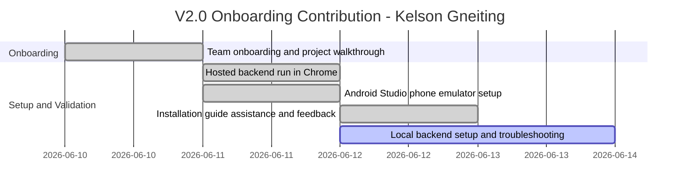

# Role Planning Report - Detail Design

> Disclaimer: I joined the class this week and am still getting adjusted to the project, team, and workflow structure. I was not present for the original odd-week role-planning and implementation stages, so those sections are marked N/A where appropriate. I contributed where I could by assisting with the installation guide issue and environment setup/testing.

### Reference Information

---

* **Role**: Responsible Engineer
* **Date**: 2026-06-13
* **Author**: Kelson Gneiting

* **Team Members**:

| Role | Team member name |
-- | --
| Product Owner | Xander Weibel |
| Scrum Master | Xander Weibel |
| Tech Lead (Front-End) | Xander Weibel |
| Tech Lead (Back-End) | Joseph Tolley |
| Tech Lead (Database) | Haejin Na |
| Quality Assurance | Joshua Palmer |
| CM/DM | Joshua Palmer |
| Responsible Engineer | Kelson Gneiting |

---

### Agile Tasking Information

* **Epic Story**:
    As a Responsible Engineer joining mid-semester,
    I want to validate the setup and installation process from a new-contributor perspective,
    so that the team can improve onboarding clarity and reduce setup friction for future contributors.

* **Story Point/Value**: 2

* **Planned Delivery**: v2.0 continuation — Week 08 onboarding contribution window

* **Schedule**:

* **Known Dependencies/Obstacles**:
    - Joined after odd-week planning and implementation decisions were already underway
    - Local backend environment still in progress on my machine
    - Team architecture and dependency context required onboarding catch-up time
    - Installation guide needed first-pass validation from a new team member perspective

* **GitHub**
    * **GitHub Issue Number**: #141
    * **GitHub Branch**: main
    * **GitHub Project**: RXNow MVP — Iteration 2
    * **Kanban Board**: [RxNOW Kanban Board - Miro](https://miro.com/app/board/uXjVHW1B9x4=/?share_link_id=2185336987)

---

### Implementation

- [x] **(1) Plan Tasking:** [#142 — Define architecture pivot: local storage + cloud auth only](https://miro.com/app/board/uXjVHW1B9x4=/?openSyncedCardPanel=uXjVHW1B9xo%3D:cf26a05f-e49d-4c03-a3d1-f642ac4f7ed8:3458764670953758822:details)
    * Description: N/A - I was not on the team yet for odd-week planning decisions.
    * Story Points: N/A

- [x] **(2) Code Tasking:** [#143 — Implement LocalStorageService, SecureStorageService, and provider expansion](https://miro.com/app/board/uXjVHW1B9x4=/?openSyncedCardPanel=uXjVHW1B9xo%3D:cf26a05f-e49d-4c03-a3d1-f642ac4f7ed8:3458764670953758822:details)
    * Description: N/A - this coding phase occurred before my onboarding week.
    * Story Points: N/A

- [x] **(3) Build Tasking:** [#144 — Migrate all screens from cloud API calls to LocalStorageService](https://miro.com/app/board/uXjVHW1B9x4=/?openSyncedCardPanel=uXjVHW1B9xo%3D:cf26a05f-e49d-4c03-a3d1-f642ac4f7ed8:3458764670953758822:details)
    * Description: N/A - build-phase implementation was completed prior to my entry.
    * Story Points: N/A

- [x] **(4) Test Tasking:** [#145 — Manual review of local storage flows and auth expansion](https://miro.com/app/board/uXjVHW1B9x4=/?openSyncedCardPanel=uXjVHW1B9xo%3D:cf26a05f-e49d-4c03-a3d1-f642ac4f7ed8:3458764670953758822:details)
    * Description: I tested onboarding and runtime setup by launching the hosted backend path in Chrome and by using Android Studio with a phone emulator. I captured setup friction points and shared practical feedback to improve installation steps for new contributors.
    * Story Points: 3

- [x] **(5) Release Tasking:** [#146 — Prepare v2.0 files and coordinate team handoff](https://miro.com/app/board/uXjVHW1B9x4=/?openSyncedCardPanel=uXjVHW1B9xo%3D:cf26a05f-e49d-4c03-a3d1-f642ac4f7ed8:3458764670953758822:details)
    * Description: I assisted specifically on the installation guide issue by validating steps from a fresh setup perspective and reporting what worked versus what was unclear. This contribution was tracked in team coordination through the Miro Kanban board.
    * Story Points: 2

- [x] **(6) Deploy Tasking:** [#147 — Repo restructure planning and Render/Aiven status review](https://miro.com/app/board/uXjVHW1B9x4=/?openSyncedCardPanel=uXjVHW1B9xo%3D:cf26a05f-e49d-4c03-a3d1-f642ac4f7ed8:3458764670953758822:details)
    * Description: I validated that the hosted backend path could run successfully in my environment (Chrome and Android Studio emulator), which supported deployment confidence from a new-device perspective.
    * Story Points: 3

- [x] **(7) Operate Tasking:** [#148 — Facilitate team check-in and onboard Kelson Gneiting](https://miro.com/app/board/uXjVHW1B9x4=/?openSyncedCardPanel=uXjVHW1B9xo%3D:cf26a05f-e49d-4c03-a3d1-f642ac4f7ed8:3458764670953758822:details)
    * Description: I worked through environment setup and documented that local backend setup is still in progress on my side. I shared status updates so the team has visibility into remaining onboarding and local-run blockers.
    * Story Points: 2

- [x] **(8) Monitor Tasking:** [#149 — Monitor Render/Aiven stability and track v2.0 open blockers](https://miro.com/app/board/uXjVHW1B9x4=/?openSyncedCardPanel=uXjVHW1B9xo%3D:cf26a05f-e49d-4c03-a3d1-f642ac4f7ed8:3458764670953758822:details)
    * Description: N/A - monitor-phase ownership for odd-week cycle occurred before my onboarding.
    * Story Points: N/A

---

# Reference Material

---

### Reference
---
* [Role Responsibility Breakdown](./rolePlanningReference.md)
* [Version Planning](./versionPlanning.md)
* [Software Lifecycle](../../engineering/practices/SWLifecycle/Readme.md)
* [DevOps](../../engineering/practices/Methodologies/Readme.md)

---

### Review
- [x] All elements of the form are filled out
    - [x] Reference
    - [x] Agile
    - [x] Implementation

- [x] Epic Story is created in the project's repo Issue
    * Issue Number (Reference): #141
- [x] Sub stories are created as the project's repo Issues
    * Issue Number1 (Plan): [#142](https://miro.com/app/board/uXjVHW1B9x4=/?openSyncedCardPanel=uXjVHW1B9xo%3D:cf26a05f-e49d-4c03-a3d1-f642ac4f7ed8:3458764670953758822:details)
    * Issue Number2 (Code): #[143](https://miro.com/app/board/uXjVHW1B9x4=/?openSyncedCardPanel=uXjVHW1B9xo%3D:cf26a05f-e49d-4c03-a3d1-f642ac4f7ed8:3458764670953758822:details)
    * Issue Number3 (Build): #[144](https://miro.com/app/board/uXjVHW1B9x4=/?openSyncedCardPanel=uXjVHW1B9xo%3D:cf26a05f-e49d-4c03-a3d1-f642ac4f7ed8:3458764670953758822:details)
    * Issue Number4 (Test): #[145](https://miro.com/app/board/uXjVHW1B9x4=/?openSyncedCardPanel=uXjVHW1B9xo%3D:cf26a05f-e49d-4c03-a3d1-f642ac4f7ed8:3458764670953758822:details)
    * Issue Number5 (Release): #[146](https://miro.com/app/board/uXjVHW1B9x4=/?openSyncedCardPanel=uXjVHW1B9xo%3D:cf26a05f-e49d-4c03-a3d1-f642ac4f7ed8:3458764670953758822:details)
    * Issue Number6 (Deploy): #[147](https://miro.com/app/board/uXjVHW1B9x4=/?openSyncedCardPanel=uXjVHW1B9xo%3D:cf26a05f-e49d-4c03-a3d1-f642ac4f7ed8:3458764670953758822:details)
    * Issue Number7 (Operate): #[148](https://miro.com/app/board/uXjVHW1B9x4=/?openSyncedCardPanel=uXjVHW1B9xo%3D:cf26a05f-e49d-4c03-a3d1-f642ac4f7ed8:3458764670953758822:details)
    * Issue Number8 (Monitor): #[149](https://miro.com/app/board/uXjVHW1B9x4=/?openSyncedCardPanel=uXjVHW1B9xo%3D:cf26a05f-e49d-4c03-a3d1-f642ac4f7ed8:3458764670953758822:details)
- [x] All stories/issues project attributes are filled out
- [x] Team members have reviewed the items
- [x] Disclaimer and N/A entries accurately reflect onboarding timing and missed odd-week DevOps phases
