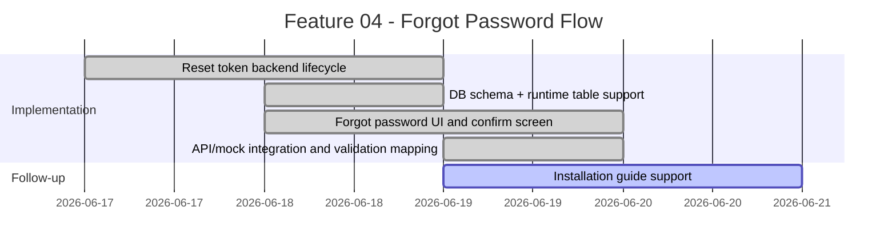
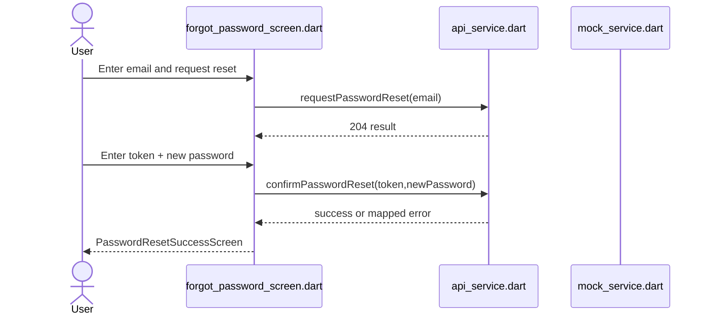
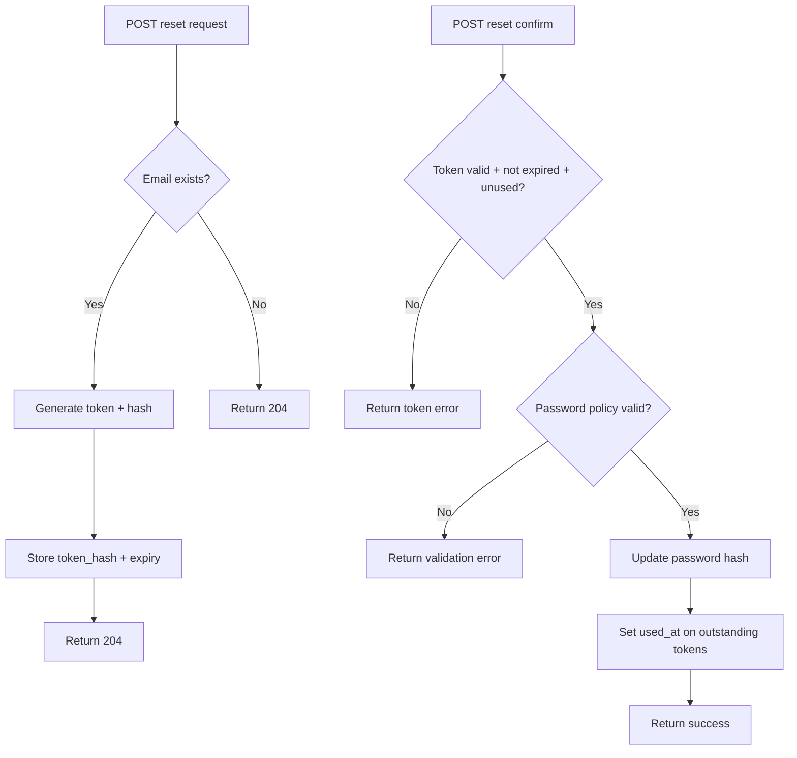
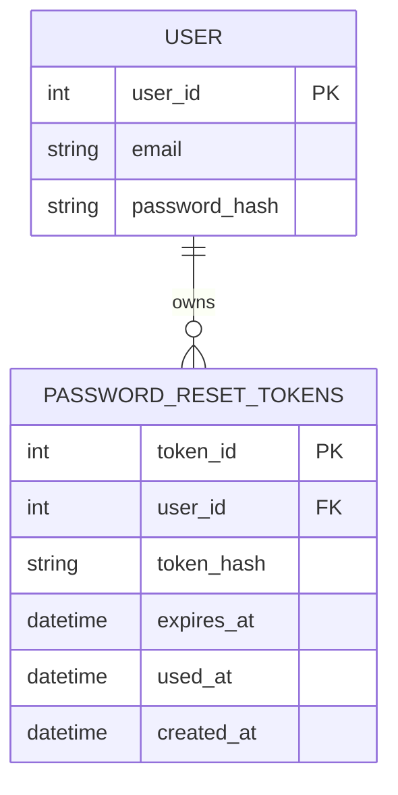

# Feature Planning Report - Detail Design
<!-- Instructions
Please fill this out during your planning meeting.
Each member of the group should complete a feature every two weeks. You are encharge of ensuring that your feature is complete.

You need to make a copy of this file.
Name it the <FeatureNumber>_<Feature title>.md and
Put it in the <artifacts/<team>/project/engineering/detaileddesign directory
    where <team>, will be replace with your team's name 
    i.e. artifacts/RecSrv/project/engineering/methodology/02_UserProfile.md
-->

### Reference Information (10 pts)
---
* **Feature Title**: Forgot Password Reset Flow (Request + Confirm)
* **Feature Number**: 04
* **Date**: 2026-06-20
* **Author**: Kelson Gneiting
* **Team Members**: 

| Role | Team member name|
-- | --
| Product Owner | Xander Weibel |
| Scrum Master | Kelson Gneiting |
| Tech Lead (Front-End) | Xander Weibel |
| Tech Lead (Back-End) | Joseph Tolley |
| Tech Lead (Database) | Haejin Na |
| Quality Assurance | Joshua Palmer | 
| CM/DM | Joshua Palmer | 
| |if more team members than roles | 
| Responsible Engineer | Kelson Gneiting | 
| Responsible Engineer | N/A | 


----
### Traceablility (10 pts)
* **Requirement Number** (SRS Ref #): FR5 (password reset), FR2 (password policy), SA2, SA3, SA4, DB8
* **Design Number** (SDD Ref #): Back-End Auth workflows + Front-End Auth screens (forgot/reset)
* **Test Plan** (TPD Ref #): TC-AUTH-09, TC-AUTH-10, TC-AUTH-11, TC-AUTH-12
* **User Documnet** (Ref Section #): User Guide section for account recovery
* **Installation Document** (Ref #): VDD 3.0 installation notes and environment mode behavior
* **Software Developer Guide** (Ref #): Auth controller/service + DB schema token lifecycle documentation

----
### Agile Taksing Information (10 pts)
* **Epic Story**:
<!--Format:
As <<>>,
I want <<>>,
so that <<>> -->
As a user,
I want to securely reset my password using a one-time token,
so that I can recover account access without exposing sensitive information.
* **Value**: Improves account recovery UX while maintaining secure token and password-handling standards
* **Planned Delivery**: v3.0 - Week 09
<!--Use https://mermaid.js.org/syntax/gitgraph.html -->
* **Schedule**:
<!-- Use https://mermaid.js.org/syntax/gantt.html -->

* **Known Dependancies/Obsticles**: 
    * Production email provider is not yet wired (email mode currently warns and falls back to dev logging)
    * Deep-link token auto-fill into confirm reset screen is not yet implemented
    * Backend integration tests for token edge cases still need to be added
* **GitHub**
        * **GitHub Issue Number**: Team issue tracking is maintained on Miro board cards
        * **GitHub Branch**: feature/forgot-password
        * **GitHub Project**: RXNow MVP
        * **Issue Board Link**: [RxNOW Kanban Board - Miro](https://miro.com/app/board/uXjVHW1B9x4=/?share_link_id=2185336987)


---
Detailed Design 
---
<!-- NOTE: Not all projects will follow the 3-Tier and MVC architecture, please find the corresponding functionality. You may use N/A for any of the them but you must provide a detailed reason. 
-->
### FrontEnd (20 pts)
**Workflow Description**: <!-- Use paragraph and https://mermaid.js.org/syntax/sequenceDiagram.html-->
The forgot-password UI now supports both reset request and token confirmation workflows. Users can request a reset from the initial form, then proceed to an Enter Reset Token path that opens a confirmation screen with token input, new password fields, policy indicators, and backend-aware error mapping. On success, the flow routes to the existing PasswordResetSuccessScreen.


- Agile Info:
    - Story: Forgot password request/confirm UI integration
    - Est Story Points: 5
    - Assigned Responsible Engineer: Kelson Gneiting
    - GitHub Issue Number: Miro board tracking

<!-- See Role -->

**Classes**:
* **Model**:
    * **UML Class**:
        <!-- Use https://mermaid.js.org/syntax/classDiagram.html: --->
        ```mermaid
        classDiagram
            class ResetRequestModel {
                +String email
            }
            class ResetConfirmModel {
                +String token
                +String newPassword
                +String confirmPassword
            }
        ```
    * ***Code Location***: 
        lib/models/reset_models.dart (logical view)
* **Control** 
    * **UML Class**:
        <!-- Use https://mermaid.js.org/syntax/classDiagram.html: --->
        ```mermaid
        classDiagram
            class ForgotPasswordController {
                +requestReset(email)
                +confirmReset(token,newPassword)
                +validatePasswordPolicy(password)
            }
        ```
        * **Create** (Function name):
            requestReset(email)
        * **Read** (Function name):
            readResetState()
        * **Update** (Function name):
            confirmReset(token,newPassword)
        * **Delete** (Function name):
            clearResetState()
        * ***Code Location***: 
            lib/screens/forgot_password_screen.dart

* **View** (UML Class)
    <!--- Use https://mermaid.js.org/syntax/classDiagram.html: --->
    * **User Interface (Wireframe)**:
        * **Create** (Function name):
            renderRequestResetForm()
        * **Read** (Function name):
            renderConfirmResetForm()
        * **Update** (Function name):
            updatePasswordPolicyIndicators()
        * **Delete** (Function name):
            clearFormInputs()
        * ***Code Location***: 
            lib/screens/forgot_password_screen.dart
    * **Back Interface** (UML Class):
        * **Create** (Function name):
            requestPasswordReset(email)
        * **Read** (Function name):
            getResetFlowState()
        * **Update** (Function name):
            confirmPasswordReset(token,newPassword)
        * **Delete** (Function name):
            clearResetArtifacts()
        * ***Code Location***: 
            lib/services/api_service.dart, lib/services/mock_service.dart

### Back-End (20 pts)
* **Business Logic**: 
<!-- Use https://mermaid.js.org/syntax/flowchart.html -->
Implemented secure reset token lifecycle in backend auth services and controllers. Request endpoint accepts email and returns 204 for both known/unknown emails (enumeration resistance), creates one-time token, stores only SHA-256 hash with expiry (15 minutes), and uses environment-driven delivery mode behavior. Confirm endpoint validates token and new password, enforces policy, updates password hash, and invalidates all outstanding tokens for that user by setting used_at.


- Agile Info:
    - Story: Secure password reset backend lifecycle
    - Est Story Points: 8
    - Assigned Responsible Engineer: Kelson Gneiting (implementation), Joseph Tolley (backend lead oversight)
    - GitHub Issue Number: Miro board tracking

**Classes**
* **Models**: 
    <!--Use UML and Sequence or ZenUML -->
    * **UML Class**:
        <!-- Use https://mermaid.js.org/syntax/classDiagram.html: --->
        ```mermaid
        classDiagram
            class PasswordResetToken {
                +int token_id
                +int user_id
                +string token_hash
                +datetime expires_at
                +datetime used_at
                +datetime created_at
            }
        ```
    * ***Code Location***:
        backend/src/services/authService.js
* **Control**: 
    <!-- Use UML and https://mermaid.js.org/syntax/sequenceDiagram.html -->
    * **UML Class**:
        * **Create** (Function name):
            requestPasswordReset(email)
        * **Read** (Function name):
            validateResetToken(token)
        * **Update** (Function name):
            confirmPasswordReset(token,newPassword)
        * **Delete** (Function name):
            invalidateOutstandingTokens(userId)
        * ***Code Location***: 
            backend/src/controllers/authController.js
            <!-- Use https://mermaid.js.org/syntax/classDiagram.html: -->

* **View**(UML Class)
    <!--- Use https://mermaid.js.org/syntax/classDiagram.html: --->
    * **Front-End API** ():
        * **Create** (Function name):
            POST /auth/password-reset/request
        * **Read** (Function name):
            N/A
        * **Update** (Function name):
            POST /auth/password-reset/confirm
        * **Delete** (Function name):
            N/A
        * ***Code Location***: 
            backend/src/controllers/authController.js
    * **Database Interface** (UML Class):
        * **Create** (Function name):
            insertPasswordResetToken()
        * **Read** (Function name):
            getValidResetTokenByHash()
        * **Update** (Function name):
            updateUserPasswordHash(), markTokensUsed()
        * **Delete** (Function name):
            logical invalidate via used_at
        * ***Code Location***: 
            backend/src/services/authService.js, backend/src/db.js
    
### Database (20 pts)
* **Data Relationship Logic**: 
<!-- Use https://mermaid.js.org/syntax/entityRelationshipDiagram.html -->
Added password_reset_tokens table to canonical schema and runtime startup path to avoid manual setup gaps. Table includes constraints and indexes for token hash lookup, expiry handling, and one-time token usage semantics.


- Agile Info:
        - Story: Reset token persistence support
        - Est Story Points: 3
        - Assigned Responsible Engineer: Kelson Gneiting (implementation), Haejin Na (database lead review)
        - GitHub Issue Number: Miro board tracking

**Classes**:
<!--Use https://mermaid.js.org/syntax/entityRelationshipDiagram.html -->
* **Models**: (Table/Doc Descriptions) 
    * password_reset_tokens table with token_hash-only storage, expiry, and used_at invalidation pattern
    * ***Code Location***: 
        backend/schema.sql
* **Control**: DBMS
    * Setup, Maintenance, Trigger Scripts
        * **Create** (Function name):
            createPasswordResetTokenTable()
        * **Read** (Function name):
            queryValidTokenByHash()
        * **Update** (Function name):
            updateUsedAtByUser(), updateUserPasswordHash()
        * **Delete** (Function name):
            N/A (records retained for lifecycle auditing)
        * ***Code Location***: 
            backend/src/db.js, backend/src/services/authService.js
* **View** (UML Class)
    <!--- Use https://mermaid.js.org/syntax/classDiagram.html: --->
    * **Back-End API/Queries** ():
        * **Create** (Function name):
            INSERT reset token hash
        * **Read** (Function name):
            SELECT valid token by hash+expiry+unused
        * **Update** (Function name):
            UPDATE used_at and password hash
        * **Delete** (Function name):
            N/A
        * ***Code Location***:
            backend/src/services/authService.js

---
### Review (10 pts)
- [x] All elements of the form are filled out
    - [x] Reference 
    - [x] Traceablity
    - [x] Agile
    - [x] Detailed Design 
- [x] Epic Story is created in the project's repo Issue
    * Issue Number (Reference): [RxNOW Kanban Board - Miro](https://miro.com/app/board/uXjVHW1B9x4=/?share_link_id=2185336987)
    <!-- Include a link to the Issue--> 
- [x] Sub stories are created as the project's repo Issues
    * Issue Number 1 (i.e. Front-End): [RxNOW Kanban Board - Miro](https://miro.com/app/board/uXjVHW1B9x4=/?share_link_id=2185336987)
    * Issue Number 2 (i.e. Back-End): [RxNOW Kanban Board - Miro](https://miro.com/app/board/uXjVHW1B9x4=/?share_link_id=2185336987)
    * Issue Number 3 (i.e. Database): [RxNOW Kanban Board - Miro](https://miro.com/app/board/uXjVHW1B9x4=/?share_link_id=2185336987)
    <!-- Include a link to the Issues--> 
- [x] All stories/issues project attributes are filled out
- [x] Teammembers have reviewed the items

### Implementation Notes (Week 9)
What was implemented:
* Secure backend token lifecycle in authService.js and authController.js.
* Password reset request endpoint with non-enumerating 204 behavior.
* Password reset confirm endpoint with token validation, password policy enforcement, and token invalidation.
* password_reset_tokens table added in db.js startup and canonical schema.sql.
* Front-end confirm-reset integration in forgot_password_screen.dart with success routing.
* API and mock compatibility updates in api_service.dart and mock_service.dart.

Security decisions:
* Raw reset tokens are never stored in DB (SHA-256 hash only).
* Reset tokens expire after 15 minutes.
* Tokens become single-use via used_at updates.
* Request endpoint always returns 204 for unknown emails.
* Reset password enforces same policy as registration.

Delivery mode behavior:
* dev_log mode logs reset link/token for local testing.
* email mode currently warns and falls back to logging until provider wiring is complete.

Files validated with no reported diagnostics issues in this work pass:
* authController.js
* authService.js
* db.js
* schema.sql
* api_service.dart
* mock_service.dart
* forgot_password_screen.dart

Natural next steps:
* Wire production email provider for email delivery mode.
* Add backend integration tests for valid/expired/reused/unknown-email cases.
* Add deep-link token auto-fill into confirm reset screen.
