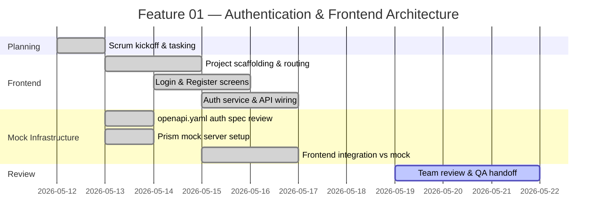
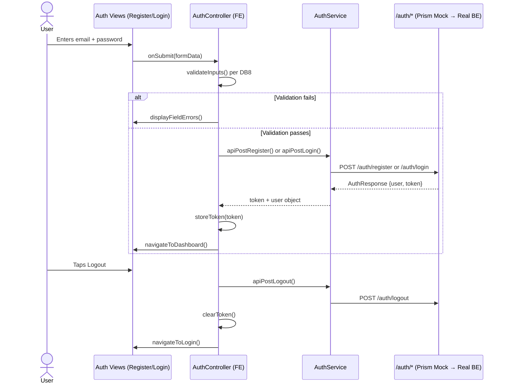
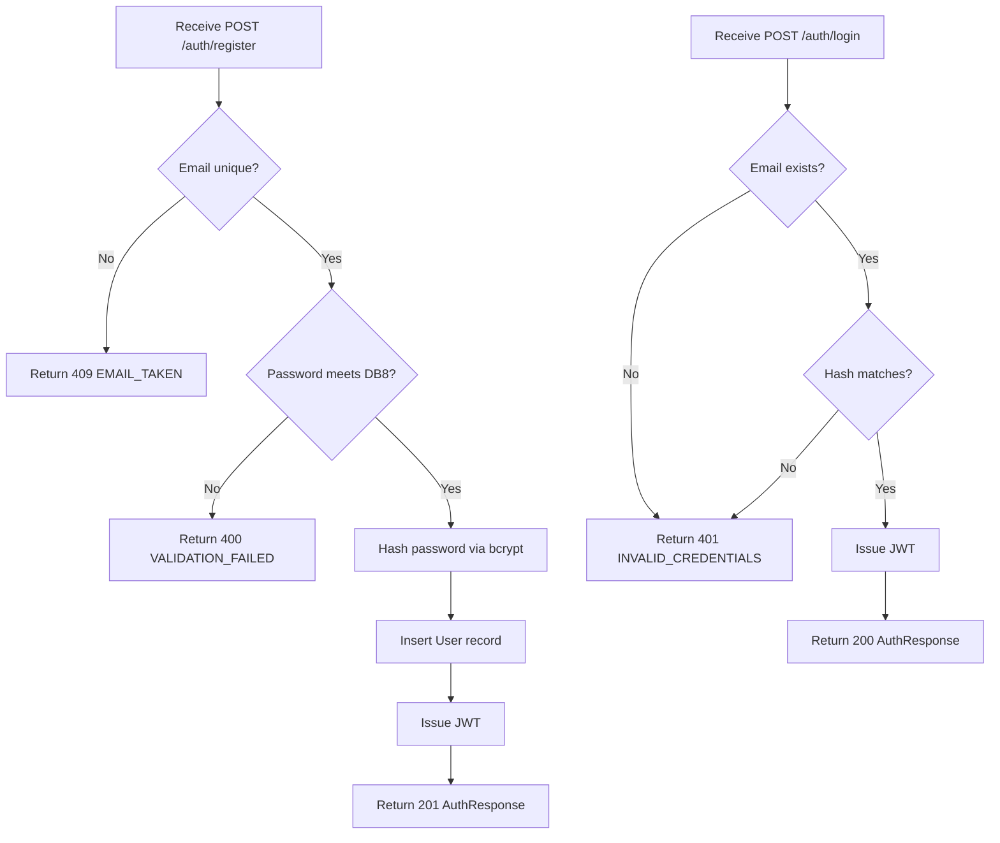
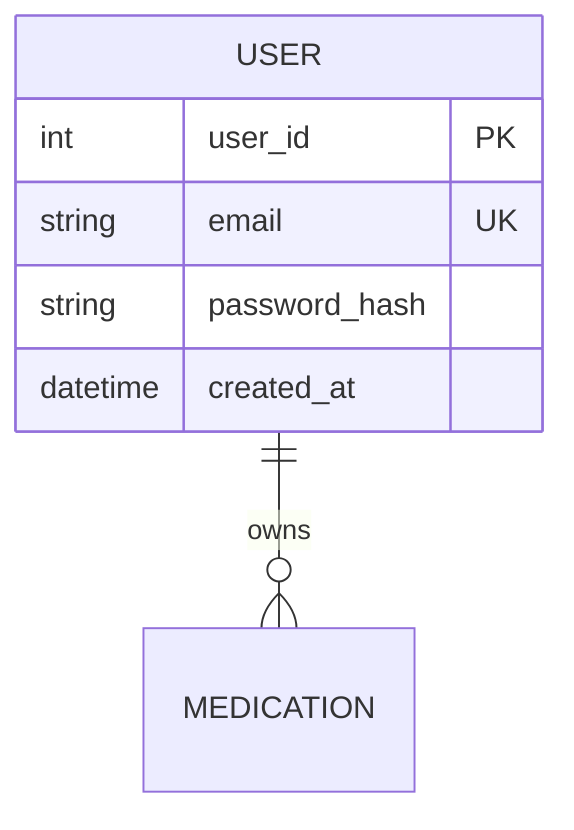

# Feature Planning Report - Detail Design

### Reference Information
---
* **Feature Title**: User Authentication & Frontend Architecture Setup
* **Feature Number**: 01
* **Date**: 2026-05-23
* **Author**: Xander Weibel
* **Team Members**: Parker Morgan, Haejin Na, Joshua Palmer, Joseph Howard Tolley, Xander Weibel

| Role | Xander Weibel |
-- | --
| Product Owner | Xander Weibel |
| Scrum Master | Xander Weibel |
| Tech Lead (Front-End) | Joseph Tolley|
| Tech Lead (Back-End) | Joseph Tolley |
| Tech Lead (Database) | Haeji Na |
| Quality Assurance | Joshua Palmer |
| CM/DM | Joshua Palmer |


---
### Traceability
* **Requirement Number** (SRS Ref #): FR1, FR2, FR3, FR4, FR5 (PF1 — User Account Creation and Authentication); IR1, IR2, IR4; SA3, SA4; DB1, DB8
* **Design Number** (SDD Ref #): SDD Section 2 (Front-End Design), Section 3 (APIs — Auth), Section 4 (Back-End Design — Auth), Component C1 (Authentication), Component C5 (UI), Component C6 (API)
* **Test Plan** (TPD Ref #): FR1–FR5 (Verification Mapping — Inspection, Demonstration; Unit, Integration, System)
* **User Document** (Ref Section #): SRS Section 1.3 (Product Functions — PF1), Section 3.1 (FR1–FR5)
* **Installation Document** (Ref #): SDD Section 7 (Installation — clone, install, run)
* **Software Developer Guide** (Ref #): API-README.md — Mock server setup (Prism), openapi.yaml `/auth/*` endpoints

---
### Agile Tasking Information
* **Epic Story**:
  As a patient user,
  I want to create an account and securely log in,
  so that I can access my personal medication dashboard and manage my prescriptions.

* **Value**: Foundational gate for all other features — no Tier 1 feature (REQ-002 through REQ-006) is accessible without authentication. Delivers FR1–FR5 and establishes the frontend routing and API contract used by every subsequent feature.

* **Planned Delivery**: v1.0 — Week 05 (Architecture & Initial Build)

* **Schedule**:


* **Known Dependencies / Obstacles**:
  - openapi.yaml `/auth/*` endpoints must be finalized before frontend service layer is built
  - Backend JWT implementation (Joe) must match the `AuthResponse` schema in the spec before convergence
  - Password policy (DB8) must be enforced on both frontend (form validation) and backend (server-side)
  - Prism mock used as stand-in until real backend is available; convergence = one URL swap

* **GitHub**
  * **GitHub Issue Number**: [Miro Board — Auth Epic](https://miro.com/app/board/uXjVHW1B9x4=/?openSyncedCardPanel=uXjVHW1B9xo%3D:2e7bb6c0-8f30-49f8-91ab-e13521d30d46:3458764670953758822:details)
  * **GitHub Branch**: `feature/01-auth-frontend`
  * **GitHub Project**: RXNow MVP — Iteration 1

---

## Detailed Design

### FrontEnd

**Workflow Description**:
The frontend authentication flow handles account registration, login, logout, and password reset. All API calls are routed through an `AuthService` class that targets either the Prism mock server (development) or the real backend (production). Session state is managed via a stored JWT token; protected routes check for token presence before rendering.



- Agile Info:
  - Story: As a user, I want a Register and Login screen so I can create and access my account.
  - Est Story Points: 5
  - Assigned Responsible Engineer: [Your Name]
  - GitHub Issue Number: [Miro — FE Auth Sub-task](https://miro.com/app/board/uXjVHW1B9x4=/?openSyncedCardPanel=uXjVHW1B9xo%3D:2e7bb6c0-8f30-49f8-91ab-e13521d30d46:3458764670953758822:details)

**Classes**:

* **Model**:
  * **UML Class**:
    ```mermaid
    classDiagram
      class UserModel {
        +int user_id
        +string email
        +string created_at
      }
      class AuthState {
        +string token
        +UserModel user
        +bool isAuthenticated()
        +void clear()
      }
    ```
  * ***Code Location***: `src/models/UserModel.ts`, `src/state/AuthState.ts`

* **Control**:
  * **UML Class**:
    ```mermaid
    classDiagram
      class AuthController {
        +validateInputs(formData) bool
        +storeToken(token) void
        +clearToken() void
        +navigateToDashboard() void
        +navigateToLogin() void
      }
    ```
  * **Create** (Function name): `processSignup(formData)`
  * **Read** (Function name): `processLogin(formData)`
  * **Update** (Function name): `processPasswordReset(token, newPassword)`
  * **Delete** (Function name): `processLogout()`
  * ***Code Location***: `src/controllers/AuthController.ts`

* **View**:
  * **User Interface (Wireframe)**: Login screen (email + password fields, submit button, link to Register); Register screen (email + password fields, submit); Password Reset request and confirm screens. All screens are mobile-optimized per IR1. Error states display inline per SA2.
  * **Create** (Function name): `renderRegisterScreen()`
  * **Read** (Function name): `renderLoginScreen()`
  * **Update** (Function name): `renderPasswordResetScreen()`
  * **Delete** (Function name): N/A — logout triggers navigation, no dedicated view
  * ***Code Location***: `src/views/RegisterView.tsx`, `src/views/LoginView.tsx`, `src/views/PasswordResetView.tsx`
  * **Back Interface** (API calls from View layer):
    * **Create** (Function name): `apiPostRegister(email, password)` → POST `/auth/register`
    * **Read** (Function name): `apiPostLogin(email, password)` → POST `/auth/login`
    * **Update** (Function name): `apiPostPasswordResetConfirm(token, newPassword)` → POST `/auth/password-reset/confirm`
    * **Delete** (Function name): `apiPostLogout()` → POST `/auth/logout`
    * ***Code Location***: `src/services/AuthService.ts`

---

### Back-End

> **Note**: Back-end is currently represented by the Prism mock server (`openapi.yaml`). Real implementation is assigned to Joe (Joseph Howard Tolley). This section documents the expected business logic against which the frontend was developed.

* **Business Logic**:


- Agile Info:
  - Story: As the system, I need to validate credentials and issue JWT tokens so that user sessions are secure.
  - Est Story Points: 5
  - Assigned Responsible Engineer: Joseph Howard Tolley
  - GitHub Issue Number: [Miro — BE Auth Sub-task](https://miro.com/app/board/uXjVHW1B9x4=/?openSyncedCardPanel=uXjVHW1B9xo%3D:2e7bb6c0-8f30-49f8-91ab-e13521d30d46:3458764670953758822:details)

**Classes**:

* **Models**:
  * **UML Class**:
    ```mermaid
    classDiagram
      class User {
        +int user_id
        +string email
        +string password_hash
        +datetime created_at
      }
    ```
  * ***Code Location***: `src/models/User.py` (or equivalent BE language)

* **Control**:
  * **UML Class**:
    ```mermaid
    classDiagram
      class AuthController {
        +createAccount(email, password) AuthResponse
        +authenticateUser(email, password) AuthResponse
        +recoverPassword(email) void
        +terminateSession(token) void
      }
    ```
  * **Create** (Function name): `createAccount(email, password)`
  * **Read** (Function name): `authenticateUser(email, password)`
  * **Update** (Function name): `recoverPassword(email)`, `confirmPasswordReset(token, newPassword)`
  * **Delete** (Function name): `terminateSession(token)`
  * ***Code Location***: `src/controllers/AuthController.py`

* **View** (API surface):
  * **Front-End API**:
    * **Create** (Function name): `POST /auth/register`
    * **Read** (Function name): `POST /auth/login`
    * **Update** (Function name): `POST /auth/password-reset/request`, `POST /auth/password-reset/confirm`
    * **Delete** (Function name): `POST /auth/logout`
    * ***Code Location***: `openapi.yaml` `/auth/*` — authoritative contract
  * **Database Interface**:
    * **Create** (Function name): `UserRepository.insertUser(email, passwordHash)`
    * **Read** (Function name): `UserRepository.findUserByEmail(email)`
    * **Update** (Function name): `UserRepository.updatePassword(userId, newHash)`
    * **Delete** (Function name): N/A — sessions are stateless JWT; no DB row deleted on logout
    * ***Code Location***: `src/repositories/UserRepository.py`

---

### Database

* **Data Relationship Logic**:

> Full ERD in `EntityRelationshipDiagram.md`. This feature scopes only the `USER` entity.

- Agile Info:
  - Story: As the system, I need a User table with hashed passwords so that credentials are stored securely.
  - Est Story Points: 2
  - Assigned Responsible Engineer: Xander Benjamin Weibel
  - GitHub Issue Number: [Miro — DB Auth Sub-task](https://miro.com/app/board/uXjVHW1B9x4=/?openSyncedCardPanel=uXjVHW1B9xo%3D:2e7bb6c0-8f30-49f8-91ab-e13521d30d46:3458764670953758822:details)

**Classes**:

* **Models** (Table Descriptions):
  * `USER` — Stores registered accounts. `email` is unique (DB1). `password_hash` stores one-way bcrypt hash (SA3). Password must meet 8-char minimum with uppercase, lowercase, and number (DB8).
  * ***Code Location***: `db/migrations/001_create_users.sql`

* **Control** (DBMS Scripts):
  * **Create** (Function name): `INSERT INTO user (email, password_hash, created_at) VALUES (?, ?, ?)`
  * **Read** (Function name): `SELECT * FROM user WHERE email = ?`
  * **Update** (Function name): `UPDATE user SET password_hash = ? WHERE user_id = ?`
  * **Delete** (Function name): N/A for MVP scope
  * ***Code Location***: `db/migrations/001_create_users.sql`, `db/seeds/dev_seed.sql`

* **View** (Back-End API / Queries):
  * **Create** (Function name): `UserRepository.insertUser()`
  * **Read** (Function name): `UserRepository.findUserByEmail()`
  * **Update** (Function name): `UserRepository.updatePassword()`
  * **Delete** (Function name): N/A
  * ***Code Location***: `src/repositories/UserRepository.py`

---

### Review
- [ ] All elements of the form are filled out
    - [ ] Reference
    - [ ] Traceability
    - [ ] Agile
    - [ ] Detailed Design
- [ ] Epic Story is created in the project's repo Issue
    * Issue Number (Reference):
- [ ] Sub stories are created as the project's repo Issues
    * Issue Number 1 (i.e. Front-End):
    * Issue Number 2 (i.e. Back-End):
    * Issue Number 3 (i.e. Database):
- [ ] All stories/issues project attributes are filled out
- [ ] Team members have reviewed the items
