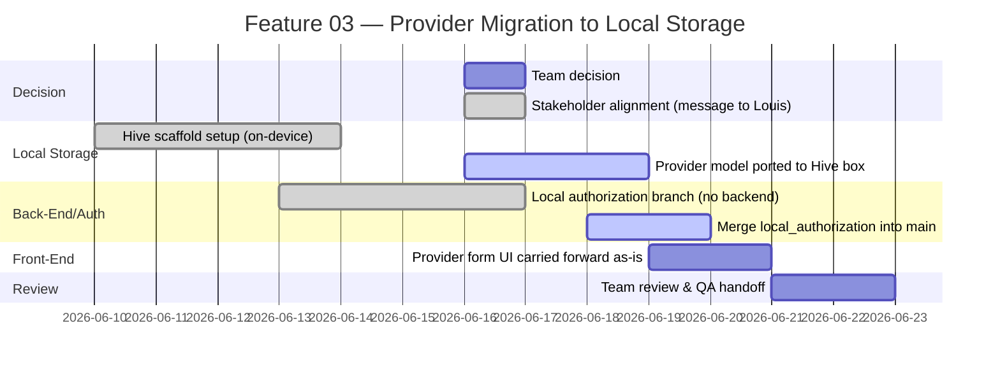
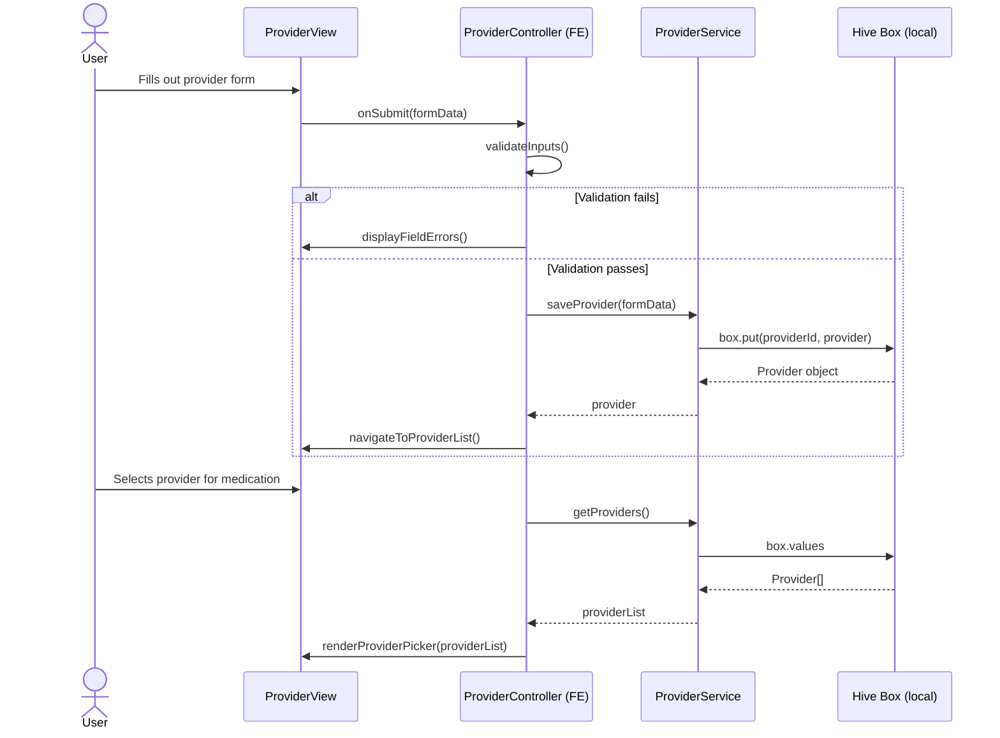
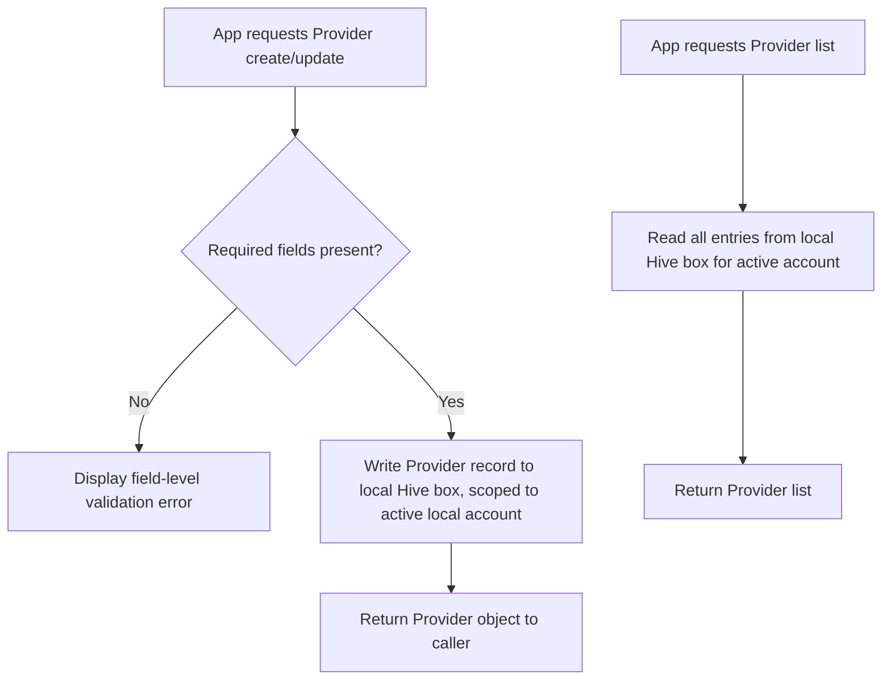
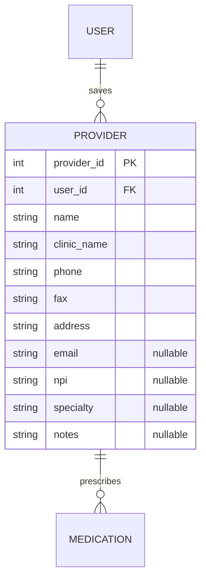

# Feature Planning Report - Detail Design

### Reference Information
---
* **Feature Title**: Provider Schema Migration to Local Storage (Hive) — Supersedes Render/Aiven Deployment
* **Feature Number**: 03
* **Date**: 2026-06-19
* **Author**: Xander Weibel
* **Team Members**: Haejin Na, Joshua Palmer, Joseph Tolley, Xander Weibel, Kelson Gneiting

| Role | Assignee |
-- | --
| Product Owner | Xander Weibel |
| Scrum Master | Kelson Gneiting |
| Tech Lead (Front-End) | Xander Weibel |
| Tech Lead (Back-End/Local Auth) | Joseph Tolley |
| Tech Lead (Local Storage) | Haejin Na |
| Quality Assurance | Joshua Palmer |
| CM/DM | Joshua Palmer |

**Supersedes**: Feature 02 (Provider Schema Expansion & Render/Aiven Deployment Stabilization, Week 07). Feature 02's Provider field set is carried forward unchanged; its delivery mechanism (Aiven schema migration, Render-hosted REST endpoints) is retired per the Week 08–09 architecture pivot to a fully local, offline MVP. The Render/Aiven implementation work product remains in the repository for future-cohort reference but is no longer part of the active build.

---

### Traceability
* **Requirement Number** (SRS Ref #): FR18 (Provider Association); DB1–DB9; SA1, SA2, SA4; DC1, DC2, DC3
* **Design Number** (SDD Ref #): SDD Section 4 (Back-End Design) — local equivalent; Section 6 (Database Design) — local schema equivalent; Component C2 (Medication Management). *Pending SDD revision: Sections 4–6 still describe a Render/Aiven back-end and need updating to describe local persistence (see Open Items below).*
* **Test Plan** (TPD Ref #): FR18 (Verification Mapping — Demonstration, Inspection; Unit, Integration, System — local equivalents)
* **User Document** (Ref Section #): SRS Section 3.1 (FR18), Section 3.5 (DB2, DB3)
* **Installation Document** (Ref #): VDD 3.0 / Louis Installation Guide — local Flutter build only, no Render/Aiven setup required
* **Software Developer Guide** (Ref #): `openapi.yaml` `/providers` endpoints are now historical/reference only and do not reflect the active local data path; ERD (EntityRelationshipDiagram.md) Provider entity fields still apply at the data-model level

---

### Agile Tasking Information
* **Epic Story**:
  As a patient user,
  I want to save my provider's contact details and associate them with my medications,
  so that I can generate a complete refill request without having to look up provider information each time — all without requiring an internet connection or server.

* **Value**: Preserves the stakeholder-directed Provider field expansion from Feature 02 while removing the Render/Aiven dependency that was identified as a compliance and timeline bottleneck (per June 16 team meeting). Keeps provider/refill data fully on-device, simplifying HIPAA-adjacent data-handling concerns for the MVP.

* **Planned Delivery**: v3.0 — Week 09 (Deployment & Installation cycle, repositioned as Local Stabilization)

* **Schedule**:


* **Known Dependencies / Obstacles**:
  - Render/Aiven backend is retired; any in-flight Feature 02 work referencing those endpoints does not carry forward into the active build
  - Hive box structure for Provider must mirror the field set already validated in Feature 02 (name, clinic_name, phone, fax, address required; email, npi, specialty, notes nullable) so no requirements are lost in the migration
  - `local_authorization` branch (Joe) removes backend dependency for accounts; Provider storage follows the same pattern — confirm both land on a consistent local-storage approach before merge to `main`
  - SDD Sections 4–6 and ERD still describe a server/SQL model and need a documentation pass to reflect Hive-based local storage (flagged as an open item, not a blocker for this feature)
  - openapi.yaml remains in the repo as a historical contract; team should add a note marking it superseded for MVP scope so future contributors aren't misled

* **GitHub**:
  * **GitHub Branch**: `feature/03` (built on top of `local_authorization`)
  * **GitHub Project**: RXNow MVP

---

## Detailed Design

### Front-End

**Workflow Description**:
The provider form UI from Feature 02 is carried forward unchanged — same fields, same validation rules (name, clinic/office name, fax, phone, and address required; email, NPI, specialty, notes optional). The only change is the back interface: instead of calling a REST API, the front-end controller now reads/writes directly to a local Hive box.



- Agile Info:
  - Story: As a user, I want to add and save provider contact details on my device so I can associate them with my medications without needing an internet connection.
  - Est Story Points: 2 (reduced from 3 — UI is reused as-is from Feature 02; only the service layer changes)
  - Assigned Responsible Engineer: Xander Weibel

**Classes**:

* **Model**:
  * **UML Class**:
    ```mermaid
    classDiagram
      class ProviderModel {
        +int provider_id
        +int user_id
        +string name
        +string clinic_name
        +string phone
        +string fax
        +string address
        +string email
        +string npi
        +string specialty
        +string notes
      }
    ```
  * ***Code Location***: `src/models/ProviderModel.ts` (unchanged from Feature 02 — field set carries forward)

* **Control**:
  * **UML Class**:
    ```mermaid
    classDiagram
      class ProviderController {
        +validateInputs(formData) bool
        +navigateToProviderList() void
        +renderProviderPicker(list) void
      }
    ```
  * **Create** (Function name): `processCreateProvider(formData)`
  * **Read** (Function name): `processGetProviders()`
  * **Update** (Function name): `processUpdateProvider(providerId, formData)`
  * **Delete** (Function name): `processDeleteProvider(providerId)`
  * ***Code Location***: `src/controllers/ProviderController.ts` (unchanged — calls into `ProviderService` regardless of backing store)

* **View**:
  * **User Interface**: Provider form screen — unchanged from Feature 02.
  * **Create** (Function name): `renderProviderForm()`
  * **Read** (Function name): `renderProviderList()`
  * **Update** (Function name): `renderProviderEditForm(provider)`
  * **Delete** (Function name): N/A — handled via list action
  * ***Code Location***: `src/views/ProviderView.tsx`
  * **Back Interface** *(changed from Feature 02)*:
    * **Create** (Function name): `saveProvider(formData)` → `Hive box.put()`
    * **Read** (Function name): `getProviders()` → `Hive box.values`
    * **Update** (Function name): `updateProvider(id, formData)` → `Hive box.put(id, updated)`
    * **Delete** (Function name): `deleteProvider(id)` → `Hive box.delete(id)`
    * ***Code Location***: `src/services/ProviderService.ts` — rewritten to call Hive instead of REST endpoints

---

### Back-End / Local Authorization

* **Business Logic**:


- Agile Info:
  - Story: As the system, I need to store and return provider records scoped to the locally authorized account so that refill requests are populated correctly without a server.
  - Est Story Points: 2 (reduced from 3 — no network/API layer to build or secure)
  - Assigned Responsible Engineer: Joseph Tolley

**Classes**:

* **Models**:
  * **UML Class**: unchanged field set from Feature 02; now a Hive-annotated Dart class rather than a server-side ORM model.
    ```mermaid
    classDiagram
      class Provider {
        +int provider_id
        +int user_id
        +string name
        +string clinic_name
        +string phone
        +string fax
        +string address
        +string email
        +string npi
        +string specialty
        +string notes
      }
    ```
  * ***Code Location***: `lib/models/provider.dart` (Hive `@HiveType` model — replaces `src/models/Provider.py`)

* **Control**:
  * **UML Class**:
    ```mermaid
    classDiagram
      class ProviderController {
        +createProvider(userId, data) Provider
        +getProviders(userId) Provider[]
        +updateProvider(providerId, data) Provider
        +deleteProvider(providerId) void
      }
    ```
  * **Create** (Function name): `createProvider(userId, data)`
  * **Read** (Function name): `getProviders(userId)`
  * **Update** (Function name): `updateProvider(providerId, data)`
  * **Delete** (Function name): `deleteProvider(providerId)`
  * ***Code Location***: `lib/controllers/provider_controller.dart` (replaces `src/controllers/ProviderController.py`)

* **View** (local data interface — replaces API surface):
  * **Create** (Function name): `ProviderRepository.insert(userId, data)`
  * **Read** (Function name): `ProviderRepository.findByUser(userId)`
  * **Update** (Function name): `ProviderRepository.update(providerId, data)`
  * **Delete** (Function name): `ProviderRepository.delete(providerId)`
  * ***Code Location***: `lib/repositories/provider_repository.dart` — wraps the Hive box; no REST layer
  * **Note**: `openapi.yaml` `/providers` endpoints remain documented for historical/future-cohort reference but are not called by the active build.

---

### Local Storage (replaces "Database" section from Feature 02)

* **Data Relationship Logic** (Hive box structure, same relationships as the original ERD):


- Agile Info:
  - Story: As the system, I need a local Provider store with the full stakeholder-required field set so refill requests are populated correctly without any network dependency.
  - Est Story Points: 1 (reduced from 2 — Hive box setup is lighter weight than a SQL migration; field set already validated in Feature 02)
  - Assigned Responsible Engineer: Haejin Na

**Classes**:

* **Models** (Hive Box Description):
  * `PROVIDER` box — stores provider contact records scoped per local account. `name`, `clinic_name`, `phone`, `fax`, and `address` are required. `email`, `npi`, `specialty`, and `notes` are nullable, unchanged from Feature 02. Per FR18 and Louis's direction — user-created only, no fixed list, no Maps/Surescripts integration.
  * ***Code Location***: `lib/models/provider.dart` (Hive `TypeAdapter`) — replaces `db/migrations/002_expand_provider.sql`, which remains in-repo as historical reference

* **Control** (Hive Operations):
  * **Create** (Function name): `box.put(providerId, provider)`
  * **Read** (Function name): `box.values` / `box.get(providerId)`
  * **Update** (Function name): `box.put(providerId, updatedProvider)`
  * **Delete** (Function name): `box.delete(providerId)`
  * ***Code Location***: `lib/repositories/provider_repository.dart`

* **View** (Local Data Access):
  * **Create** (Function name): `ProviderRepository.insert()`
  * **Read** (Function name): `ProviderRepository.findByUser()`
  * **Update** (Function name): `ProviderRepository.update()`
  * **Delete** (Function name): `ProviderRepository.delete()`
  * ***Code Location***: `lib/repositories/provider_repository.dart`

---

### Open Items Carried Into Week 09–10
1. **SDD Sections 4–6 documentation drift.** The SDD still describes a Render/Aiven back-end and SQL schema. Needs a revision pass to describe the local Hive architecture. *Owner: Xander, with input from Haeji and Joe.*
2. **openapi.yaml status marker.** Add a note to API-README.md / openapi.yaml indicating the spec is retained for historical/future-cohort reference and does not reflect the MVP's active local data path. *Owner: Joe.*
3. **Repository cleanup decision.** Legacy Render/Aiven backend code and migration scripts remain in the repo. Decide whether to leave in place for future-cohort handoff (current default) or archive to a separate branch. *Owner: Joe and Xander.*
4. **Provider sharing across accounts.** Currently per-local-account, consistent with Feature 02's per-user scoping decision. No change planned for MVP. *Owner: Haeji, carried from ERD open questions.*

---

### Review
- [ ] All elements of the form are filled out
    - [ ] Reference
    - [ ] Traceability
    - [ ] Agile
    - [ ] Detailed Design
- [ ] Epic Story is created in the project's repo Issue
    * Issue Number (Reference):
- [ ] Sub stories are created as the project's repo Issues
    * Issue Number 1 (Front-End):
    * Issue Number 2 (Local Authorization/Storage):
    * Issue Number 3 (Local Data Layer):
- [ ] All stories/issues project attributes are filled out
- [ ] Team members have reviewed the items
