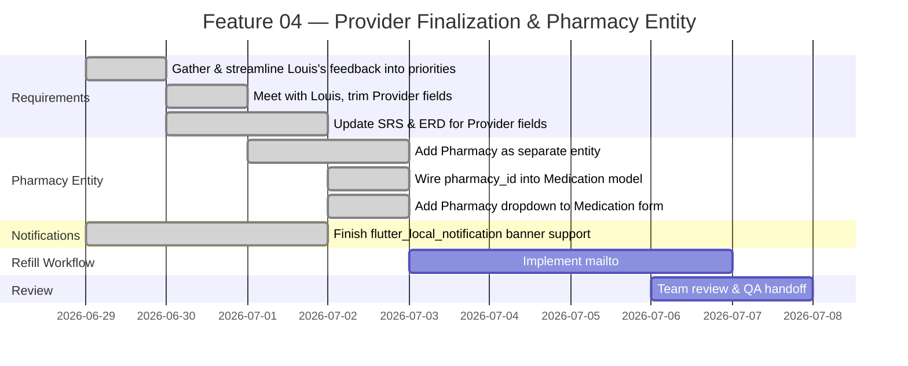
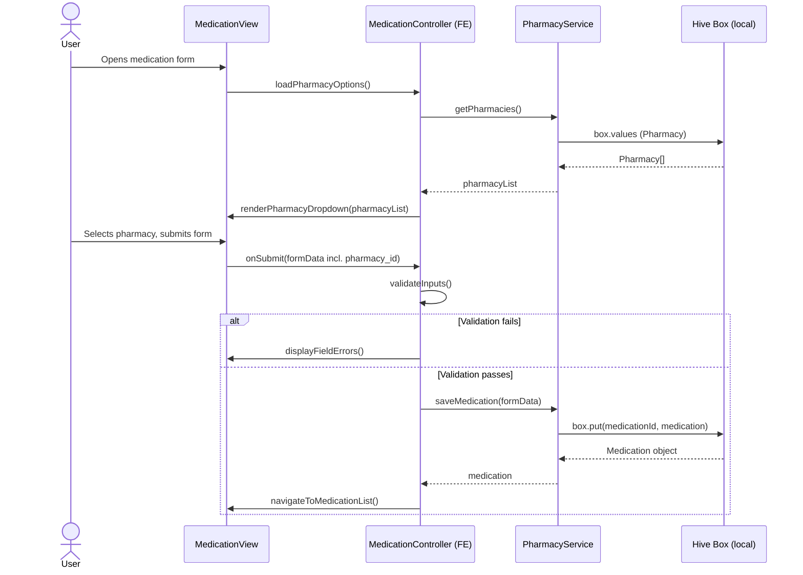
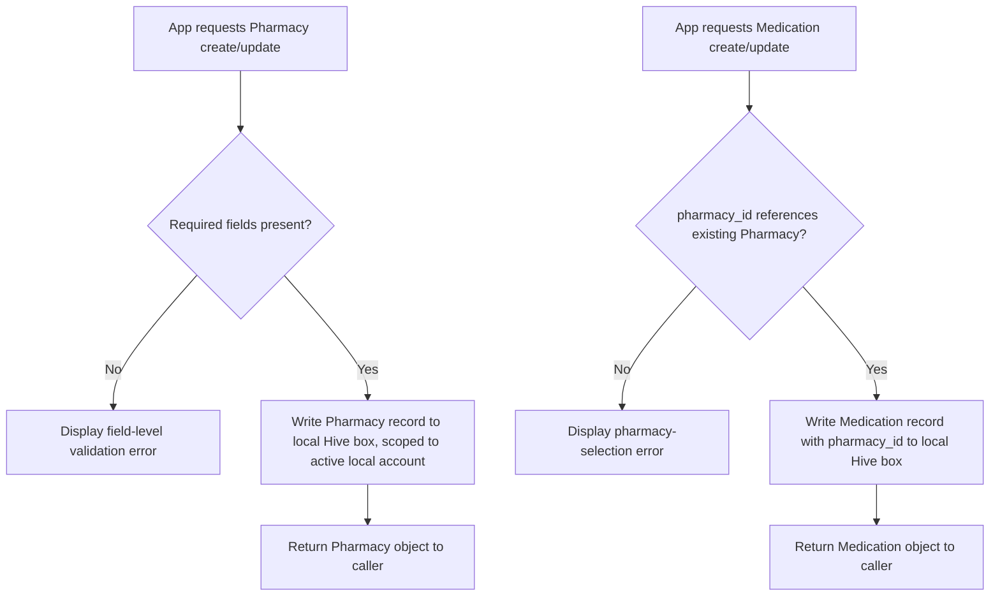
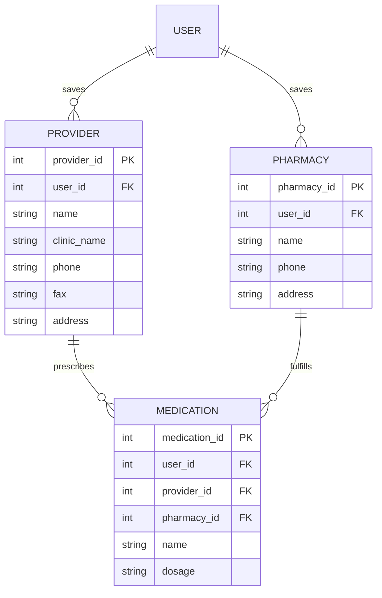

# Feature Planning Report - Detail Design

### Reference Information
---
* **Feature Title**: Provider Field Finalization, Pharmacy Entity Addition & Local-Storage Architecture Confirmation
* **Feature Number**: 04
* **Date**: 2026-07-03
* **Author**: Xander Weibel
* **Team Members**: Haejin Na, Joshua Palmer, Joseph Tolley, Xander Weibel, Kelson Gneiting

| Role | Assignee |
-- | --
| Product Owner | Xander Weibel |
| Scrum Master | Kelson Gneiting |
| Tech Lead (Front-End) | Xander Weibel |
| Tech Lead (Back-End/Local Auth) | Joseph Tolley |
| Tech Lead (Local Storage) | Haejin Na |
| Quality Assurance | Joshua Palmer |
| CM/DM | Joshua Palmer |

**Supersedes**: Feature 03 (Provider Schema Migration to Local Storage, Week 09). This feature closes the open architecture question left by Feature 03 and the June 27 decision log — **local Hive storage is now confirmed as the intentional MVP architecture, not drift** — and builds on it: the Provider field set is finalized to Louis's trimmed specification, fax becomes a required field, and a new Pharmacy entity is introduced alongside its wiring into the Medication model and form. Refill-to-email transmission (`mailto:`) work has started and carries into Week 12.

**Scope Change — Automated eFax Deferred Out of MVP (Not Just Delayed)**: Automated fax transmission (via a third-party eFax service or API) will **not** be implemented by this team. Sending actual PHI-containing fax content requires a dedicated backend to handle it in a HIPAA-compliant way, and building/certifying that backend is out of scope for the current MVP timeline. The `mailto:`-based email workflow is therefore the **final deliverable** for this project cycle, not a placeholder — automated faxing is left as a fully-scoped future enhancement for the next team, not an in-flight task this team expects to finish.

---

### Traceability
* **Requirement Number** (SRS Ref #): FR18 (Provider Association, fields updated); **new** Pharmacy requirement — *number not yet assigned, pending SRS revision, see Open Items*; DB1–DB9 (revised for Pharmacy + Provider field changes); IR5 (native mail app refill flow); SA1, SA2, SA4; DC1, DC2, DC3
* **Design Number** (SDD Ref #): SDD Section 4 (Back-End Design) and Section 6 (Database Design) — **now being actively rewritten** to describe the local Hive architecture as authoritative (this closes the Feature 03 open item that flagged these sections as drifted); Component C2 (Medication Management) — extended to reference Pharmacy
* **Test Plan** (TPD Ref #): FR18 (Verification Mapping — Demonstration, Inspection; Unit, Integration, System — local equivalents); new test cases pending for Pharmacy entity and fax-required validation
* **User Document** (Ref Section #): SRS Section 3.1 (FR18), Section 3.5 (DB2, DB3) — updated this week; Pharmacy section to be added
* **Installation Document** (Ref #): VDD 3.0 / Louis Installation Guide — unchanged, local Flutter build only
* **Software Developer Guide** (Ref #): `openapi.yaml` `/providers` endpoints remain historical/reference only; ERD (`EntityRelationshipDiagram.md`) updated this week for revised Provider fields and new Pharmacy entity

---

### Agile Tasking Information
* **Epic Story**:
  As a patient user,
  I want my provider and pharmacy contact details, trimmed to what Louis actually needs, saved on my device and linked to my medications,
  so that I can generate a complete refill request — addressed to the right pharmacy — without an internet connection or server, and without re-entering information I've already saved.

* **Value**: Resolves the architecture ambiguity flagged in the June 27 decision log by confirming local-only storage as intentional, so the team can stop treating the SRS/ERD/openapi.yaml as the source of truth for data location. Finalizing the Provider field set against Louis's direct feedback reduces churn on the form and its validation. Adding Pharmacy as its own entity (rather than free text on a refill) is a prerequisite for the `mailto:` refill workflow, since the message needs a real destination.

* **Planned Delivery**: v3.1 — Week 11 (Requirements Alignment & Pharmacy Entity cycle)

* **Schedule**:


* **Known Dependencies / Obstacles**:
  - The local-vs-backend architecture question from the June 27 decision log is now resolved: **local Hive storage stands**. SDD Sections 4–6 documentation drift (flagged in Feature 03) is being corrected in parallel, not treated as a separate blocker.
  - Fax number is now a **required** field on the Provider form (previously optional) — this changes the validation contract touched by both the Front-End and Local Authorization/Storage layers from Feature 03 and must be applied consistently.
  - Pharmacy is a new entity, structurally parallel to Provider (name, phone, address), stored in its own local Hive box; Medication now carries a `pharmacy_id` foreign key.
  - `mailto:` implementation is in progress and is this team's **final** refill-transmission deliverable for MVP — automated fax transmission (via a third-party eFax API) is explicitly out of scope for this project's timeline, since sending real fax/PHI content would require a dedicated HIPAA-compliant backend that doesn't exist and isn't being built here. The message-generation logic is still architected so a future team could swap in real fax transmission without restructuring it, but doing so is their work, not a near-term follow-up for this team.
  - Still unresolved (carried from the June 27 decision log, see Open Items): whether Pharmacy is scoped per-user or per-medication; `url_launcher` vs. `share_plus` for the email step; whether single-device/single-user-at-a-time is an acceptable stated MVP constraint given local storage still has no per-user data isolation; whether username-based login is in scope alongside FR3's email-only spec.
  - openapi.yaml and the legacy Render/Aiven code remain in-repo as historical reference per the Feature 03 decision; no change this week.

* **GitHub**:
  * **GitHub Branch**: `feature/04` (built on top of `feature/03`)
  * **GitHub Project**: RXNow MVP

---

## Detailed Design

### Front-End

**Workflow Description**:
The Provider form is updated to reflect Louis's trimmed field set and the now-required fax number. A new Pharmacy form/list follows the same pattern as Provider. The Medication form gains a Pharmacy picker so a medication can be associated with a pharmacy at creation or edit time.



- Agile Info:
  - Story: As a user, I want to pick a saved pharmacy when adding or editing a medication, so my refill requests know where to go.
  - Est Story Points: 2
  - Assigned Responsible Engineer: Xander Weibel

**Classes**:

* **Model**:
  * **UML Class**:
    ```mermaid
    classDiagram
      class ProviderModel {
        +int provider_id
        +int user_id
        +string name
        +string clinic_name
        +string phone
        +string fax
        +string address
      }
      class PharmacyModel {
        +int pharmacy_id
        +int user_id
        +string name
        +string phone
        +string address
      }
      class MedicationModel {
        +int medication_id
        +int user_id
        +int provider_id
        +int pharmacy_id
        +string name
        +string dosage
      }
      MedicationModel --> ProviderModel
      MedicationModel --> PharmacyModel
    ```
  * ***Code Location***: `src/models/ProviderModel.ts` (field set trimmed per Louis this week — see Business Decisions below); `src/models/PharmacyModel.ts` (new); `src/models/MedicationModel.ts` (adds `pharmacy_id`)

* **Control**:
  * **UML Class**:
    ```mermaid
    classDiagram
      class PharmacyController {
        +validateInputs(formData) bool
        +navigateToPharmacyList() void
        +renderPharmacyPicker(list) void
      }
    ```
  * **Create** (Function name): `processCreatePharmacy(formData)`
  * **Read** (Function name): `processGetPharmacies()`
  * **Update** (Function name): `processUpdatePharmacy(pharmacyId, formData)`
  * **Delete** (Function name): `processDeletePharmacy(pharmacyId)`
  * ***Code Location***: `src/controllers/PharmacyController.ts` (new, mirrors `ProviderController.ts`)

* **View**:
  * **User Interface**: Pharmacy form screen (new, mirrors Provider form); Medication form screen — updated with Pharmacy dropdown.
  * **Create** (Function name): `renderPharmacyForm()`
  * **Read** (Function name): `renderPharmacyList()`
  * **Update** (Function name): `renderPharmacyEditForm(pharmacy)`
  * **Delete** (Function name): N/A — handled via list action
  * ***Code Location***: `src/views/PharmacyView.tsx` (new); `src/views/MedicationView.tsx` (updated for dropdown)
  * **Back Interface**:
    * **Create** (Function name): `savePharmacy(formData)` → `Hive box.put()`
    * **Read** (Function name): `getPharmacies()` → `Hive box.values`
    * **Update** (Function name): `updatePharmacy(id, formData)` → `Hive box.put(id, updated)`
    * **Delete** (Function name): `deletePharmacy(id)` → `Hive box.delete(id)`
    * ***Code Location***: `src/services/PharmacyService.ts` (new, mirrors `ProviderService.ts`)

---

### Back-End / Local Storage

* **Business Logic**:


- Agile Info:
  - Story: As the system, I need to store Pharmacy records and validate that Medications reference a real Pharmacy, so refill requests resolve to a valid destination without a server.
  - Est Story Points: 2
  - Assigned Responsible Engineer: Joseph Tolley

**Classes**:

* **Models**:
  * **UML Class**:
    ```mermaid
    classDiagram
      class Pharmacy {
        +int pharmacy_id
        +int user_id
        +string name
        +string phone
        +string address
      }
    ```
  * ***Code Location***: `lib/models/pharmacy.dart` (new Hive `@HiveType` model, mirrors `lib/models/provider.dart`)

* **Control**:
  * **UML Class**:
    ```mermaid
    classDiagram
      class PharmacyController {
        +createPharmacy(userId, data) Pharmacy
        +getPharmacies(userId) Pharmacy[]
        +updatePharmacy(pharmacyId, data) Pharmacy
        +deletePharmacy(pharmacyId) void
      }
    ```
  * **Create** (Function name): `createPharmacy(userId, data)`
  * **Read** (Function name): `getPharmacies(userId)`
  * **Update** (Function name): `updatePharmacy(pharmacyId, data)`
  * **Delete** (Function name): `deletePharmacy(pharmacyId)`
  * ***Code Location***: `lib/controllers/pharmacy_controller.dart` (new)

* **View** (local data interface):
  * **Create** (Function name): `PharmacyRepository.insert(userId, data)`
  * **Read** (Function name): `PharmacyRepository.findByUser(userId)`
  * **Update** (Function name): `PharmacyRepository.update(pharmacyId, data)`
  * **Delete** (Function name): `PharmacyRepository.delete(pharmacyId)`
  * ***Code Location***: `lib/repositories/pharmacy_repository.dart` — wraps the Hive box; no REST layer
  * **Note**: As with Provider in Feature 03, `openapi.yaml` has no Pharmacy endpoint and is not the active contract for MVP.

---

### Local Storage (Provider Field Finalization & Pharmacy Data Relationships)

* **Business Decisions Applied This Week** (from 2026-06-27 decision log):
  - Provider fields finalized to: name, clinic/office name, phone, fax, physical address — **fax is now required**, matching Louis's direct feedback and superseding the "nullable fax" note in Feature 03.
  - Pharmacy is confirmed as its own entity, separate from Provider: pharmacy name, phone number, physical address.
  - Local-only Hive storage is confirmed as the intentional architecture (resolves the open item Feature 03 raised about SDD/ERD/openapi.yaml drift).

* **Data Relationship Logic** (updated ERD, reflecting the new Pharmacy entity):


- Agile Info:
  - Story: As the system, I need a local Pharmacy store, linked to Medication, so refill requests can be addressed to the correct pharmacy without any network dependency.
  - Est Story Points: 2
  - Assigned Responsible Engineer: Haejin Na

**Classes**:

* **Models** (Hive Box Description):
  * `PHARMACY` box — stores pharmacy contact records scoped per local account. `name`, `phone`, and `address` are required, mirroring Provider's required-field pattern.
  * `PROVIDER` box — field set finalized this week: `name`, `clinic_name`, `phone`, `fax`, `address` all now required (fax moved from nullable to required).
  * `MEDICATION` box — updated to store `pharmacy_id` alongside the existing `provider_id`.
  * ***Code Location***: `lib/models/pharmacy.dart` (new); `lib/models/provider.dart` (fax validation updated); `lib/models/medication.dart` (adds `pharmacy_id`)

* **Control** (Hive Operations):
  * **Create** (Function name): `box.put(pharmacyId, pharmacy)`
  * **Read** (Function name): `box.values` / `box.get(pharmacyId)`
  * **Update** (Function name): `box.put(pharmacyId, updatedPharmacy)`
  * **Delete** (Function name): `box.delete(pharmacyId)`
  * ***Code Location***: `lib/repositories/pharmacy_repository.dart`

* **View** (Local Data Access):
  * **Create** (Function name): `PharmacyRepository.insert()`
  * **Read** (Function name): `PharmacyRepository.findByUser()`
  * **Update** (Function name): `PharmacyRepository.update()`
  * **Delete** (Function name): `PharmacyRepository.delete()`
  * ***Code Location***: `lib/repositories/pharmacy_repository.dart`

---

### Notifications (Completed This Week, Out-of-Band from Provider/Pharmacy Scope)

* `flutter_local_notification` banner support was finished this week. This is a standalone completion (medication reminder banners) and does not depend on or feed into the Provider/Pharmacy/refill workstream above.
* ***Code Location***: `lib/services/notification_service.dart`
* Assigned Responsible Engineer: Xander Weibel

---

### In Progress / Carried Into Week 12

* **`mailto:` integration for refill send.** Confirmed technically feasible using Flutter's `url_launcher` package and a `mailto:` URI per the June 27 decision log, and consistent with IR5. Work started this week but is **not complete** — the generated message still needs to be extended to include Provider and Pharmacy details (currently medication name/dosage only), and the "Send" action still only updates status locally without opening the mail app. Carries into Week 12. **This is the final refill-transmission mechanism for this project's MVP** — automated eFax sending is explicitly deferred to a future team (see Scope Change note in Reference Information), since it requires a dedicated HIPAA-compliant backend that is not being built as part of this project.
  * ***Code Location***: `refill_request_screen.dart` (UI trigger, existing), message-generation logic (to be extended)
  * Assigned Responsible Engineer: Xander Weibel (per this week's tasking)

---

### Open Items Carried Into Week 11–12
1. **Pharmacy scoping.** Whether Pharmacy records are scoped per-user or per-medication, and whether they follow the same local-storage pattern as Provider, is not yet decided (per 2026-06-27 decision log). This week's implementation assumes per-user scoping, consistent with Provider — **flagged for confirmation, not a final decision.** *Owner: Haeji.*
2. **`url_launcher` vs. `share_plus`.** Still undecided which package implements the email step of the refill workflow. *Owner: Xander, blocking the mailto: carry-over item above.*
3. **Single-device / single-user-at-a-time MVP constraint.** Local storage still has no per-user data isolation; whether this is an acceptable stated MVP constraint has not been decided. *Owner: team, with Louis.*
4. **Username-based login scope.** FR3 specifies email only; whether username-based login is also in scope is undecided, and the auth request/response contract in `openapi.yaml` still doesn't match what the frontend actually sends. *Owner: Joe.*
5. **SDD Sections 4–6 documentation pass.** Carried from Feature 03 — now actively being addressed alongside this week's SRS/ERD updates, but not yet complete. *Owner: Xander, with input from Haeji and Joe.*
6. **New Pharmacy requirement number.** A formal SRS requirement number for Pharmacy has not yet been assigned; this report references it as pending. *Owner: Xander.*
7. **Repository cleanup decision (carried, unchanged).** Legacy Render/Aiven backend code and migration scripts remain in the repo pending a decision to archive or keep for future-cohort handoff. *Owner: Joe and Xander.*
8. **Automated eFax — explicitly out of scope, handed off to future cohort.** This team will not build automated fax transmission. Doing so requires a dedicated backend built and certified for HIPAA compliance to handle PHI-bearing fax content, which is a substantial project in its own right and is not being scoped or started here. The `mailto:` email workflow (Item 5 above, In Progress) is this team's final deliverable for refill transmission. A future cohort picking this up would need to: (a) stand up a compliant backend, (b) integrate a third-party eFax service/API, and (c) replace the `mailto:` call in the message-generation layer, which was architected to make that swap isolated rather than a rewrite. *Owner: N/A — flagged for future-cohort planning, not assigned to current team.*

---

### Review
- [ ] All elements of the form are filled out
    - [ ] Reference
    - [ ] Traceability
    - [ ] Agile
    - [ ] Detailed Design
- [ ] Epic Story is created in the project's repo Issue
    * Issue Number (Reference):
- [ ] Sub stories are created as the project's repo Issues
    * Issue Number 1 (Front-End — Pharmacy dropdown/form):
    * Issue Number 2 (Back-End/Local Storage — Pharmacy entity, fax required):
    * Issue Number 3 (Refill Workflow — mailto: integration, carried):
- [ ] All stories/issues project attributes are filled out
- [ ] Team members have reviewed the items
