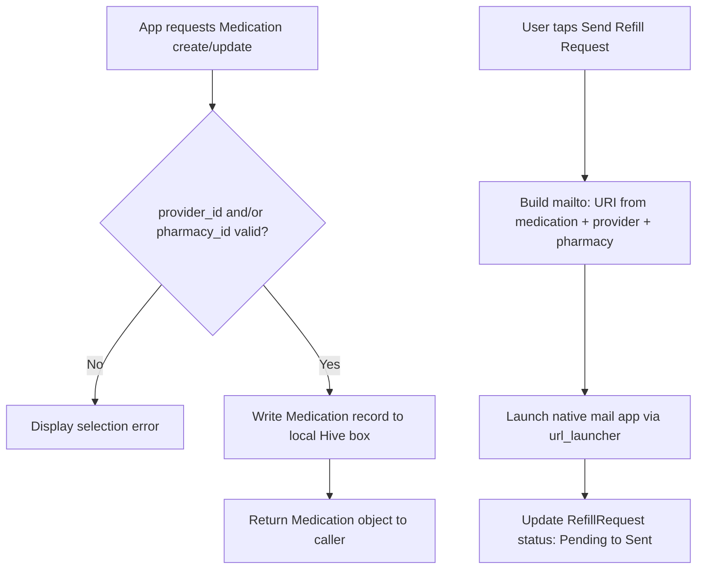

# Feature Planning Report - Detail Design

### Reference Information
---
* **Feature Title**: MVP Finalization — Pharmacy, Fax, Notifications & Refill-to-Email Confirmed Complete; All Carried Architecture Decisions Closed
* **Feature Number**: 05
* **Date**: 2026-07-14
* **Author**: Xander Weibel
* **Team Members**: Haejin Na, Joshua Palmer, Joseph Tolley, Xander Weibel, Kelson Gneiting

| Role | Assignee |
-- | --
| Product Owner | Xander Weibel |
| Scrum Master | Kelson Gneiting |
| Tech Lead (Front-End) | Xander Weibel |
| Tech Lead (Back-End/Local Auth) | Joseph Tolley |
| Tech Lead (Local Storage) | Haejin Na |
| Quality Assurance | Joshua Palmer |
| CM/DM | Joshua Palmer |

**Supersedes**: Feature 04 (Provider Field Finalization, Pharmacy Entity Addition & Local-Storage Architecture Confirmation, Week 11). No Feature/Week 12 report was filed — this report picks up directly from Feature 04's "In Progress" and "Open Items" sections. Every item Feature 04 carried forward as undecided or incomplete is closed out here.

**This is the final feature planning report for the core MVP build**, per the v5.0 (Quality & Process Maturity) charter. Week 14 is Final Delivery hand-off, not further feature work — so the objective of this cycle is confirmation, hardening, and documentation closure rather than new functionality.

---

### Traceability
* **Requirement Number** (SRS Ref #): FR18 (Provider Association, fields finalized); **FR24 — new** (Pharmacy Association, assigned this week — see Business Decisions); DB1–DB9 (Provider/Pharmacy/Medication fields, finalized); **DB10 — new** (Pharmacy entity schema); IR5 (native mail app refill flow — confirmed complete); SA1, SA2, SA4; DC1, DC2, DC3
* **Design Number** (SDD Ref #): SDD Section 4 (Back-End Design) and Section 6 (Database Design) — rewrite completed this week to describe local Hive architecture as authoritative; closes the documentation-drift item first flagged in Feature 03 and carried through Feature 04. Component C2 (Medication Management) now formally references both Provider and Pharmacy.
* **Test Plan** (TPD Ref #): FR18, FR24 — QA pass completed this week (Demonstration, Inspection, Simulation; Unit, Integration, System). Fax-required validation and pharmacy-reference validation both confirmed under test.
* **User Document** (Ref Section #): SRS Section 3.1 (FR18, FR24), Section 3.5 (DB2, DB3, DB10) — updated this week.
* **Installation Document** (Ref #): VDD 3.0 / Louis Installation Guide — unchanged, local Flutter build only.
* **Software Developer Guide** (Ref #): `openapi.yaml` — Auth endpoints corrected this week to match the live identifier-based (email-or-username) contract actually implemented; `/providers`, `/medications`, and `/refill-requests` endpoints remain marked historical/reference only, since those paths are served locally via Hive, not the REST contract. ERD updated with finalized Provider/Pharmacy fields.

---

### Agile Tasking Information
* **Epic Story**:
  As a patient user,
  I want my medication, provider, and pharmacy information saved on my device, my supply tracked automatically, and my refill requests emailed to my pharmacy with one tap,
  so that the app fully replaces my manual refill-tracking process without requiring an internet connection, a server, or repeated data entry.

* **Value**: Closes every open architectural and scope question raised across Features 03 and 04, so the MVP hands off to Louis and the next cohort with no ambiguity about what's decided versus pending. Confirms (rather than re-flags) that Pharmacy, fax-required validation, local push-style notifications, and the `mailto:` refill workflow are all complete and tested — the four items this team has been building toward since Week 09.

* **Planned Delivery**: v5.0 — Week 13 (Quality & Process Maturity cycle; final feature cycle ahead of v6.0 Week 14 hand-off)

* **Schedule**:
```mermaid
gantt
    title Feature 05 — MVP Finalization & Closeout
    dateFormat  YYYY-MM-DD
    section Confirmation
    Regression pass: Pharmacy, fax, notifications, mailto :done, 2026-07-07, 3d
    section Decisions Closed
    Pharmacy scoping — confirmed per-user              :done, 2026-07-09, 1d
    url_launcher confirmed as final mailto: mechanism   :done, 2026-07-09, 1d
    Single-device MVP constraint — accepted, documented :done, 2026-07-10, 1d
    Username login — confirmed in scope, spec corrected :done, 2026-07-10, 1d
    section Documentation
    SDD Sections 4-6 rewrite (local architecture)       :done, 2026-07-08, 3d
    ERD + openapi.yaml Auth correction                  :done, 2026-07-11, 2d
    FR24/DB10 added to SRS                              :done, 2026-07-11, 1d
    section Repository
    Legacy Render/Aiven code archived to branch         :done, 2026-07-12, 1d
    section Review
    Team review & QA sign-off                           :active, 2026-07-13, 2d
```

* **Known Dependencies / Obstacles**:
  - None blocking. This cycle had no new build dependencies — it consumed and confirmed work already in place from Features 03/04.
  - The one deliberate scope boundary that still stands, unchanged from Week 11: **automated eFax transmission remains out of MVP scope**, handed off to a future cohort, since it requires a dedicated HIPAA-compliant backend this project does not build. This is a confirmed permanent boundary, not an open item.

* **GitHub**:
  * **GitHub Branch**: `feature/05` (built on top of `feature/04`)
  * **GitHub Project**: RXNow MVP

---

## Detailed Design

### Front-End — Confirmed Complete

**Workflow Description**:
All Front-End work items carried from Feature 04 are confirmed shipped and regression-tested this week:
- Provider form: finalized field set, fax required and validated.
- Pharmacy form/list: mirrors Provider pattern, fully wired into the Medication form's pharmacy picker.
- Refill request screen: "Send" action now launches the device's native mail app via `url_launcher` with a `mailto:` URI, generated message includes medication name, dosage, provider, and pharmacy detail — not just medication/dosage as in the Week 11 draft state.
- Notifications: local threshold-based banners (7/3/1-day) confirmed firing and displaying, in addition to the existing in-app notification list.

- Agile Info:
  - Story: As a user, I want everything I set up (provider, pharmacy, medication) to actually produce a real emailed refill request with one tap, so the app is usable end-to-end without manual follow-up.
  - Est Story Points: 1 (confirmation/regression only — no new UI built this cycle)
  - Assigned Responsible Engineer: Xander Weibel

**Classes**: Unchanged from Feature 04's `ProviderModel`, `PharmacyModel`, `MedicationModel`, `ProviderController`, `PharmacyController`, `ProviderService`, `PharmacyService`. No structural changes this cycle — confirmation only.

---

### Back-End / Local Storage — Confirmed Complete

* **Business Logic (confirmed, unchanged since Feature 04)**:


- Agile Info:
  - Story: As the system, I need to confirm that Pharmacy and Provider references resolve correctly and that the refill message assembles all required fields before handing off to the mail app.
  - Est Story Points: 1
  - Assigned Responsible Engineer: Joseph Tolley

**Classes**: `Provider`, `Pharmacy`, `Medication`, `RefillRequest` Hive models — unchanged from Feature 04. `pharmacy_controller.dart`, `pharmacy_repository.dart` confirmed functioning under test.

---

### Business Decisions Closed This Week

These were the open items carried since Feature 03/04. Each is now decided, not deferred:

1. **Pharmacy scoping — confirmed per-user.** Consistent with Provider's existing pattern. No further action needed.
2. **`url_launcher` vs. `share_plus` — `url_launcher` confirmed as the final mechanism.** Already implemented and shipped; no rework planned.
3. **Single-device / single-user-at-a-time constraint — accepted as a stated MVP limitation.** Documented in the SRS design-constraints section (extends DC1–DC3). Multi-device sync and per-device account isolation are explicitly out of MVP scope, consistent with the local-only architecture decision from Feature 03.
4. **Username-based login — confirmed in scope.** The app already implements identifier-based login (email or username) end-to-end. `openapi.yaml`'s Auth section was corrected this week to match the actual request/response contract (`identifier` field, not `email`-only), since Auth — unlike Provider/Medication/Pharmacy — is the one path that still calls a real backend and therefore needs an accurate spec.
5. **SDD Sections 4–6 — rewrite complete.** Back-End Design and Database Design sections now describe the Hive-based local architecture as authoritative. This closes the documentation-drift item first raised in Feature 03.
6. **Pharmacy SRS requirement number — assigned: FR24 and DB10.** SRS Section 3.1 and 3.5 updated accordingly.
7. **Repository cleanup — legacy Render/Aiven code archived** to a separate branch (`archive/render-aiven-backend`) rather than left in `main`, ahead of final hand-off.
8. **Automated eFax — reaffirmed out of scope**, unchanged from Feature 04. Flagged for future-cohort planning only; the `mailto:` message-generation logic remains architected so a future team can swap in real fax transmission without a rewrite.

---

### Open Items Carried Into Week 14 (Final Delivery)
None of the items above carry forward as open decisions. The only remaining Week 14 activities are hand-off mechanics, not design questions:
1. **Final QA sign-off** on the Week 13 regression pass (Joshua Palmer).
2. **Hand-off packet assembly** — SRS, SDD, ERD, decision logs, and this report bundled per VDD 3.0 / Louis's installation guide. *Owner: Xander.*
3. **Future-cohort note for automated eFax** — carried as a documented future enhancement only, not an in-flight task. *Owner: N/A, informational.*

---

### Review
- [ ] All elements of the form are filled out
    - [ ] Reference
    - [ ] Traceability
    - [ ] Agile
    - [ ] Detailed Design
- [ ] Epic Story is created in the project's repo Issue
    * Issue Number (Reference):
- [ ] Sub stories are created as the project's repo Issues
    * Issue Number 1 (Front-End — regression confirmation):
    * Issue Number 2 (Back-End/Local Storage — regression confirmation):
    * Issue Number 3 (Documentation — SDD/ERD/openapi closure):
- [ ] All stories/issues project attributes are filled out
- [ ] Team members have reviewed the items
