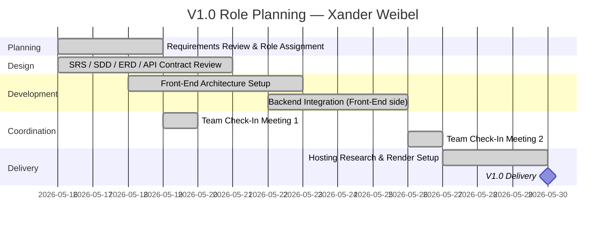

# Role Planning Report - Detail Design

### Reference Information

---

* **Role**: Tech Lead (Front-End) / Product Owner / Scrum Master (Adapted)
* **Date**: 2026-05-29
* **Author**: Xander Benjamin Weibel

* **Team Members**:

| Role | Team member name |
-- | --
| Product Owner | Xander Weibel |
| Scrum Master | Xander Weibel (adapted — we're using structured check-ins in place of formal sprint scrums, but still using the main elements) |
| Tech Lead (Front-End) | Xander Weibel |
| Tech Lead (Back-End) | Joseph  Tolley |
| Tech Lead (Database) | Haejin Na |
| Quality Assurance | Joshua Palmer |
| CM/DM | Joshua Palmer |

---

### Agile Tasking Information

* **Epic Story**:
  As Tech Lead (Front-End) and Product Owner,
  I want to plan and execute the tasks associated with my roles for v1.0,
  so that the project can have traceable, quality assurance and due diligence to deliver a high quality MVP product.

* **Story Point/Value**: 5

* **Planned Delivery**: v1.0 — Week 05–06 (Architecture & Initial Build)

* **Schedule**:

* **Known Dependencies/Obstacles**:
  - Backend API must be stable before front-end integration can be completed
  - Render hosting requires GitHub OAuth access granted by repo admin
  - PostgreSQL free tier on Render expires in 30 days — will need to recreate at v2.0 milestone
  - Team is geographically distributed; async check-ins replace formal scrum ceremonies

* **GitHub**
    * **GitHub Issue Number**: #141
    * **GitHub Branch**: `v1.0-frontend` / `main`
    * **GitHub Project**: RXNow MVP

---

### Implementation

- [x] **(1) Plan Tasking:** [#142 — Define front-end architecture and component structure for MVP](https://miro.com/app/board/uXjVHW1B9x4=/?openSyncedCardPanel=uXjVHW1B9xo%3D:cf26a05f-e49d-4c03-a3d1-f642ac4f7ed8:3458764670953758822:details)
    * Description: Reviewed SRS, SDD, ERD, and OpenAPI spec to map out the front-end component tree and screen flow for all MVP product functions (PF1–PF6). Aligned naming conventions with back-end controller/service layer per the Class Diagram.
    * Story Points: 3

- [x] **(2) Code Tasking:** [#143 — Implement front-end UI for authentication, dashboard, and medication management](https://miro.com/app/board/uXjVHW1B9x4=/?openSyncedCardPanel=uXjVHW1B9xo%3D:cf26a05f-e49d-4c03-a3d1-f642ac4f7ed8:3458764670953758822:details)
    * Description: Built and iterated on core UI screens: login/register, medication dashboard (FR12, FR13), medication create/edit/delete form (FR6–FR9), and refill workflow initiation (FR17–FR23). Implemented days_remaining display and low-supply color/text indicators per UR3.
    * Story Points: 8

- [x] **(3) Build Tasking:** [#144 — Connect front-end to back-end API endpoints](https://miro.com/app/board/uXjVHW1B9x4=/?openSyncedCardPanel=uXjVHW1B9xo%3D:cf26a05f-e49d-4c03-a3d1-f642ac4f7ed8:3458764670953758822:details)
    * Description: Wired front-end service calls to the back-end REST API contract defined in openapi.yaml. Replaced Prism mock server with real back-end endpoints. Validated request/response shapes against spec and resolved integration mismatches.
    * Story Points: 5

- [x] **(4) Test Tasking:** [#145 — Manual integration testing of MVP user workflows](https://miro.com/app/board/uXjVHW1B9x4=/?openSyncedCardPanel=uXjVHW1B9xo%3D:cf26a05f-e49d-4c03-a3d1-f642ac4f7ed8:3458764670953758822:details)
    * Description: Walked through all core user workflows end-to-end (account creation, login, medication CRUD, supply calculation display, refill request initiation) and verified outputs against SRS Section 4.3 contract (IPO). Logged defects as GitHub issues.
    * Story Points: 3

- [x] **(5) Release Tasking:** [#146 — Prepare v1.0 release branch and documentation review](https://miro.com/app/board/uXjVHW1B9x4=/?openSyncedCardPanel=uXjVHW1B9xo%3D:cf26a05f-e49d-4c03-a3d1-f642ac4f7ed8:3458764670953758822:details)
    * Description: Coordinated v1.0 branch freeze, confirmed SRS/SDD/ERD/openapi.yaml are consistent with implemented build, and facilitated team review of deliverable artifacts ahead of milestone submission.
    * Story Points: 2

- [x] **(6) Deploy Tasking:** [#147 — Research and configure Render hosting for MVP backend](https://miro.com/app/board/uXjVHW1B9x4=/?openSyncedCardPanel=uXjVHW1B9xo%3D:cf26a05f-e49d-4c03-a3d1-f642ac4f7ed8:3458764670953758822:details)
    * Description: Evaluated free hosting options for the Node.js/PostgreSQL backend. Selected Render as primary platform. Configured GitHub OAuth to connect private repo, provisioned free PostgreSQL instance, set environment variables, and implemented /healthz keepalive endpoint with UptimeRobot to prevent free-tier spin-down.
    * Story Points: 3

- [x] **(7) Operate Tasking:** [#148 — Facilitate team check-ins and unblock cross-role dependencies](https://miro.com/app/board/uXjVHW1B9x4=/?openSyncedCardPanel=uXjVHW1B9xo%3D:cf26a05f-e49d-4c03-a3d1-f642ac4f7ed8:3458764670953758822:details)
    * Description: Ran two structured team check-in meetings across the two-week sprint. Tracked blockers, clarified API contract questions between front-end and back-end, and coordinated task handoffs. Adapted scrum format to async-friendly check-ins suited to team's schedule.
    * Story Points: 2

- [x] **(8) Monitor Tasking:** [#149 — Monitor build stability and track open issues post-integration](https://miro.com/app/board/uXjVHW1B9x4=/?openSyncedCardPanel=uXjVHW1B9xo%3D:cf26a05f-e49d-4c03-a3d1-f642ac4f7ed8:3458764670953758822:details)
    * Description: Monitored front-end/back-end integration stability after connecting to live backend. Tracked GitHub issues for any regression or broken flows. Verified pills_remaining calculation (FR10), low-supply flag (FR14), and notification threshold logic (FR15) remained stable across updates.
    * Story Points: 2

---

# Reference Material

---

### Reference
---
* [Role Responsibility Breakdown](./rolePlanningReference.md)
* [Version Planning](./versionPlanning.md)
* [Software Lifecycle](../../engineering/practices/SWLifecycle/Readme.md)
* [DevOps](../../engineering/practices/Methodologies/Readme.md)

---

### Review
- [x] All elements of the form are filled out
    - [x] Reference
    - [x] Agile
    - [x] Implementation

- [x] Epic Story is created in the project's repo Issue
    * Issue Number (Reference): #141
- [x] Sub stories are created as the project's repo Issues
    * Issue Number1 (Plan): [#142](https://miro.com/app/board/uXjVHW1B9x4=/?openSyncedCardPanel=uXjVHW1B9xo%3D:cf26a05f-e49d-4c03-a3d1-f642ac4f7ed8:3458764670953758822:details)
    * Issue Number2 (Code): #[143](https://miro.com/app/board/uXjVHW1B9x4=/?openSyncedCardPanel=uXjVHW1B9xo%3D:cf26a05f-e49d-4c03-a3d1-f642ac4f7ed8:3458764670953758822:details)
    * Issue Number3 (Build): #[144](https://miro.com/app/board/uXjVHW1B9x4=/?openSyncedCardPanel=uXjVHW1B9xo%3D:cf26a05f-e49d-4c03-a3d1-f642ac4f7ed8:3458764670953758822:details)
    * Issue Number4 (Test): #[145](https://miro.com/app/board/uXjVHW1B9x4=/?openSyncedCardPanel=uXjVHW1B9xo%3D:cf26a05f-e49d-4c03-a3d1-f642ac4f7ed8:3458764670953758822:details)
    * Issue Number5 (Release): #[146](https://miro.com/app/board/uXjVHW1B9x4=/?openSyncedCardPanel=uXjVHW1B9xo%3D:cf26a05f-e49d-4c03-a3d1-f642ac4f7ed8:3458764670953758822:details)
    * Issue Number6 (Deploy): #[147](https://miro.com/app/board/uXjVHW1B9x4=/?openSyncedCardPanel=uXjVHW1B9xo%3D:cf26a05f-e49d-4c03-a3d1-f642ac4f7ed8:3458764670953758822:details)
    * Issue Number7 (Operate): #[148](https://miro.com/app/board/uXjVHW1B9x4=/?openSyncedCardPanel=uXjVHW1B9xo%3D:cf26a05f-e49d-4c03-a3d1-f642ac4f7ed8:3458764670953758822:details)
    * Issue Number8 (Monitor): #[149](https://miro.com/app/board/uXjVHW1B9x4=/?openSyncedCardPanel=uXjVHW1B9xo%3D:cf26a05f-e49d-4c03-a3d1-f642ac4f7ed8:3458764670953758822:details)
- [x] All stories/issues project attributes are filled out
- [x] Team members have reviewed the items
