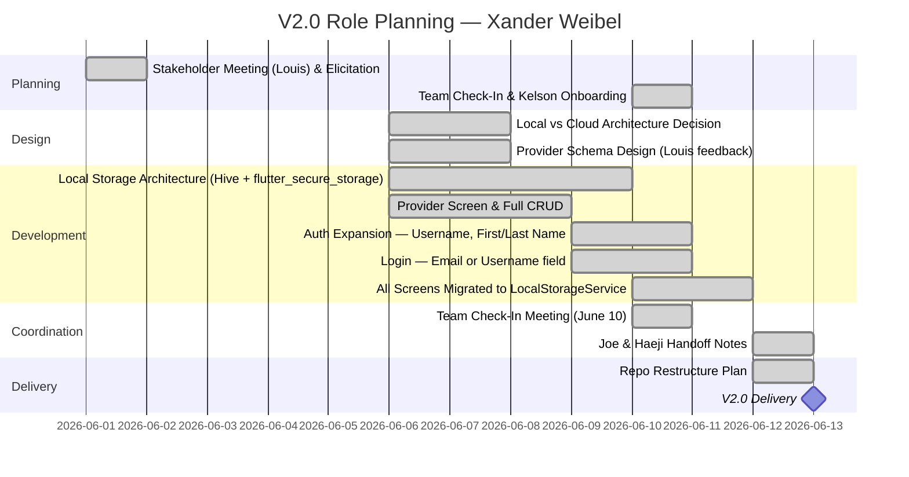

# Role Planning Report - Detail Design

### Reference Information

---

* **Role**: Tech Lead (Front-End) / Product Owner / Scrum Master (Adapted)
* **Date**: 2026-06-13
* **Author**: Xander Weibel

* **Team Members**:

| Role | Team member name |
-- | --
| Product Owner | Xander Weibel |
| Scrum Master | Xander Weibel (adapted — structured check-ins in place of formal sprint scrums) |
| Tech Lead (Front-End) | Xander Weibel |
| Tech Lead (Back-End) | Joseph Tolley |
| Tech Lead (Database) | Haejin Na |
| Quality Assurance | Joshua Palmer |
| CM/DM | Joshua Palmer |
| Responsible Engineer | Kelson Gneiting |

---

### Agile Tasking Information

* **Epic Story**:
  As Tech Lead (Front-End) and Product Owner,
  I want to plan and execute the tasks associated with my roles for v2.0,
  so that the project can deliver a stable, locally-persistent MVP with expanded provider support and a restructured data architecture aligned with stakeholder direction.

* **Story Point/Value**: 5

* **Planned Delivery**: v2.0 — Week 07 (Testing & DevOps Cycle) — June 2–13, 2026

* **Schedule**:

* **Known Dependencies/Obstacles**:
  - Hive local storage scaffolded but requires Haeji to finalize adapter/model pattern before data fully persists
  - Backend auth endpoints need Joe to add `username`, `first_name`, `last_name` fields and update login to accept email or username
  - Aiven DB migration (user table expansion, provider table cleanup) blocked on Haeji
  - Render deployment pipeline remains unstable — updates require manual steps, flagged as ongoing blocker
  - Kelson onboarding mid-semester; getting Flutter running locally is his immediate priority

* **GitHub**
    * **GitHub Issue Number**: #141
    * **GitHub Branch**: `feature/02-provider-expansion` / `main`
    * **GitHub Project**: RXNow MVP — Iteration 2

---

### Implementation

- [x] **(1) Plan Tasking:** [#142 — Define architecture pivot: local storage + cloud auth only](https://miro.com/app/board/uXjVHW1B9x4=/?openSyncedCardPanel=uXjVHW1B9xo%3D:cf26a05f-e49d-4c03-a3d1-f642ac4f7ed8:3458764670953758822:details)
    * Description: Met with Louis to gather stakeholder direction. Established hybrid storage architecture — cloud holds auth only (email, password, username, name), all patient data (medications, providers, refills, notifications) moves to on-device Hive storage. Decision driven by HIPAA simplification and target audience (elderly users, pregnant mothers). Documented local vs. cloud item split for team handoff.
    * Story Points: 3

- [x] **(2) Code Tasking:** [#143 — Implement LocalStorageService, SecureStorageService, and provider expansion](https://miro.com/app/board/uXjVHW1B9x4=/?openSyncedCardPanel=uXjVHW1B9xo%3D:cf26a05f-e49d-4c03-a3d1-f642ac4f7ed8:3458764670953758822:details)
    * Description: Built `local_storage_service.dart` — full Hive-based CRUD for medications, providers, refill requests, and notifications including local FR15 threshold notification logic. Built `secure_storage_service.dart` for JWT + profile persistence via flutter_secure_storage. Scaffolded all functions with `#HU` markers for Haeji to finalize. Built `provider_screen.dart` — full add/edit/delete provider UI with all 5 required fields (name, clinic, phone, fax, address) and 4 collapsible optional fields (email, NPI, specialty, notes) per Louis's direction.
    * Story Points: 8

- [x] **(3) Build Tasking:** [#144 — Migrate all screens from cloud API calls to LocalStorageService](https://miro.com/app/board/uXjVHW1B9x4=/?openSyncedCardPanel=uXjVHW1B9xo%3D:cf26a05f-e49d-4c03-a3d1-f642ac4f7ed8:3458764670953758822:details)
    * Description: Rewired all patient-data screens — `medication_view_screen`, `add_edit_medication_screen`, `refill_request_screen`, `notifications_screen`, `dashboard_screen`, `provider_screen` — from cloud `ApiService` calls to `LocalStorageService`. Auth screens (`login_screen`, `signup_screen`) remain cloud-connected. Updated `main.dart` to init Hive on launch and check for existing session to skip login for returning users.
    * Story Points: 5

- [x] **(4) Test Tasking:** [#145 — Manual review of local storage flows and auth expansion](https://miro.com/app/board/uXjVHW1B9x4=/?openSyncedCardPanel=uXjVHW1B9xo%3D:cf26a05f-e49d-4c03-a3d1-f642ac4f7ed8:3458764670953758822:details)
    * Description: Reviewed all updated service calls across screens to verify no remaining cloud API dependencies on patient data. Verified mock mode still functions correctly for offline dev. Confirmed `#HU` stub pattern is consistent across `local_storage_service.dart` for Haeji handoff. Flagged Aiven migration and Joe's auth endpoint updates as blockers for live testing.
    * Story Points: 3

- [x] **(5) Release Tasking:** [#146 — Prepare v2.0 files and coordinate team handoff](https://miro.com/app/board/uXjVHW1B9x4=/?openSyncedCardPanel=uXjVHW1B9xo%3D:cf26a05f-e49d-4c03-a3d1-f642ac4f7ed8:3458764670953758822:details)
    * Description: Delivered 13 updated dart files for v2.0. Authored handoff notes for Joe (auth endpoint changes) and Haeji (Aiven user table migration, Hive adapter finalization). Updated VDD 2.0, Feature Planning Report 02, and Installation Guide. Confirmed no middle names used in team references per team preference.
    * Story Points: 2

- [x] **(6) Deploy Tasking:** [#147 — Repo restructure planning and Render/Aiven status review](https://miro.com/app/board/uXjVHW1B9x4=/?openSyncedCardPanel=uXjVHW1B9xo%3D:cf26a05f-e49d-4c03-a3d1-f642ac4f7ed8:3458764670953758822:details)
    * Description: Planned GitHub repo restructure to flatten Flutter app files to root level for easier install — `git mv project/App/lib`, `android/`, `ios/`, `pubspec.yaml` to root; move `delv/` to `docs/`. Render deployment remains a known instability — team agreed to deploy only at major milestones until pipeline is stabilized. Aiven remains active for auth.
    * Story Points: 3

- [x] **(7) Operate Tasking:** [#148 — Facilitate team check-in and onboard Kelson Gneiting](https://miro.com/app/board/uXjVHW1B9x4=/?openSyncedCardPanel=uXjVHW1B9xo%3D:cf26a05f-e49d-4c03-a3d1-f642ac4f7ed8:3458764670953758822:details)
    * Description: Ran June 10 team check-in (23 min). Welcomed Kelson Gneiting as new Responsible Engineer joining mid-semester. Briefed team on Louis stakeholder meeting outcomes, architecture pivot, and local vs. cloud storage split. Assigned Kelson to get Flutter running locally and document setup steps to support Josh's installation guide. Coordinated role handoff plan — one of Scrum Master or Front-End Lead to transfer to Kelson next week.
    * Story Points: 2

- [x] **(8) Monitor Tasking:** [#149 — Monitor Render/Aiven stability and track v2.0 open blockers](https://miro.com/app/board/uXjVHW1B9x4=/?openSyncedCardPanel=uXjVHW1B9xo%3D:cf26a05f-e49d-4c03-a3d1-f642ac4f7ed8:3458764670953758822:details)
    * Description: Monitored Render deployment reliability — confirmed updates are still unreliable and flagged as ongoing. Tracked open blockers for v2.0 convergence: Haeji Aiven migration, Joe auth endpoint expansion, Kelson local Flutter build. Verified mock mode (`kMockMode = false`) is correctly set for live backend and that all `#HU` markers are in place for Haeji's next steps.
    * Story Points: 2

---

# Reference Material

---

### Reference
---
* [Role Responsibility Breakdown](./rolePlanningReference.md)
* [Version Planning](./versionPlanning.md)
* [Software Lifecycle](../../engineering/practices/SWLifecycle/Readme.md)
* [DevOps](../../engineering/practices/Methodologies/Readme.md)

---

### Review
- [x] All elements of the form are filled out
    - [x] Reference
    - [x] Agile
    - [x] Implementation

- [x] Epic Story is created in the project's repo Issue
    * Issue Number (Reference): #141
- [x] Sub stories are created as the project's repo Issues
    * Issue Number1 (Plan): [#142](https://miro.com/app/board/uXjVHW1B9x4=/?openSyncedCardPanel=uXjVHW1B9xo%3D:cf26a05f-e49d-4c03-a3d1-f642ac4f7ed8:3458764670953758822:details)
    * Issue Number2 (Code): #[143](https://miro.com/app/board/uXjVHW1B9x4=/?openSyncedCardPanel=uXjVHW1B9xo%3D:cf26a05f-e49d-4c03-a3d1-f642ac4f7ed8:3458764670953758822:details)
    * Issue Number3 (Build): #[144](https://miro.com/app/board/uXjVHW1B9x4=/?openSyncedCardPanel=uXjVHW1B9xo%3D:cf26a05f-e49d-4c03-a3d1-f642ac4f7ed8:3458764670953758822:details)
    * Issue Number4 (Test): #[145](https://miro.com/app/board/uXjVHW1B9x4=/?openSyncedCardPanel=uXjVHW1B9xo%3D:cf26a05f-e49d-4c03-a3d1-f642ac4f7ed8:3458764670953758822:details)
    * Issue Number5 (Release): #[146](https://miro.com/app/board/uXjVHW1B9x4=/?openSyncedCardPanel=uXjVHW1B9xo%3D:cf26a05f-e49d-4c03-a3d1-f642ac4f7ed8:3458764670953758822:details)
    * Issue Number6 (Deploy): #[147](https://miro.com/app/board/uXjVHW1B9x4=/?openSyncedCardPanel=uXjVHW1B9xo%3D:cf26a05f-e49d-4c03-a3d1-f642ac4f7ed8:3458764670953758822:details)
    * Issue Number7 (Operate): #[148](https://miro.com/app/board/uXjVHW1B9x4=/?openSyncedCardPanel=uXjVHW1B9xo%3D:cf26a05f-e49d-4c03-a3d1-f642ac4f7ed8:3458764670953758822:details)
    * Issue Number8 (Monitor): #[149](https://miro.com/app/board/uXjVHW1B9x4=/?openSyncedCardPanel=uXjVHW1B9xo%3D:cf26a05f-e49d-4c03-a3d1-f642ac4f7ed8:3458764670953758822:details)
- [x] All stories/issues project attributes are filled out
- [x] Team members have reviewed the items
