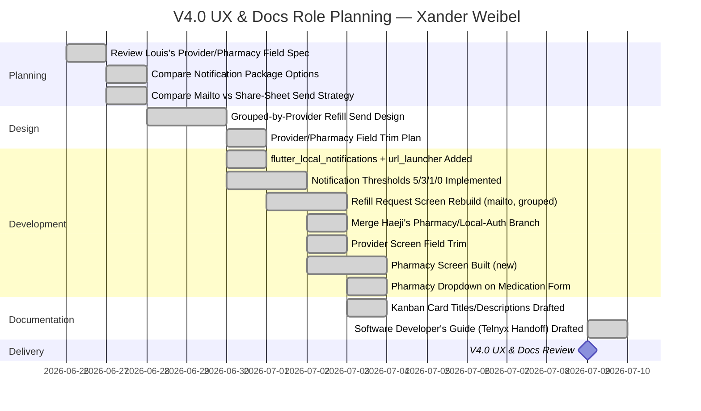

# Role Planning Report - Detail Design

### Reference Information

---

* **Role**: Tech Lead (Front-End) / Product Owner / Scrum Master (Adapted)
* **Date**: 2026-07-09
* **Author**: Xander Weibel

* **Team Members**:

| Role | Team member name |
-- | --
| Product Owner | Xander Weibel |
| Scrum Master | Xander Weibel (adapted — structured check-ins in place of formal sprint scrums) |
| Tech Lead (Front-End) | Xander Weibel |
| Tech Lead (Back-End) | Joseph Tolley |
| Tech Lead (Database) | Haejin Na |
| Quality Assurance | Joshua Palmer |
| CM/DM | Joshua Palmer |
| Responsible Engineer | Kelson Gneiting |

---

### Agile Tasking Information

* **Epic Story**:
  As Tech Lead (Front-End) and Product Owner,
  I want to plan and execute the tasks associated with my roles for the v4.0 (User Experience & Docs) milestone,
  so that Provider/Pharmacy data collection matches Louis's actual spec, low-supply alerts and refill sending work end-to-end on-device, and the next developer/hire has a concrete, accurate guide to pick up server-side fax transmission and security work.

* **Story Point/Value**: 5

* **Planned Delivery**: v4.0 — User Experience & Docs — Week 11 (carried into this Week 12 review) — June 26 – July 09, 2026

* **Schedule**:

* **Known Dependencies/Obstacles**:
  - ~~Auth architecture pivoting to fully local~~ — **Code-level resolved, decision doc still pending.** Haeji's pharmacy branch merge brought a complete local user model (salted/hashed passwords via `crypto`, per-user scoping across every box) into `local_storage_service.dart`. This was merged without overwriting her work. **The formal architecture decision doc (SRS DB1/SA3 alignment, deprecating `secure_storage_service.dart`'s JWT/session assumptions) is still not written** — the code has effectively decided this by default, which is exactly the kind of drift the 6/27 decision log warned against. This needs to close out before v5.0.
  - ~~Pharmacy is a distinct entity from Provider~~ — **Resolved.** `Pharmacy` + full CRUD landed in `local_storage_service.dart` (via Haeji's branch), and `pharmacy_screen.dart` (list + add/edit) now exists as first-class UI, not a Provider sub-field.
  - ~~Provider fax field moving from optional to required~~ — **Resolved**, and expanded: Provider fields trimmed to Louis's actual spec (name, clinic/office name, fax, address required; phone optional) — email/NPI/specialty/notes removed as bloat that was never in scope.
  - ~~Refill send mechanism changing from simulated send to real `mailto:` integration~~ — **Resolved.** `refill_request_screen.dart` now groups selected medications by provider, builds the agreed message format (Name/Prescription/Other item list), and launches `mailto:` addressed to the provider's fax number (explicitly a placeholder until real fax transmission exists — see new item below).
  - **NEW — Low-supply notifications now fire as native banners, not just in-app.** `flutter_local_notifications` added; thresholds changed from FR15's documented 7/3/1 to 5/3/1/0 per direct instruction. **This is a live conflict with SRS FR15 and the `Notification.threshold` enum in the ERD/openapi.yaml** — same pattern as the Provider/Pharmacy doc drift. Needs a decision-log entry and doc update, not a silent divergence.
  - **NEW — Real fax transmission (Telnyx) is explicitly next-team scope, not this team's.** Per Louis's direction, a Software Developer's Guide was drafted covering the architecture (app → new fax-relay server → Telnyx Programmable Fax API → provider), required accounts/env setup, testing/security/deployment/monitoring expectations, and the specific Telnyx API contract (confirmed against current Telnyx docs, not assumed). The guide flags that `RefillRequest.status` (`Pending`/`Sent` only, per FR22/ERD/openapi) will need expansion to include real delivery outcomes (`Delivered`/`Failed`) once that work starts — logged as an open item, not implemented here.
  - **NEW — SRS/ERD/openapi reconciliation for Provider and Pharmacy is more out of date than last report.** Item #168 (below) was already open before this iteration's further field trimming; the gap has grown, not shrunk. This is the single largest doc-debt item heading into v5.0 and should not roll over again without action.
  - **NEW — Native permission/manifest setup for notifications not yet done.** `flutter_local_notifications` requires the Android `POST_NOTIFICATIONS` permission and a notification icon resource, plus `flutter pub get` to pull the new dependencies (`flutter_local_notifications`, `url_launcher`) — none of this has been verified on a physical device or emulator yet.
  - **NEW — None of this iteration's code has been through QA.** Notification firing at the new thresholds, grouped mailto sending, and the trimmed Provider/Pharmacy required-field validation are all unverified beyond static review. This should be the lead Test Tasking item for the next cycle, not deferred further.

* **GitHub**
    * **GitHub Issue Number**: #156
    * **GitHub Branch**: `RXnow` / `Frontend`
    * **GitHub Project**: RXNow MVP — Iteration 2

---

### Implementation

- [x] **(1) Plan Tasking:** [#157 — Review closed blockers and re-scope remaining v2.0 stabilization work](https://miro.com/app/board/uXjVHW1B9x4=/?openSyncedCardPanel=uXjVHW1B9xo%3D:cf26a05f-e49d-4c03-a3d1-f642ac4f7ed8:3458764670953758822:details)
    * Description: Confirmed with Haeji and Joe that the three wk08 blockers (Hive adapter, auth endpoint expansion, Aiven migration) are closed. Re-scoped remaining work toward hardening the existing screens rather than new architecture — defensive parsing, refill flow correctness, and password reset completion.
    * Story Points: 3

- [x] **(2) Code Tasking:** [#158 — Harden data parsing and complete password reset flow](https://miro.com/app/board/uXjVHW1B9x4=/?openSyncedCardPanel=uXjVHW1B9xo%3D:cf26a05f-e49d-4c03-a3d1-f642ac4f7ed8:3458764670953758822:details)
    * Description: Added shared `_safeInt` parsing helpers across `medication_view_screen.dart`, `notifications_screen.dart`, and `add_edit_medication_screen.dart` to prevent cast crashes on Hive-returned values. Built out `forgot_password_screen.dart` end-to-end — request, token confirmation, and success screens — satisfying FR5. Fixed provider dropdown crash in `add_edit_medication_screen.dart` when a medication referenced a deleted provider.
    * Story Points: 8

- [x] **(3) Build Tasking:** [#159 — Rebuild refill request screen against LocalStorageService](https://miro.com/app/board/uXjVHW1B9x4=/?openSyncedCardPanel=uXjVHW1B9xo%3D:cf26a05f-e49d-4c03-a3d1-f642ac4f7ed8:3458764670953758822:details)
    * Description: Rebuilt `refill_request_screen.dart` to load-or-create a pending refill request per selected medication via `RefillService`, display the generated message (FR19), and simulate send (FR20/FR21) with status display (FR22/FR23). Wired dashboard and medication view "Request Refill" entry points to pass preselected medications through.
    * Story Points: 5

- [x] **(4) Test Tasking:** [#160 — Manual review of hardened screens and password reset flow](https://miro.com/app/board/uXjVHW1B9x4=/?openSyncedCardPanel=uXjVHW1B9xo%3D:cf26a05f-e49d-4c03-a3d1-f642ac4f7ed8:3458764670953758822:details)
    * Description: Verified safe-int parsing prevents crashes when Hive returns string-typed IDs. Walked through full password reset flow (request → token confirm → success → re-login). Confirmed refill request screen correctly transitions Pending → Sent and persists across navigation. Flagged the Provider schema divergence (local vs. ERD/openapi) as a non-blocking but unresolved item for QA tracking.
    * Story Points: 3

- [x] **(5) Release Tasking:** [#161 — Prepare stabilization release notes and update SDD references](https://miro.com/app/board/uXjVHW1B9x4=/?openSyncedCardPanel=uXjVHW1B9xo%3D:cf26a05f-e49d-4c03-a3d1-f642ac4f7ed8:3458764670953758822:details)
    * Description: Documented closure of all three wk08 blockers for the team record. Flagged to Josh that SDD Section 6 (Database Design) and the ERD still reference the thin `Provider` model and need reconciliation against the richer local schema now in use.
    * Story Points: 2

- [x] **(6) Deploy Tasking:** [#162 — Execute repo restructure and rename frontend branch](https://miro.com/app/board/uXjVHW1B9x4=/?openSyncedCardPanel=uXjVHW1B9xo%3D:cf26a05f-e49d-4c03-a3d1-f642ac4f7ed8:3458764670953758822:details)
    * Description: Executed the previously-planned repo restructure — flattened Flutter app files (`lib/`, `android/`, `ios/`, `pubspec.yaml`) to root, moved `delv/` to `docs/`. Renamed the working branch from `feature/02-provider-expansion` to `RXnow` / `Frontend` to align with the team's updated branch naming convention. Render deployment remains a known instability, still deferred to major milestones only.
    * Story Points: 3

- [x] **(7) Operate Tasking:** [#163 — Facilitate team check-in and verify Kelson's local build](https://miro.com/app/board/uXjVHW1B9x4=/?openSyncedCardPanel=uXjVHW1B9xo%3D:cf26a05f-e49d-4c03-a3d1-f642ac4f7ed8:3458764670953758822:details)
    * Description: Ran June 23 team check-in. Confirmed Kelson has Flutter running locally against the restructured repo. Briefed team on blocker closeout and the Provider schema divergence flag. Continued coordination of the Scrum Master / Front-End Lead handoff to Kelson — still in progress, no change to report this cycle.
    * Story Points: 2

- [x] **(8) Monitor Tasking:** [#164 — Monitor Render stability and track remaining open items](https://miro.com/app/board/uXjVHW1B9x4=/?openSyncedCardPanel=uXjVHW1B9xo%3D:cf26a05f-e49d-4c03-a3d1-f642ac4f7ed8:3458764670953758822:details)
    * Description: Continued monitoring Render deployment reliability — no change, still requires manual steps. Tracked remaining open items: Provider schema reconciliation, Installation Guide path updates post-restructure, and Kelson's transition into a formal role.
    * Story Points: 2

- [x] **(9) Plan Tasking:** [#165 — Scope full-local auth architecture pivot](https://miro.com/app/board/uXjVHW1B9x4=/?openSyncedCardPanel=uXjVHW1B9xo%3D:cf26a05f-e49d-4c03-a3d1-f642ac4f7ed8:3458764670953758822:details)
    * Description: Code-level pivot landed via Haeji's branch — `createUser`/`verifyUserPassword` in `local_storage_service.dart` use salted SHA-256 hashing (`crypto` package), and every box (medications, providers, pharmacies, refills, notifications) is now scoped by local `user_id`. **Formal architecture decision doc still outstanding** — SRS DB1/SA3 need to be reconciled against this being the actual storage tier before it's treated as final. Carried forward as an open item above rather than closed.
    * Story Points: 5
    * Owner: Joe Tolley (SRS/SDD), Xander (front-end session handling)

- [x] **(10) Code Tasking:** [#166 — Create Pharmacy entity and PharmacyRepository](https://miro.com/app/board/uXjVHW1B9x4=/?openSyncedCardPanel=uXjVHW1B9xo%3D:cf26a05f-e49d-4c03-a3d1-f642ac4f7ed8:3458764670953758822:details)
    * Description: `Pharmacy` CRUD (`getPharmacies`, `createPharmacy`, `updatePharmacy`, `deletePharmacy`) landed in `local_storage_service.dart` via Haeji's branch, merged without overwriting her work. Built `pharmacy_screen.dart` (list + add/edit) as first-class UI mirroring the Provider screen pattern. Fields trimmed to Louis's spec: name and address required, phone optional. `pharmacy_id` now flows through `createMedication`/`updateMedication`, with cascade-null-on-delete matching existing Provider behavior.
    * Story Points: 8
    * Owner: Haejin Na, Xander (UI + medication-form wiring)

- [x] **(11) Code Tasking:** [#167 — Make Provider fax number required; implement mailto: refill send](https://miro.com/app/board/uXjVHW1B9x4=/?openSyncedCardPanel=uXjVHW1B9xo%3D:cf26a05f-e49d-4c03-a3d1-f642ac4f7ed8:3458764670953758822:details)
    * Description: `provider_screen.dart` trimmed to Louis's spec (name, clinic/office name, fax, address required; phone optional) — removed email/NPI/specialty/notes and the now-unneeded optional-fields toggle. `refill_request_screen.dart` rebuilt to group selected medications by provider and launch a real `mailto:` (via `url_launcher`) addressed to the provider's fax number, with subject/body built from patient name + medication list (Prescription/Other item format). Replaces the prior simulated-send status flip.
    * Story Points: 5
    * Owner: Kelson Gneiting (field requirements), Xander (mailto integration + grouped send logic)

- [ ] **(12) Release Tasking:** [#168 — Reconcile SRS/ERD/openapi for Provider and Pharmacy](https://miro.com/app/board/uXjVHW1B9x4=/?openSyncedCardPanel=uXjVHW1B9xo%3D:cf26a05f-e49d-4c03-a3d1-f642ac4f7ed8:3458764670953758822:details)
    * Description: Still not started. Now covers more ground than when first opened — Provider fields were trimmed further this cycle (email/NPI/specialty/notes removed entirely) and Pharmacy went from "planned" to fully implemented. SRS §3.5 (Logical Database Requirements), the ERD, and `openapi.yaml`'s `Provider`/new `Pharmacy` schemas all need updating in one pass. This is the top-priority carryover into v5.0.
    * Story Points: 3
    * Owner: Xander (Provider), Haeji (Pharmacy)

- [x] **(13) Code Tasking — NEW:** [#169 — Implement native low-supply notifications at 5/3/1/0-day thresholds](https://miro.com/app/board/uXjVHW1B9x4=/?openSyncedCardPanel=uXjVHW1B9xo%3D:cf26a05f-e49d-4c03-a3d1-f642ac4f7ed8:3458764670953758822:details)
    * Description: Added `flutter_local_notifications` dependency and new `notification_service.dart` wrapping plugin init + permission requests. `local_storage_service.dart`'s threshold-check loop changed from FR15's documented 7/3/1 to 5/3/1/0, firing a native banner alongside the existing in-app `Notification` record on each new crossing (same fire-once dedup logic as before, not rewritten). **Deliberately diverges from FR15/ERD as currently written — flagged above, not yet reconciled in the docs.**
    * Story Points: 5
    * Owner: Xander

- [x] **(14) Documentation Tasking — NEW:** [#170 — Draft Software Developer's Guide for Telnyx fax-relay handoff](https://miro.com/app/board/uXjVHW1B9x4=/?openSyncedCardPanel=uXjVHW1B9xo%3D:cf26a05f-e49d-4c03-a3d1-f642ac4f7ed8:3458764670953758822:details)
    * Description: Per Louis's direction to prepare for a hire/new group to build the real fax-sending server, drafted a full developer's guide: architecture (app → fax-relay server → Telnyx → provider), dev environment setup, Telnyx account/API requirements (verified against current Telnyx docs — endpoint, auth, webhook behavior, size limits), git/coding/review process, testing strategy, security expectations, deployment/rollback strategy, monitoring/logging, and a running decision-log carryover list. Explicitly out of scope for this team to implement — documentation only, so the handoff doesn't start from zero.
    * Story Points: 5
    * Owner: Xander

- [ ] **(15) Test Tasking — NEW:** [#171 — QA pass on notification thresholds, grouped mailto send, and Provider/Pharmacy validation](https://miro.com/app/board/uXjVHW1B9x4=/?openSyncedCardPanel=uXjVHW1B9xo%3D:cf26a05f-e49d-4c03-a3d1-f642ac4f7ed8:3458764670953758822:details)
    * Description: Not started. This cycle's code (items 10, 11, 13) has had no device-level verification. Needs: confirm native notification banners actually fire at 5/3/1/0 days on a real Android build (including the `POST_NOTIFICATIONS` permission prompt and manifest/icon setup), confirm grouped mailto opens correctly with multiple medications under one provider, and confirm the trimmed Provider/Pharmacy forms correctly block save on missing required fields.
    * Story Points: 5
    * Owner: Joshua Palmer (QA)

---

---

### Reference
---
* [Role Responsibility Breakdown](./rolePlanningReference.md)
* [Version Planning](./versionPlanning.md)
* [Software Lifecycle](../../engineering/practices/SWLifecycle/Readme.md)
* [DevOps](../../engineering/practices/Methodologies/Readme.md)

---

### Review
- [x] All elements of the form are filled out
    - [x] Reference
    - [x] Agile
    - [x] Implementation

- [x] Epic Story is created in the project's repo Issue
    * Issue Number (Reference): #156
- [x] Sub stories are created as the project's repo Issues
    * Issue Number1 (Plan): [#157](https://miro.com/app/board/uXjVHW1B9x4=/?openSyncedCardPanel=uXjVHW1B9xo%3D:cf26a05f-e49d-4c03-a3d1-f642ac4f7ed8:3458764670953758822:details)
    * Issue Number2 (Code): #[158](https://miro.com/app/board/uXjVHW1B9x4=/?openSyncedCardPanel=uXjVHW1B9xo%3D:cf26a05f-e49d-4c03-a3d1-f642ac4f7ed8:3458764670953758822:details)
    * Issue Number3 (Build): #[159](https://miro.com/app/board/uXjVHW1B9x4=/?openSyncedCardPanel=uXjVHW1B9xo%3D:cf26a05f-e49d-4c03-a3d1-f642ac4f7ed8:3458764670953758822:details)
    * Issue Number4 (Test): #[160](https://miro.com/app/board/uXjVHW1B9x4=/?openSyncedCardPanel=uXjVHW1B9xo%3D:cf26a05f-e49d-4c03-a3d1-f642ac4f7ed8:3458764670953758822:details)
    * Issue Number5 (Release): #[161](https://miro.com/app/board/uXjVHW1B9x4=/?openSyncedCardPanel=uXjVHW1B9xo%3D:cf26a05f-e49d-4c03-a3d1-f642ac4f7ed8:3458764670953758822:details)
    * Issue Number6 (Deploy): #[162](https://miro.com/app/board/uXjVHW1B9x4=/?openSyncedCardPanel=uXjVHW1B9xo%3D:cf26a05f-e49d-4c03-a3d1-f642ac4f7ed8:3458764670953758822:details)
    * Issue Number7 (Operate): #[163](https://miro.com/app/board/uXjVHW1B9x4=/?openSyncedCardPanel=uXjVHW1B9xo%3D:cf26a05f-e49d-4c03-a3d1-f642ac4f7ed8:3458764670953758822:details)
    * Issue Number8 (Monitor): #[164](https://miro.com/app/board/uXjVHW1B9x4=/?openSyncedCardPanel=uXjVHW1B9xo%3D:cf26a05f-e49d-4c03-a3d1-f642ac4f7ed8:3458764670953758822:details)
    * Issue Number9 (Plan): #[165](https://miro.com/app/board/uXjVHW1B9x4=/?openSyncedCardPanel=uXjVHW1B9xo%3D:cf26a05f-e49d-4c03-a3d1-f642ac4f7ed8:3458764670953758822:details) — code-level done, decision doc still open
    * Issue Number10 (Code): #[166](https://miro.com/app/board/uXjVHW1B9x4=/?openSyncedCardPanel=uXjVHW1B9xo%3D:cf26a05f-e49d-4c03-a3d1-f642ac4f7ed8:3458764670953758822:details) — done
    * Issue Number11 (Code): #[167](https://miro.com/app/board/uXjVHW1B9x4=/?openSyncedCardPanel=uXjVHW1B9xo%3D:cf26a05f-e49d-4c03-a3d1-f642ac4f7ed8:3458764670953758822:details) — done
    * Issue Number12 (Release, still open): #[168](https://miro.com/app/board/uXjVHW1B9x4=/?openSyncedCardPanel=uXjVHW1B9xo%3D:cf26a05f-e49d-4c03-a3d1-f642ac4f7ed8:3458764670953758822:details)
    * Issue Number13 (Code — NEW, done): #[169](https://miro.com/app/board/uXjVHW1B9x4=/?openSyncedCardPanel=uXjVHW1B9xo%3D:cf26a05f-e49d-4c03-a3d1-f642ac4f7ed8:3458764670953758822:details)
    * Issue Number14 (Documentation — NEW, done): #[170](https://miro.com/app/board/uXjVHW1B9x4=/?openSyncedCardPanel=uXjVHW1B9xo%3D:cf26a05f-e49d-4c03-a3d1-f642ac4f7ed8:3458764670953758822:details)
    * Issue Number15 (Test — NEW, open): #[171](https://miro.com/app/board/uXjVHW1B9x4=/?openSyncedCardPanel=uXjVHW1B9xo%3D:cf26a05f-e49d-4c03-a3d1-f642ac4f7ed8:3458764670953758822:details)
- [x] All stories/issues project attributes are filled out
- [ ] Team members have reviewed the items (items 13–15 are newly surfaced this cycle — pending team review)
