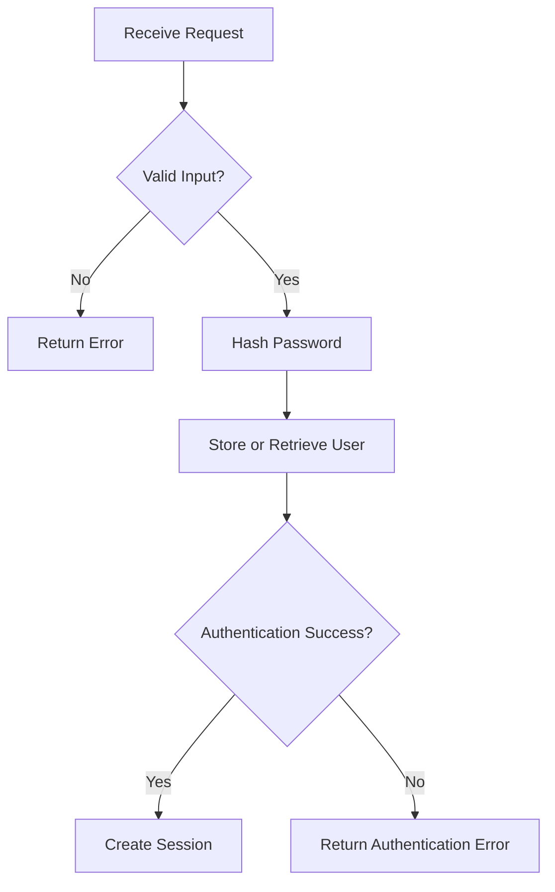
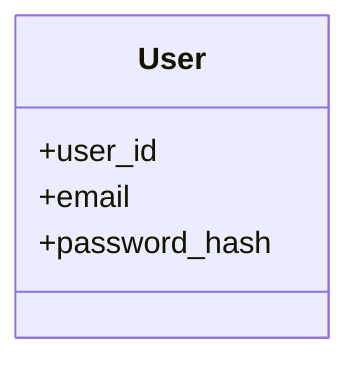
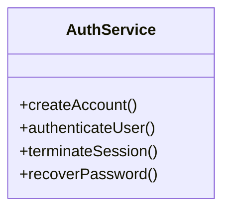
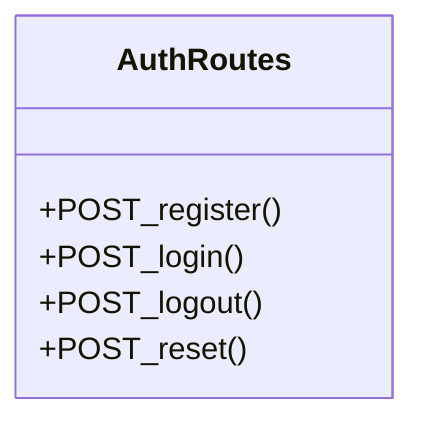
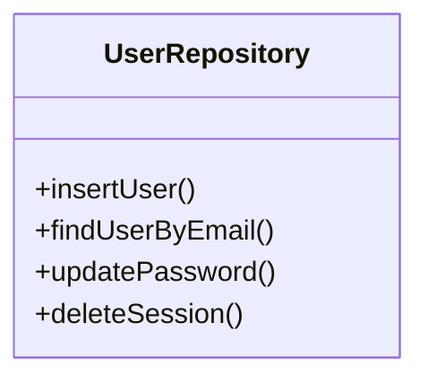

# Feature Planning Report - Detail Design

### Reference Information
---
* **Team Members**: Xander Weibel, Parker Morgan, Joe Tolley, Haeji Na, Josh Palmer
* **SDD**: [RxNOW SDD](https://github.com/louisramos23/RXNOW/blob/main/delv/SoftwareDesignDocumentSDD.md)

| Role | Team member name|
-- | --
| Product Owner | Xander |
| Scrum Master | Xander |
| Tech Lead (Front-End) | Parker |
| Tech Lead (Back-End) | Joe |
| Tech Lead (Database) | Haeji |
| Quality Assurance | Josh | 
| CM/DM | Josh | 


# Front-End Features Planned
### FrontEnd (20 pts)

**Workflow Description**
The user initiates the authentication process by entering credentials into the `AuthComponent`. The `AuthController` captures this data and performs client-side validation to ensure the password meets the complexity requirements defined in the system security policies. Once validated, the `AuthService` (Back Interface) dispatches an asynchronous POST request to the API. Upon a successful authentication, the system stores the JWT token, updates the `UserAccount` model state, and redirects the user to the application dashboard.

- **Agile Info:**
  - **Story:** As a user, I want to create an account and log in sucurely so that my personal data is protected and accessible only to me.
  - **Est Story Points:** 5
  - **Assigned Responsible Engineer:** Parker Morgan
**Classes**:
* **Model**:
    * **UML Class**:
        <!-- Use https://mermaid.js.org/syntax/classDiagram.html: --->
        classDiagram
            class UserAccount {
                +String email
                +String passwordHash
                +Boolean isAuthenticated
                +String sessionToken
                +serialize()
            }
    * ***Code Location***: `src/models/UserAccount.js`
* **Control** 
    * **UML Class**:
        <!-- Use https://mermaid.js.org/syntax/classDiagram.html: --->
        ```mermaid
        classDiagram
            class AuthController {
                +processSignup(data)
                +processLogin(creds)
                +processReset(email)
                +processLogout()
                -validateForm(data)
            }
        ```
        * **Create** (Function name): `processSignup`
        * **Read** (Function name): `processLogin`
        * **Update** (Function name): `processReset`
        * **Delete** (Function name): `processLogout`
        * ***Code Location***: `src/controllers/AuthController.js`

* **View** (UML Class)
    <!--- Use https://mermaid.js.org/syntax/classDiagram.html: --->
    ```mermaid
    classDiagram
        class AuthComponent {
            +renderSignupForm()
            +renderLoginForm()
            +renderResetForm()
            +destroySessionUI()
            -toggleLoader()
        }
* **User Interface (Wireframe)**:
    * **Create** (Function name): `renderSignupForm`
    * **Read** (Function name): `renderLoginForm`
    * **Update** (Function name): `renderResetForm`
    * **Delete** (Function name): `destroySessionUI`
    * ***Code Location***: `src/views/AuthComponent.jsx`
* **Back Interface** (UML Class):
    ```mermaid
    classDiagram
        class AuthService {
            +apiPostUser(payload)
            +apiGetAuth(payload)
            +apiPatchPassword(payload)
            +apiDeleteSession()
        }
    ```
    * **Create** (Function name): `apiPostUser`
    * **Read** (Function name): `apiGetAuth`
    * **Update** (Function name): `apiPatchPassword`
    * **Delete** (Function name): `apiDeleteSession`
    * ***Code Location***: `src/services/AuthService.js`
    
# Back-End Features Planned
<!--- Please add the features planned in the SDD for back end here --->

* **Business Logic**:

The backend validates credentials, hashes passwords before storage, authenticates users, and manages login sessions.



* Agile Info:

  * Story: Backend authentication services
  * Est Story Points: 5
  * Assigned Responsible Engineer: 
---

**Classes**

* **Models**:



* ***Code Location***:

---

* **Control**:



* **Create** (Function name): `createAccount()`
* **Read** (Function name): `authenticateUser()`
* **Update** (Function name): `recoverPassword()`
* **Delete** (Function name): `terminateSession()`
* ***Code Location***:

---

* **View** (UML Class)



* **Front-End API** ():

  * **Create** (Function name): `POST_register()`
  * **Read** (Function name): `POST_login()`
  * **Update** (Function name): `POST_reset()`
  * **Delete** (Function name): `POST_logout()`
  * ***Code Location***:

* **Database Interface** (UML Class):



* **Create** (Function name): `insertUser()`
* **Read** (Function name): `findUserByEmail()`
* **Update** (Function name): `updatePassword()`
* **Delete** (Function name): `deleteSession()`
* ***Code Location***:

---

# Database Features Planned
### Database (20 pts)

**Data Relationship Logic:**  
The Medication Management feature uses a one-to-many relationship between the User and Medication entities. One User can have many Medication records, but each Medication record belongs to exactly one User. This relationship is enforced by `Medication.user_id` referencing `User.user_id`. The database will store the medication information needed for tracking medication supply, including medication name, dosage, pills remaining, and pills per day.

- **Agile Info:**
  - **Story:** As a database role owner, I want to define the database structure for medication management so that user medication records can be stored, updated, retrieved, and deleted correctly.
  - **Est Story Points:** 3
  - **Assigned Responsible Engineer:** Haeji Na
  - **GitHub Issue Number:** #[add database sub-issue number]

**Classes:**

* **Models:** (Table/Doc Descriptions)

  **User Table:** Stores user account information.
  - `user_id` — Primary Key
  - `email`
  - `password_hash`

  **Medication Table:** Stores medication records associated with a user.
  - `medication_id` — Primary Key
  - `user_id` — Foreign Key referencing `User.user_id`
  - `name`
  - `dosage`
  - `pills_remaining`
  - `pills_per_day`

  ***Code Location:*** TBD / future database schema or migration script location

* **Control:** DBMS  
  *Setup, Maintenance, Trigger Scripts*
  - **Create** (Function name): `createMedication`
  - **Read** (Function name): `getMedicationsByUser`
  - **Update** (Function name): `updateMedication`
  - **Delete** (Function name): `deleteMedication`
  - ***Code Location:*** TBD / future database access layer or SQL script location

* **View** (UML Class)

  **Back-End API/Queries:**
  - **Create** (Function name): `POST /medications`
  - **Read** (Function name): `GET /medications`
  - **Update** (Function name): `PUT /medications/{medication_id}`
  - **Delete** (Function name): `DELETE /medications/{medication_id}`
  - ***Code Location:*** TBD / future backend API and data access layer location
