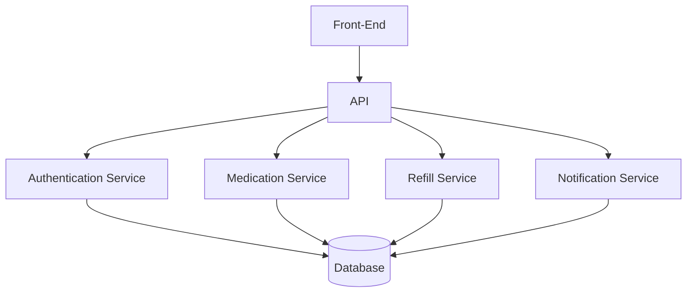
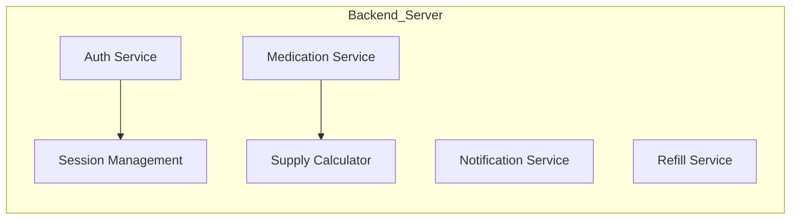
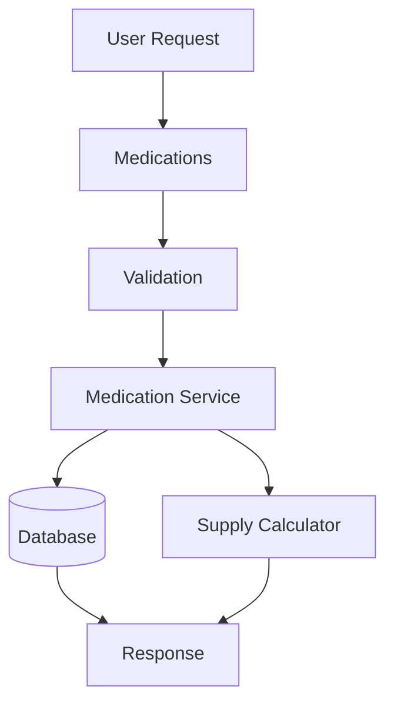
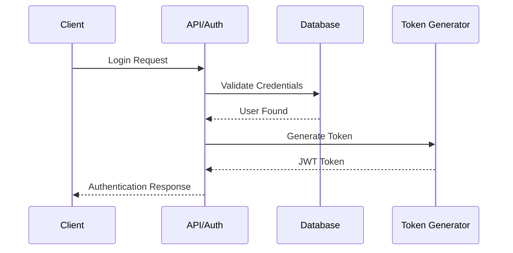
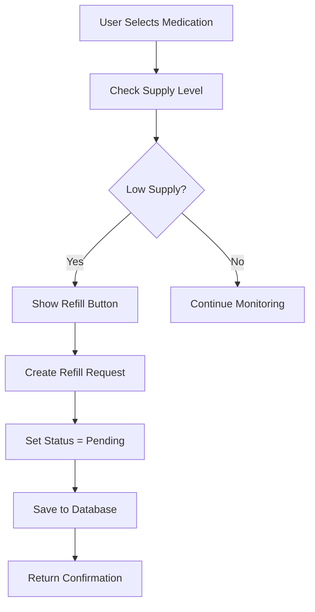
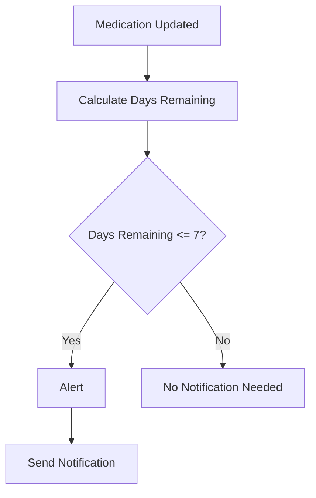

# RXNOW Backend Visual Representations

## 1. Backend System Architecture



---

# 2. Backend Server Components



---

# 3. Medication CRUD Flow



---

# 4. Authentication Workflow



---

# 5. Refill Workflow Diagram



---

# 6. Notification Engine Logic


---

# 7. Initial Backend Folder Structure (js example)

```text
backend/
│
├── controllers/
│   ├── authController.js
│   ├── medicationController.js
│   ├── refillController.js
│   └── notificationController.js
│
├── services/
│   ├── authService.js
│   ├── medicationService.js
│   ├── refillService.js
│   └── notificationService.js
|
├── database/
│   ├── schema.sql
│   └── connection.js
│
└── server.js
```

---

# 8. Backend Responsibilities Summary

| Backend Area        | Responsibility                        |
| ------------------- | ------------------------------------- |
| Authentication      | Login, registration, token validation |
| Medication Service  | CRUD operations for medications       |
| Supply Calculator   | Calculate remaining medication days   |
| Notification Engine | Generate alerts                       |
| Refill Workflow     | Create refill requests                |
| API                 | Handle communication from front-end   |
| Database            | Handle communication with database    |
| Validation          | Ensure clean and safe input           |
| Logging             | Record backend events and errors      |
