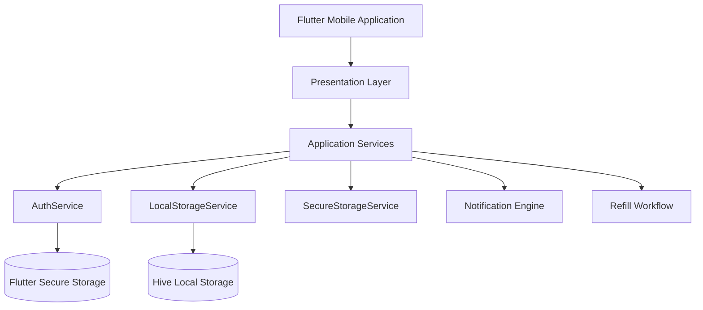
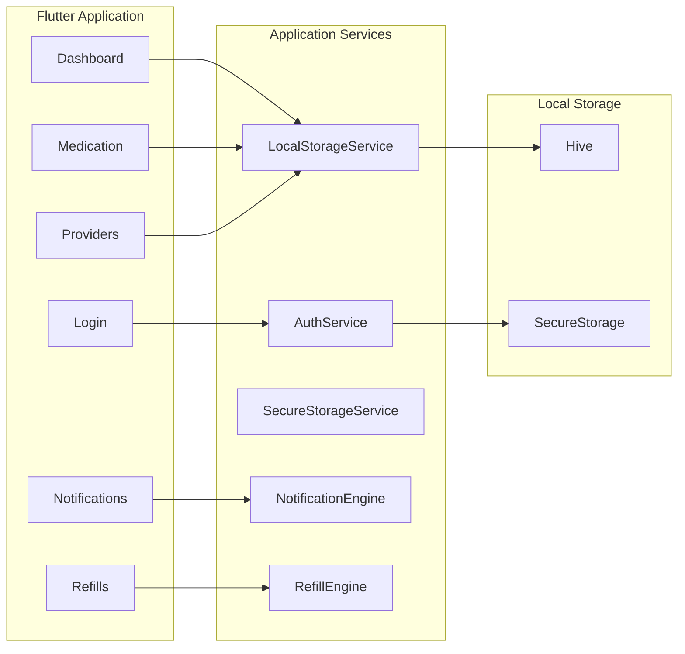
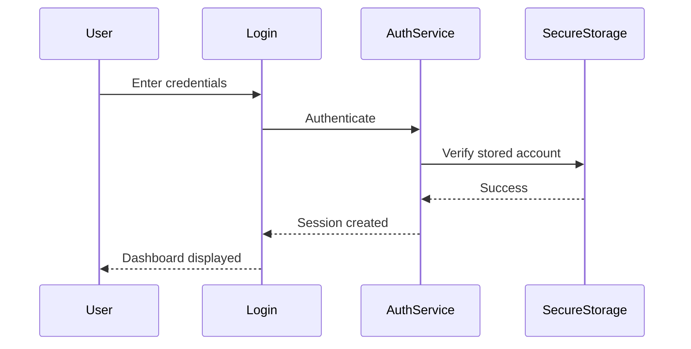

# RXNOW Local-First Architecture

---

# 1. Overall System Architecture



## Overview

RXNOW follows a **local-first architecture** in which all core application functionality executes on the user's device.

The application stores user authentication information securely using Flutter Secure Storage while medications, providers, notifications, and refill requests are stored locally using Hive.

After installation and account creation, the application remains fully functional without requiring continuous internet connectivity.

### Design Goals

* Offline functionality
* User privacy
* Fast local performance
* Reduced infrastructure complexity
* Modular software architecture
* Future cloud extensibility

---

# 2. Architectural Evolution

## Original Architecture

```text
Flutter Application
        │
        ▼
Backend API
        │
        ▼
Cloud Database
```

## Current MVP Architecture

```text
Flutter Application
        │
        ▼
Presentation Layer
        │
        ▼
Application Services
        │
        ▼
Hive Local Storage

+

Flutter Secure Storage
```

This design removes the dependency on a backend server for routine application operation while preserving the ability to integrate cloud synchronization in future releases.

---

# 3. Application Components



## Component Responsibilities

### AuthService

Responsible for:

* User registration
* User authentication
* Session management
* Password validation

---

### LocalStorageService

Responsible for:

* Medication CRUD
* Provider CRUD
* Notification management
* Refill request management
* Data persistence

---

### SecureStorageService

Responsible for:

* Secure credential storage
* Session persistence
* Authentication state

---

### Notification Engine

Responsible for:

* Threshold detection
* Notification generation
* Notification history
* Read status

---

### Refill Engine

Responsible for:

* Refill request generation
* Status tracking
* Email workflow preparation

---

# 4. Medication Workflow

```mermaid
flowchart TD

User

↓

Medication Screen

↓

Validate Input

↓

LocalStorageService

↓

Hive

↓

Supply Calculation

↓

Notification Check

↓

Refresh UI
```

Medication management is performed entirely on the user's device.

---

# 5. Authentication Workflow



Authentication information is stored securely on the device, allowing subsequent logins without requiring network access.

---

# 6. Provider Workflow

```mermaid
flowchart TD

Provider Screen

↓

Create / Edit

↓

Validate

↓

LocalStorageService

↓

Hive

↓

Medication Association
```

Providers are implemented as reusable entities that may be associated with multiple medications.

---

# 7. Notification Engine

```mermaid
flowchart TD

Medication Updated

↓

Calculate Days Remaining

↓

Threshold Reached?

↓

Generate Notification

↓

Store Notification

↓

Display Notification
```

Thresholds:

* 7 days
* 3 days
* 1 day

Notifications remain available while offline.

---

# 8. Local Storage Layer

```mermaid
flowchart TD

Flutter Application

↓

LocalStorageService

↓

Hive

├── Users

├── Providers

├── Medications

├── Notifications

└── Refill Requests
```

Sensitive authentication information is stored separately:

```text
SecureStorageService

↓

Flutter Secure Storage
```

This separation improves security while simplifying application data management.

---

# 9. Suggested Project Organization

```text
lib/

├── screens/

├── services/

│   ├── auth_service.dart

│   ├── local_storage_service.dart

│   ├── secure_storage_service.dart

│   └── api_service.dart

├── widgets/

├── theme/

├── models/

└── main.dart
```

Each layer has a clearly defined responsibility, improving maintainability and reducing coupling.

---

# 10. System Responsibility Summary

| Component              | Responsibility                                             |
| ---------------------- | ---------------------------------------------------------- |
| Flutter UI             | User interaction and navigation                            |
| AuthService            | Registration, login, logout, password validation           |
| SecureStorageService   | Secure credential and session storage                      |
| LocalStorageService    | Medication, provider, notification, and refill persistence |
| Notification Engine    | Threshold monitoring and alert generation                  |
| Refill Engine          | Request generation and tracking                            |
| Hive                   | Persistent application data                                |
| Flutter Secure Storage | Sensitive authentication information                       |

---

# 11. Deployment Architecture

```mermaid
flowchart TD

Android Device

↓

Flutter Application

↓

Application Services

↓

Hive

+

Flutter Secure Storage
```

No backend server or external database is required for the MVP.

---

# 12. Future Expansion

The local-first architecture supports future enhancements including:

* Cloud synchronization
* Multi-device accounts
* Pharmacy integration
* Provider portal integration
* Electronic Health Record (EHR) integration
* Push notifications
* Biometric authentication

These capabilities can be added through additional service layers without significant changes to the existing application architecture.

---

# Architecture Summary

RXNOW has evolved from a traditional client-server architecture into a modular, local-first mobile application.

By separating presentation, business logic, secure storage, and local persistence into distinct layers, the application achieves:

* Full offline functionality
* Improved privacy
* Faster application performance
* Simplified deployment
* Easier maintenance
* Greater extensibility for future cloud-based enhancements

This architecture accurately reflects the current implementation of the RXNOW MVP while providing a scalable foundation for future development.
