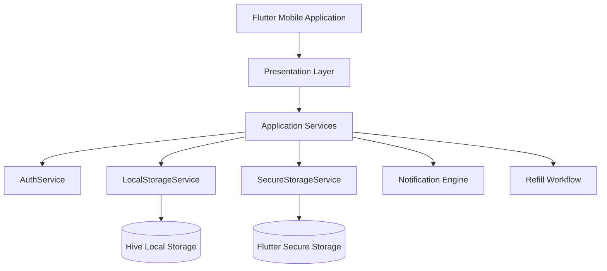
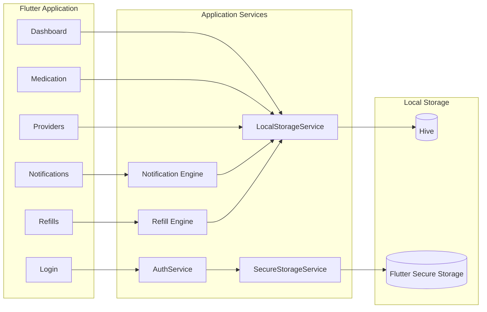
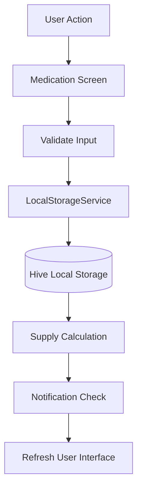
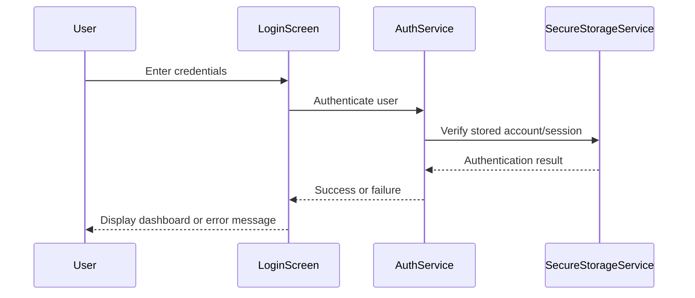
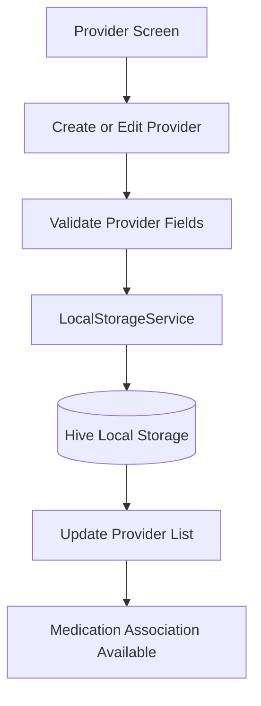
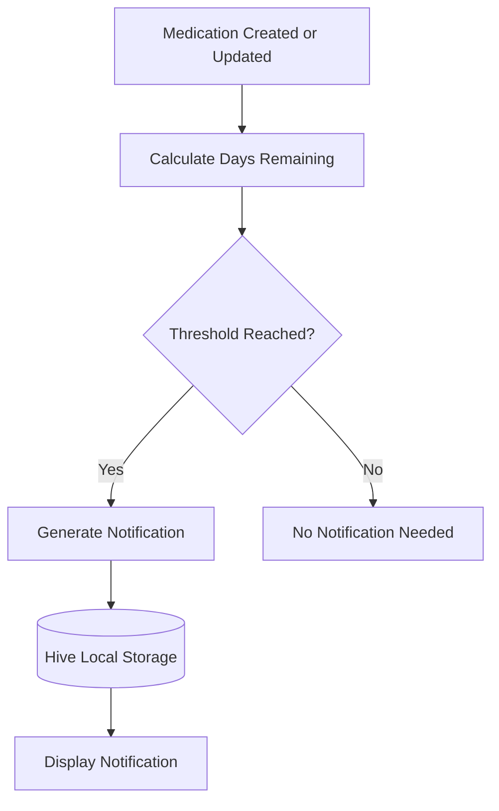
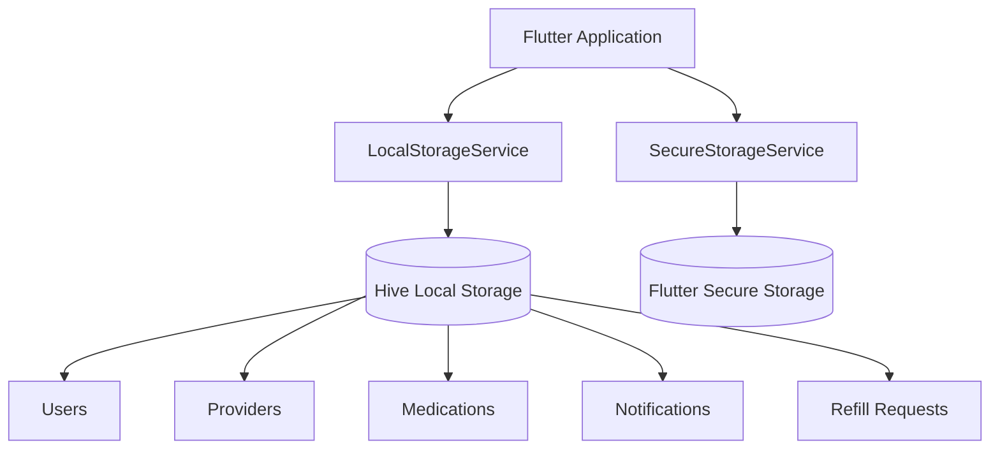
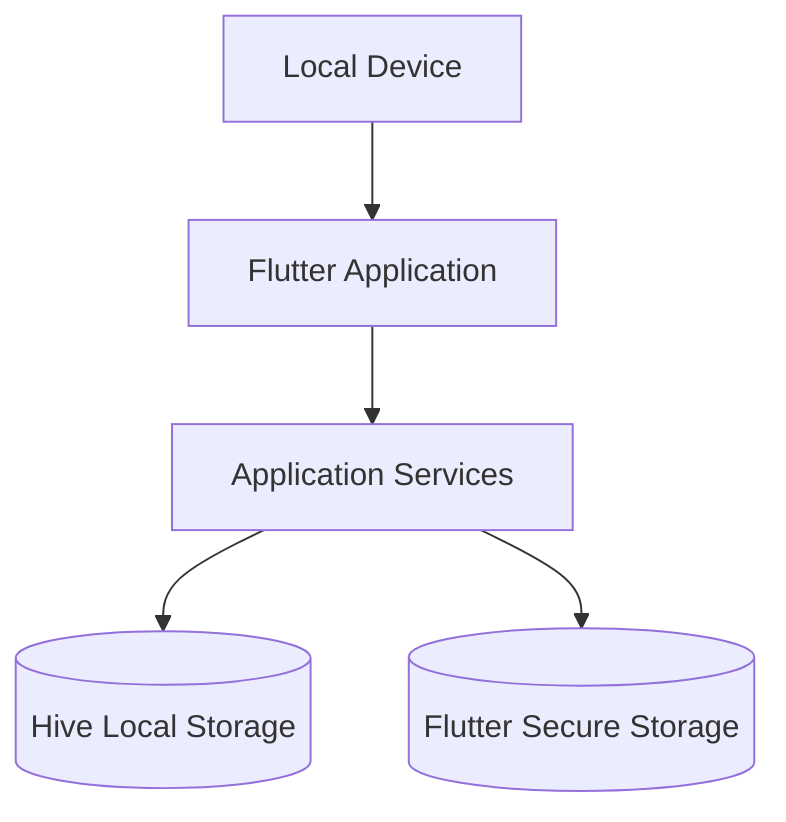

# RXNOW Local-First Architecture

---

# 1. Overall System Architecture



## Overview

RXNOW follows a **local-first architecture** in which all core application functionality executes on the user's local device.

The application stores user authentication and session information securely using Flutter Secure Storage, while medications, providers, notifications, and refill requests are stored locally using Hive.

After installation and account creation, the application remains fully functional without requiring continuous internet connectivity.

## Design Goals

* Offline functionality
* User privacy
* Fast local performance
* Reduced infrastructure complexity
* Modular software architecture
* Future cloud extensibility

---

# 2. Architectural Evolution

## Original Architecture

```text
Flutter Application
        |
        v
Backend API
        |
        v
Cloud Database
```

## Current MVP Architecture

```text
Flutter Application
        |
        v
Presentation Layer
        |
        v
Application Services
        |
        v
Local Storage
```

The current MVP architecture removes the dependency on a backend server for routine application operation while preserving the ability to integrate cloud synchronization or external services in future releases.

---

# 3. Application Components



## Component Responsibilities

### AuthService

Responsible for:

* User registration
* User authentication
* Session management
* Password validation

### LocalStorageService

Responsible for:

* Medication CRUD
* Provider CRUD
* Notification management
* Refill request management
* Data persistence

### SecureStorageService

Responsible for:

* Secure credential storage
* Session persistence
* Authentication state

### Notification Engine

Responsible for:

* Threshold detection
* Notification generation
* Notification history
* Read status

### Refill Engine

Responsible for:

* Refill request generation
* Status tracking
* Email workflow preparation

---

# 4. Medication Workflow



## Description

Medication management is performed entirely on the user's local device.

The medication workflow includes:

1. The user creates, edits, views, or deletes a medication.
2. The screen validates the user input.
3. The validated data is sent to `LocalStorageService`.
4. The medication record is saved to Hive.
5. The application recalculates remaining supply.
6. The notification engine checks low-supply thresholds.
7. The user interface refreshes with the updated information.

No network connection is required for medication management.

---

# 5. Authentication Workflow



## Description

Authentication information is stored securely on the local device, allowing users to access the application without requiring continuous network access.

After successful authentication, the application creates or restores a local session and displays the dashboard.

---

# 6. Provider Workflow



## Description

Providers are implemented as reusable entities that may be associated with multiple medications.

The provider workflow includes:

1. The user opens the provider screen.
2. The user creates, edits, or deletes a provider.
3. Required provider fields are validated.
4. Provider data is stored locally through `LocalStorageService`.
5. Medications may reference the provider through a provider identifier.

If a provider is deleted, medications should remain available and simply clear the provider association.

---

# 7. Notification Engine



## Description

Notifications are generated locally based on medication supply calculations.

The notification engine checks whether a medication has reached one of the low-supply thresholds:

* 7 days remaining
* 3 days remaining
* 1 day remaining

Notifications remain available while offline.

The application should avoid generating duplicate notifications for the same medication and threshold unless the supply rises above the threshold and later falls back to or below that threshold again.

---

# 8. Local Storage Layer



## Description

The local storage layer stores user-specific application data on the local device.

Hive stores structured application data, including:

* User records
* Provider records
* Medication records
* Notification history
* Refill request history

Flutter Secure Storage stores sensitive authentication and session information separately.

This separation improves security while keeping application data easy to manage locally.

---

# 9. Suggested Project Organization

```text
lib/
├── screens/
│   ├── login_screen.dart
│   ├── signup_screen.dart
│   ├── forgot_password_screen.dart
│   ├── dashboard_screen.dart
│   ├── medication_view_screen.dart
│   ├── add_edit_medication_screen.dart
│   ├── provider_screen.dart
│   ├── notifications_screen.dart
│   └── refill_request_screen.dart
│
├── services/
│   ├── auth_service.dart
│   ├── local_storage_service.dart
│   ├── secure_storage_service.dart
│   └── api_service.dart
│
├── widgets/
│   └── rx_widgets.dart
│
├── theme/
│   └── app_theme.dart
│
├── models/
│
└── main.dart
```

Each layer has a clearly defined responsibility, improving maintainability and reducing coupling.

---

# 10. System Responsibility Summary

| Component              | Responsibility                                             |
| ---------------------- | ---------------------------------------------------------- |
| Flutter UI             | User interaction and navigation                            |
| AuthService            | Registration, login, logout, and password validation       |
| SecureStorageService   | Secure credential and session storage                      |
| LocalStorageService    | Medication, provider, notification, and refill persistence |
| Notification Engine    | Threshold monitoring and alert generation                  |
| Refill Engine          | Request generation and tracking                            |
| Hive                   | Persistent local application data                          |
| Flutter Secure Storage | Sensitive authentication and session information           |

---

# 11. Deployment Architecture



No backend server or external database is required for the MVP.

---

# 12. Future Expansion

The local-first architecture supports future enhancements including:

* Cloud synchronization
* Multi-device accounts
* Pharmacy integration
* Provider portal integration
* Electronic Health Record integration
* Push notifications
* Biometric authentication

These capabilities can be added through additional service layers without significant changes to the existing application architecture.

---

# Architecture Summary

RXNOW has evolved from a traditional client-server architecture into a modular, local-first mobile application.

By separating presentation, business logic, secure storage, and local persistence into distinct layers, the application achieves:

* Full offline functionality
* Improved privacy
* Faster application performance
* Simplified deployment
* Easier maintenance
* Greater extensibility for future cloud-based enhancements

This architecture accurately reflects the current implementation of the RXNOW MVP while providing a scalable foundation for future development.
