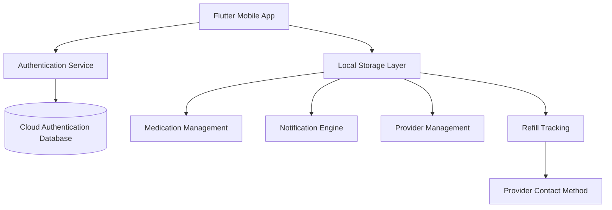
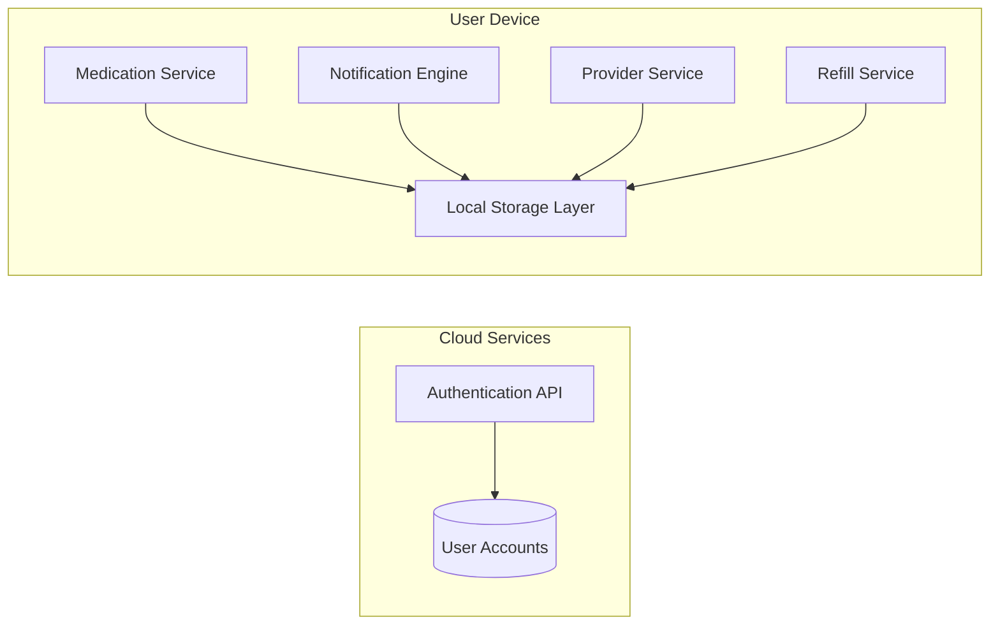
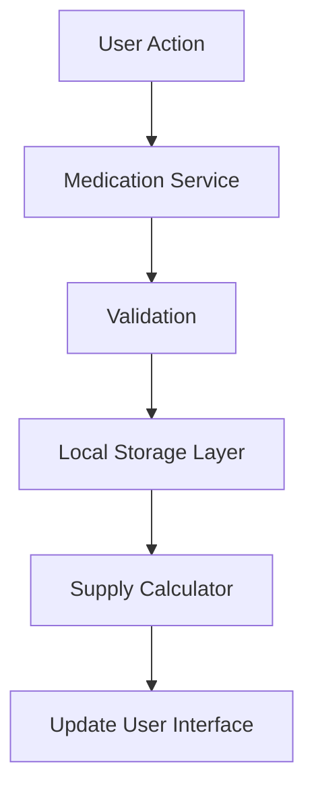
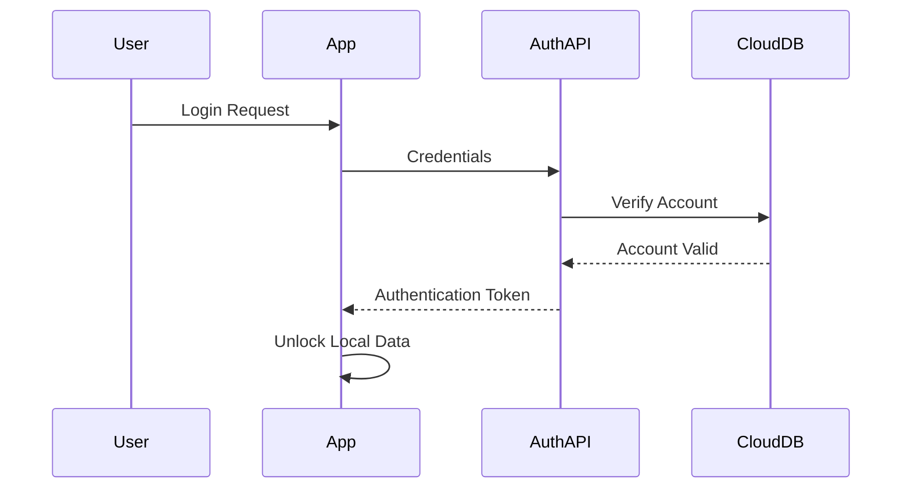
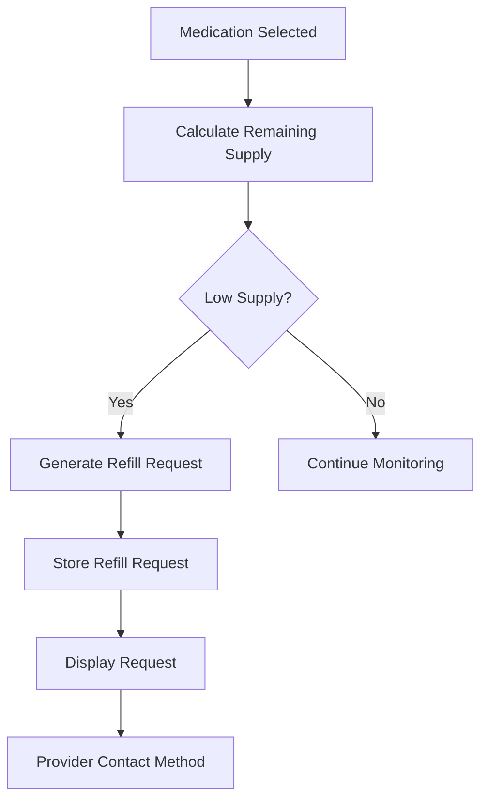
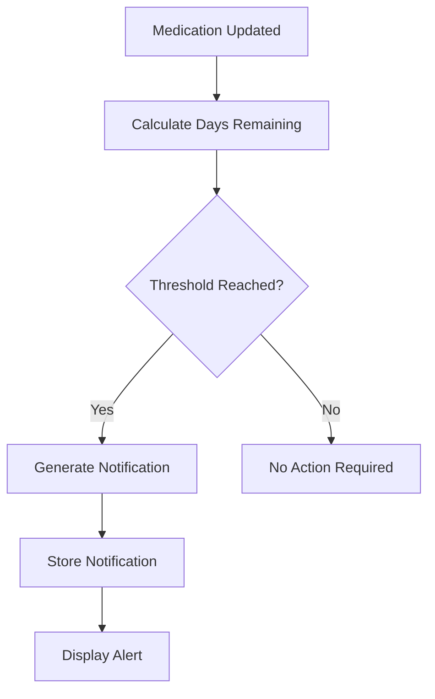
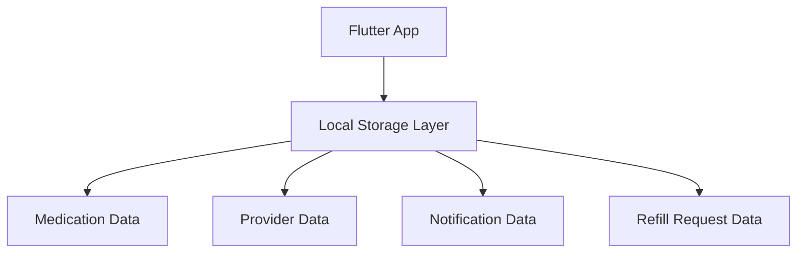
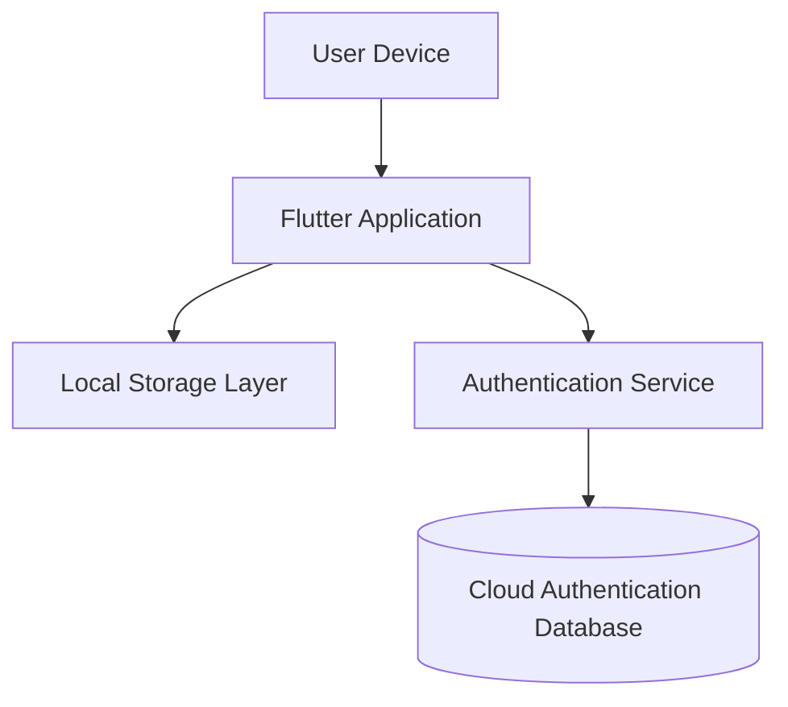

# RXNOW Hybrid Storage Architecture

## 1. Overall System Architecture



### Overview

RXNOW follows a hybrid storage architecture where authentication remains cloud-based while user-specific application data is stored locally on the user's device.

This approach prioritizes:

* User privacy
* Offline functionality
* Reduced hosting costs
* Simplified infrastructure
* Faster application performance

### Architectural Shift

Previous Architecture:

```text
Flutter App
     ↓
Backend API
     ↓
Cloud Database
```

Hybrid Architecture:

```text
Flutter App
   ↓
Local Storage Layer

Flutter App
   ↓
Authentication Service
   ↓
Cloud Authentication Database
```

The application becomes the primary execution environment, with cloud services limited to authentication and future synchronization capabilities.

---

# 2. Hybrid System Components



### Cloud Responsibilities

* User registration
* User authentication
* Password recovery
* Session validation
* JWT issuance
* Future synchronization support

### Device Responsibilities

* Medication management
* Provider management
* Notification generation
* Supply calculations
* Refill generation
* Refill tracking
* Data persistence

---

# 3. Medication Management Flow



### Description

Medication creation, editing, viewing, and deletion occur entirely on the user's device.

No network connection is required for standard medication management operations.

---

# 4. Authentication Workflow



### Description

Authentication is the primary cloud-based function of RXNOW.

Upon successful login, the application gains access to locally stored user information and application features.

---

# 5. Refill Workflow



### Description

Refill requests are generated locally and maintained within the application.

The application may provide provider contact information or messaging assistance without requiring a cloud-hosted refill system.

---

# 6. Notification Engine Logic



### Description

Notifications are generated directly on the device based on medication supply calculations.

This functionality remains available even when the device is offline.

---

# 7. Local Storage Layer



### Description

The local storage layer represents where user-specific application data is stored on the device.

The exact implementation details, storage technology, and data structures are intentionally left flexible and should be determined by the development team responsible for local data management.

The architecture assumes the ability to locally store and retrieve:

* Medication records
* Provider information
* Notification history
* Refill request history

---

# 8. Suggested Project Structure

```text
lib/
│
├── services/
│   ├── auth_service.dart
│   ├── medication_service.dart
│   ├── refill_service.dart
│   ├── notification_service.dart
│   └── provider_service.dart
│
├── storage/
│   └── local_storage_layer.dart
│
├── models/
│   ├── medication.dart
│   ├── provider.dart
│   ├── refill_request.dart
│   └── notification.dart
│
├── screens/
│
└── widgets/
```

### Note

This structure is illustrative and intended to demonstrate separation of responsibilities rather than prescribe a specific implementation.

---

# 9. System Responsibilities Summary

| Component                     | Responsibility                                             |
| ----------------------------- | ---------------------------------------------------------- |
| Authentication Service        | Registration, login, password recovery, session validation |
| Cloud Authentication Database | Store account credentials and authentication data          |
| Local Storage Layer           | Store user-specific application data on the device         |
| Medication Service            | Medication creation, editing, viewing, and deletion        |
| Provider Service              | Provider management                                        |
| Notification Engine           | Generate low-supply alerts                                 |
| Refill Service                | Generate and track refill requests                         |
| Supply Calculator             | Calculate remaining medication supply                      |
| Flutter User Interface        | Present application workflows and information              |
| Provider Contact Method       | Support refill communication workflows                     |

---

# 10. Deployment Architecture



### Benefits

This architecture provides:

* Reduced infrastructure requirements
* Improved privacy for medication information
* Offline application functionality
* Faster access to user data
* Simplified backend maintenance

