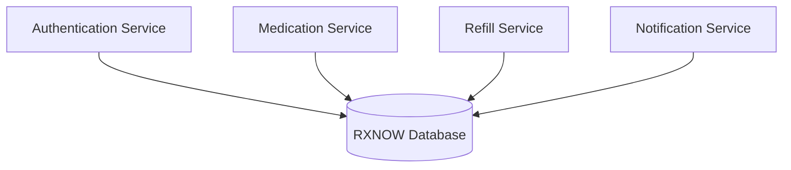
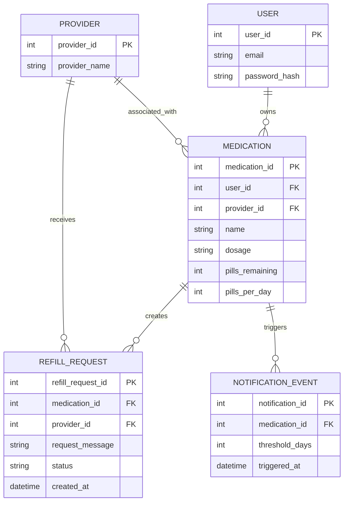
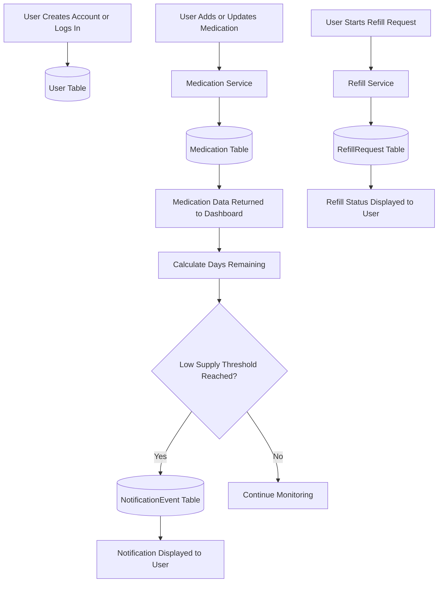
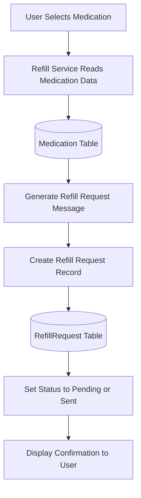
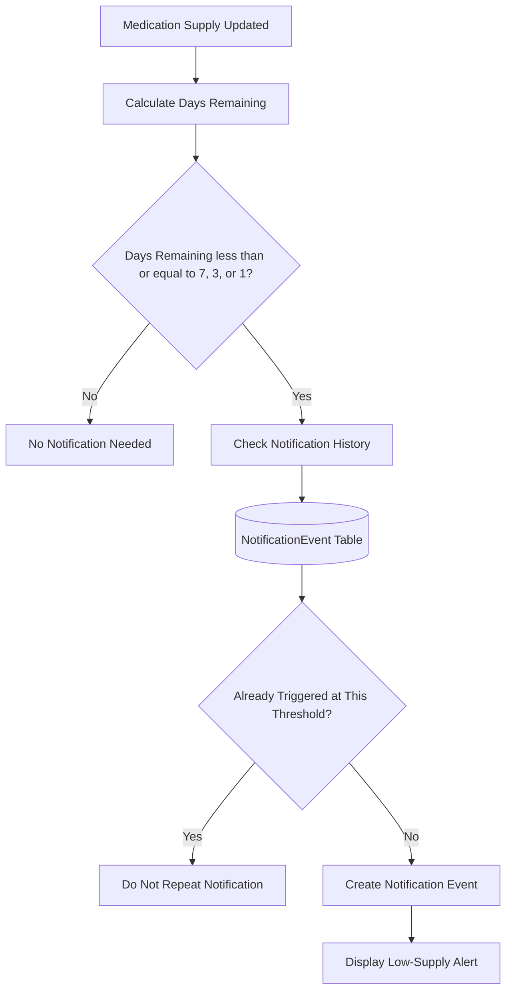

# RXNOW Database Visual Representations

## Purpose

This document provides a visual overview of the RXNOW database design. It shows the main data entities, their relationships, and how the database supports medication tracking, refill requests, and low-supply notification workflows.


---

## 1. Database System Architecture



---

## 2. Main Entity Relationship Diagram



---

## 3. Database Entity / Table Descriptions

### User

Stores account information for each RXNOW user. The email is used as the login identifier, and the password is stored only as a secure hash.

| Column | Description |
| --- | --- |
| `user_id` | Primary key for the user |
| `email` | Unique login email for the user |
| `password_hash` | Hashed password used for authentication |

---

### Medication

Stores each medication record tracked by a user. A medication record belongs to one specific user, even if other users take a medication with the same name.

| Column | Description |
| --- | --- |
| `medication_id` | Primary key for the medication record |
| `user_id` | Foreign key linking the medication to the user |
| `provider_id` | Foreign key linking the medication to a provider |
| `name` | Medication name |
| `dosage` | Medication dosage |
| `pills_remaining` | Number of pills currently remaining |
| `pills_per_day` | Number of pills taken each day |

**Calculated value:**  
`days_remaining = pills_remaining / pills_per_day`

This value can be calculated by the system rather than permanently stored in the table.

---

### Provider

Stores provider information connected to a medication or refill request.

| Column | Description |
| --- | --- |
| `provider_id` | Primary key for the provider |
| `provider_name` | Name of the medical provider |

---

### RefillRequest

Stores refill request information created from a medication record.

| Column | Description |
| --- | --- |
| `refill_request_id` | Primary key for the refill request |
| `medication_id` | Foreign key linking the request to a medication |
| `provider_id` | Foreign key linking the request to the provider |
| `request_message` | Refill message generated for the request |
| `status` | Current status, such as Pending or Sent |
| `created_at` | Date and time the request was created |

---

### NotificationEvent

Tracks low-supply notification events for a medication.

| Column | Description |
| --- | --- |
| `notification_id` | Primary key for the notification event |
| `medication_id` | Foreign key linking the event to a medication |
| `threshold_days` | Low-supply level that triggered the event, such as 7, 3, or 1 |
| `triggered_at` | Date and time the notification was triggered |

---

## 4. Relationship Summary

| Relationship | Meaning |
| --- | --- |
| `User 1 → many Medication` | One user can track many medication records |
| `Provider 1 → many Medication` | One provider can be connected to many medications |
| `Medication 1 → many RefillRequest` | One medication can create multiple refill requests over time |
| `Provider 1 → many RefillRequest` | One provider can receive many refill requests |
| `Medication 1 → many NotificationEvent` | One medication can trigger multiple low-supply notification events |

---

## 5. Overall Database Workflow



---

## 6. Refill Request Database Storage Flow



---

## 7. Notification Event Database Storage Flow



---

## 8. Proposed SQL / Database Folder Structure

```text
database/
│
├── schema.sql
├── seed.sql
├── migrations/
│   └── initial_schema.sql
│
├── queries/
│   ├── user_queries.sql
│   ├── medication_queries.sql
│   ├── provider_queries.sql
│   ├── refill_request_queries.sql
│   └── notification_queries.sql
│
└── README.md
```

---

## 9. Database Responsibilities Summary

| Database Area | Responsibility |
| --- | --- |
| User Data | Store account login information |
| Medication Data | Store medications tracked by each user |
| Provider Data | Store provider names connected to medications/refills |
| Refill Requests | Store refill messages and request status |
| Notification Events | Track low-supply alert events and prevent repeated alerts |
| Relationships | Connect users, medications, providers, refill requests, and notifications |
| Validation Support | Help enforce clean and usable data |
| Query Support | Provide reliable data for backend services |
